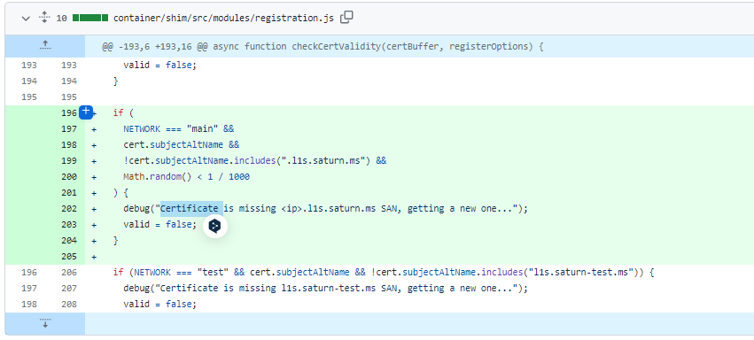
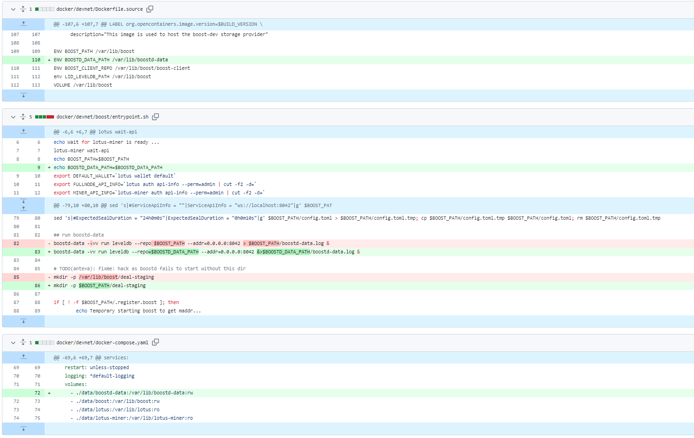
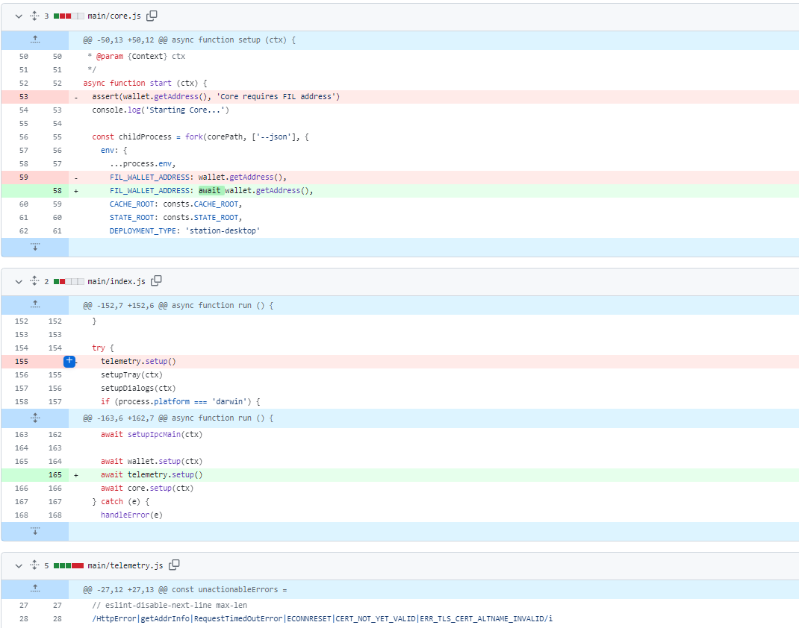
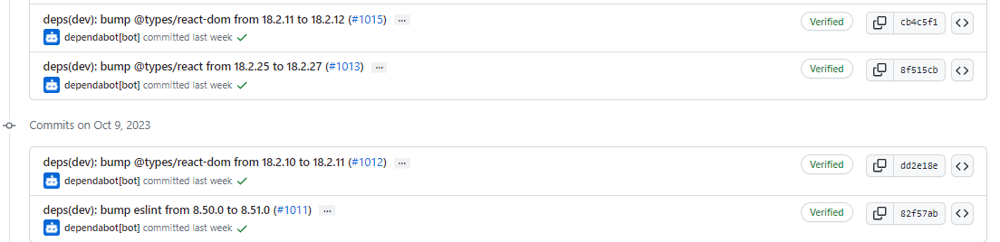
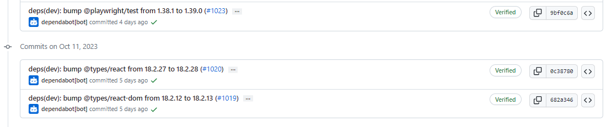
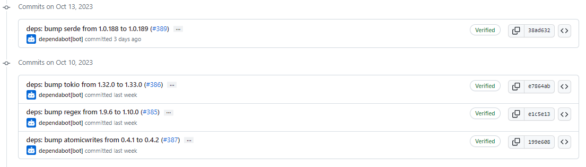

# 2023-10-15检索星球周报

## 🚀项目进展

### 1️⃣saturn

1. 更新 saturn 证书的几率为0.1%

2. 合并来自 filecoin-saturn/feat/npm-lint-cleanup 的请求 [#500](https://github.com/filecoin-saturn/L1-node/pull/500)
3. 增加获得新证书的几率到0.2%
4. 增加获得新证书的几率到0.4%
5. 增加获得新证书的几率到1%
6. 增加获得新证书的几率到5%
7. 增加获得新证书的几率到10%
8. 增加获得新证书的几率到15%
9. 检测证书中的唯一 SAN，每12小时将几率将至1%

###  2️⃣boost工具

1. 修复 boostd-data go 模块路径并移除替换指令
2. 修复今天检测问题
   + 删除多余的导入
   + 降低错误字符串的大小写
   + 使用 `fmt.Sprintf` 来构造字符串值，而不是使用 `fmt.Errorf.Error()` 来构造字符串值
3. 修复 LID 网页用户界面
   + 处理总数 = 0 的情况
   + 处理计数 = 0 的情况
   + 为调试级别 -vv 添加日志记录器
   + 处理空的最后扫描时间
4. 为 boostd-data 使用明确的软件仓库位置

###  3️⃣storetheindex

1. 删除退役的 filops 引导服务器，由 filops 运行的引导服务器 3 至 5 个已退役。删除它们，以减少日志中的噪音。
1. 将 golang.org/x/net 从 0.14.0 升级到 0.17.0。

### 4️⃣Station

##### desktop

1. feat: 将 Station Core 升级至 v14.3.0 ([#1016](https://github.com/filecoin-station/desktop/pull/1016))
1. 修复在检查钥匙串权限时钱包地址为空的问题

3. 更新部分依赖项目

##### zinnia

1. 部分依赖项目的更新

##  📢一周资讯

### 1. Food For Crisis

[FilFoundation](https://twitter.com/FilFoundation)与联合国世界粮食计划署创新加速器 ( [WFP](https://twitter.com/WFP) )、[GBBCouncil](https://twitter.com/GBBCouncil) 、 [Bayer](https://twitter.com/Bayer) 、埃森哲等机构联手开展“粮食危机”活动，以创新应对全球饥饿。

