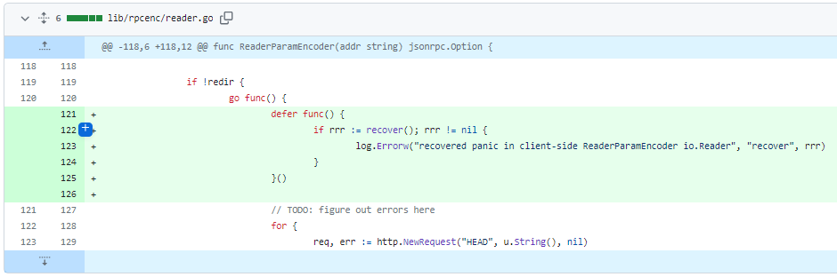
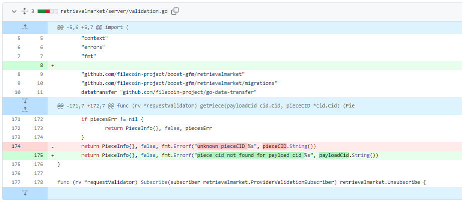
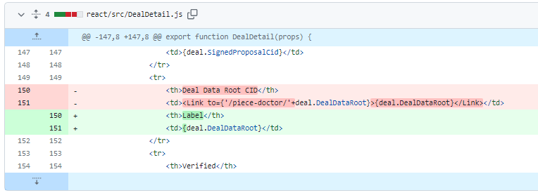
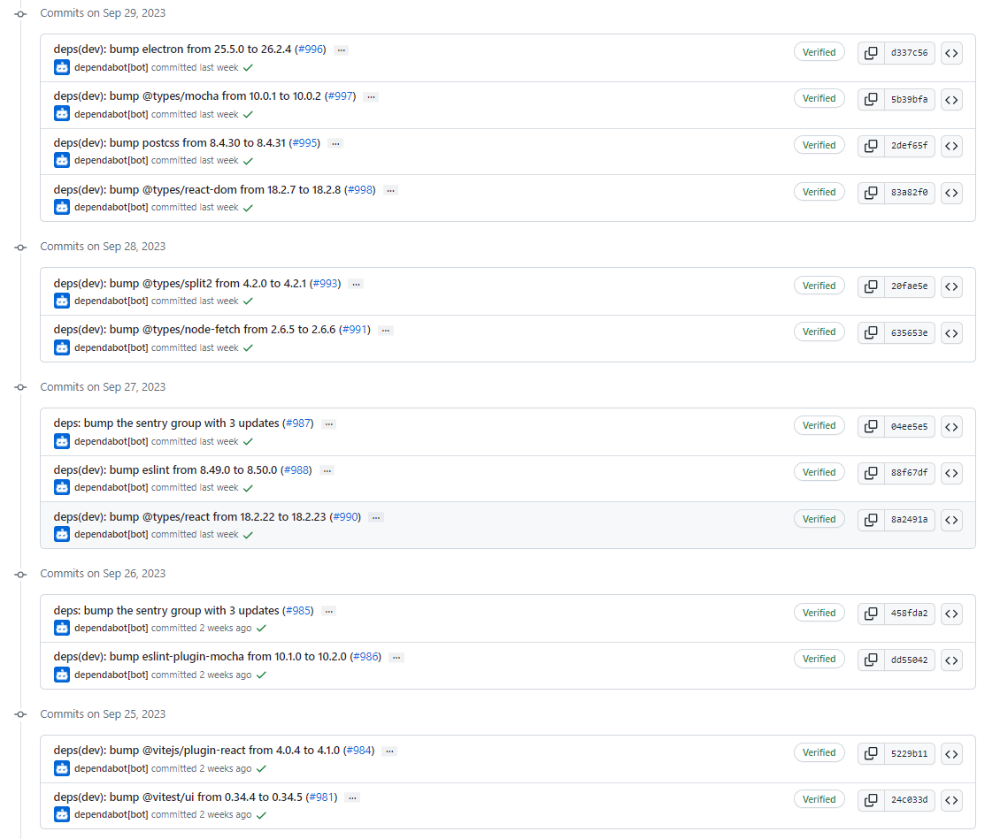
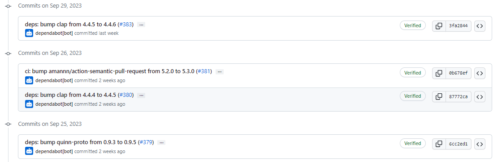
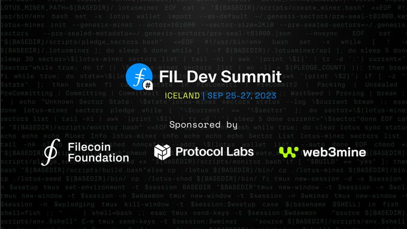

# 2023-10-1检索星球周报

## 🚀项目进展

### 1️⃣saturn

1. feat: 在贷款日志中添加 jwt log
1. 合并来自 filecoin-saturn/log_jwt PR  [#495](https://github.com/filecoin-saturn/L1-node/pull/495) 
1. feat: 移除 car range 模块，使用最新的lassie
1. feat: 在 Nginx 缓存密钥张红添加实体字节
1. 将并发量设置为 1000

###  2️⃣boost工具

1. 修复客户端 io.Reader 编码器中 go-routine 恐慌状态

2. 修复 GS 查询恐慌

3. 修改 root cid

4. fix: 移除 payloadRootCid 查找
5. refactor: 重构 if
6. ci: 显示的将 macos build 切换为 silicon 并升级 xcode 15.0.0， golang 1.19.5
7. feat: 在用户界面中显示有效载荷 CID
8. fix: 修复有效载荷 CIDs link
9. remove: 移除 console.log

###  3️⃣storetheindex

1. update: 更新 graphsync 和 go-libipni
1. 部署 telemetry，对 NFT 提供商进行跟踪
1. 将最新的 storetheindex/storetheindex 部署到 dev 环境中
1. 将 storetheindex 更新至 v0.8.2
1. 将最新的 storetheindex/storetheindex 部署到 prod 环境中
1. 投票时不消耗所有 worker 资源
1. 将投票修复程序部署到 prod 中
1. 部署带有 peerstone fix 功能的 STI
1. 删除 peerstore 中的旧地址
1. 更新日志信息
1. 使用 peerstore fix 和 无 http retry
1. 不在提供方信息 lasterror 字段中显示内部错误的详细信息
1. 将最新版本部署到开发环境中去
1. 部署 indexstar，在调试时记录取消的上下文
1. 部署减少日志记录的 indexstar 到 prod 中
1. 部署减少日志记录的 indexstar 到 dev 中
1. 更新版本 version v0.8.2 => v0.8.3
1. 增加 prod 中的 heyfil 的内存限制
1. 将最新的 storetheindex/storetheindex 部署到 prod 环境中

### 4️⃣Station

##### desktop

1. 更新了部分项目依赖

##### zinnia

1. 更新了部分项目依赖

##  📢一周资讯

### 1.FILDevSummit23 Iceland

+ day 1
  + 定义 Filecoin 可检索性
  + 原生 Wasm 的方向
  + Mastering 的第二阶段
+ day 2 content
  + 协议升级与演进
  + Filecoin 检索
  + 数据载入
  + 规模/计算
  + more
+ day 3 content
  + 数据载入
  + 存储提供商优化和工具
  + 治理与社区
  + 协议发展与演变
  + more

### 2. Filecoin & IPFS Ecosystem Roundup is online!

+ 1/ 九月 Filecoin & IPFS 生态系统综述上线！ 观看[视频](https://youtu.be/bdOPPnuZnhw)，了解直接来自社区的最新更新、发展和见解。
+ 2/ Filecoin、IPFS 和 Web3 的现状/新闻中的 Filecoin & IPFS
  + 近期活动: http://pl-network-events.vercel.app
  + SBS-Earth: http://sbs.tech
  + 检索市场工作组: http://retrieval.market
  + COD WG: http://cod.cloud
  + IPC WG: http://fil.space
+ 3/ 本月获胜者
  + VCCRI x Filecoin https://destor.com/victor-chang-cardiac-research-institute-case-study
  + lavanetxyz progresses Testnet-2 https://twitter.com/lavanetxyz/status/1691741143523045769
  + [filfi_io](https://twitter.com/filfi_io): Extreme asset liquidity [http://mining.filfi.io](https://t.co/29A8WP3NfH) 
  + Emmy Nomination for Outstanding Interactive Media
+ 4/ 获奖情况
  + CollectifDAO: 达到重要里程碑 http://collectif.finance
  + Elixir Capital 论文 + FVM 报告 https://twitter.com/FilecoinTLDR/status/1689270961218973696?s=20
  + 新加坡 FILDev 峰会成功举办 http://fildev.io
  + huddle01com  推出
+ 5/ 本月应用程序：Axelar Axelar 
  + 为 Web3 提供安全的跨链通信。我们的基础设施使 dApp 用户能够一键与任何链上的任何资产或应用程序进行交互。
+ 6/ FILMVP秒 非常感谢 
  + DSPA_Asia ：（ https://twitter.com/caitmoor/status/1704107651494207879…  
  + SpheronFDN 的社区支持： https://twitter.com/ShivashishYadav/status/1699332412386517009
+ 7/ event
  + FILDev 峰会 - [https://fildev.io](https://t.co/41pzt6f3WN) 
