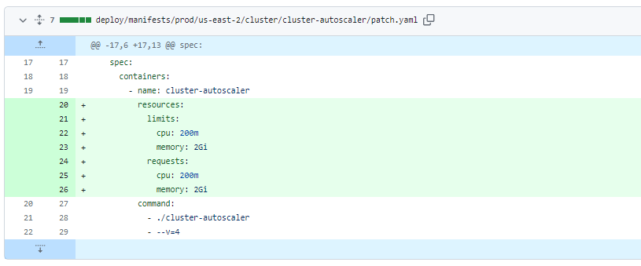
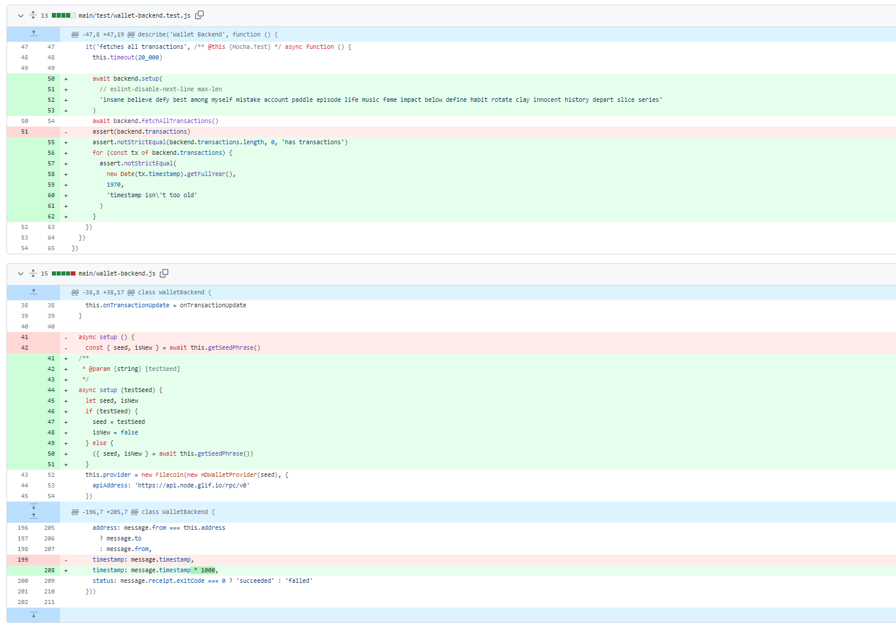
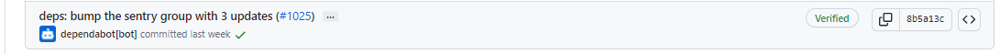
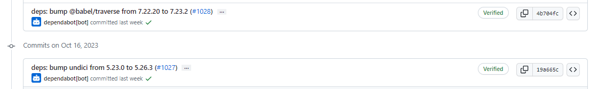
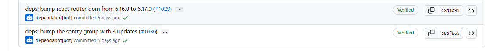
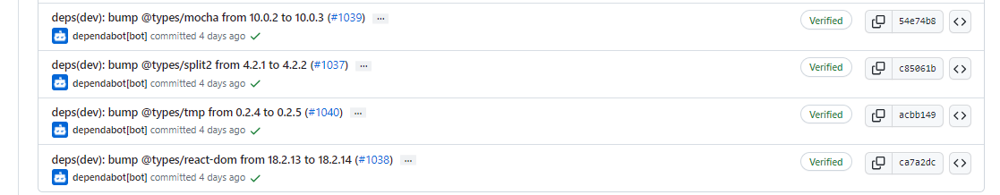
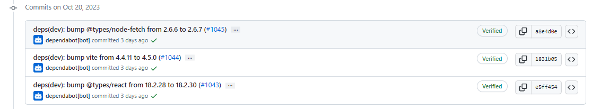
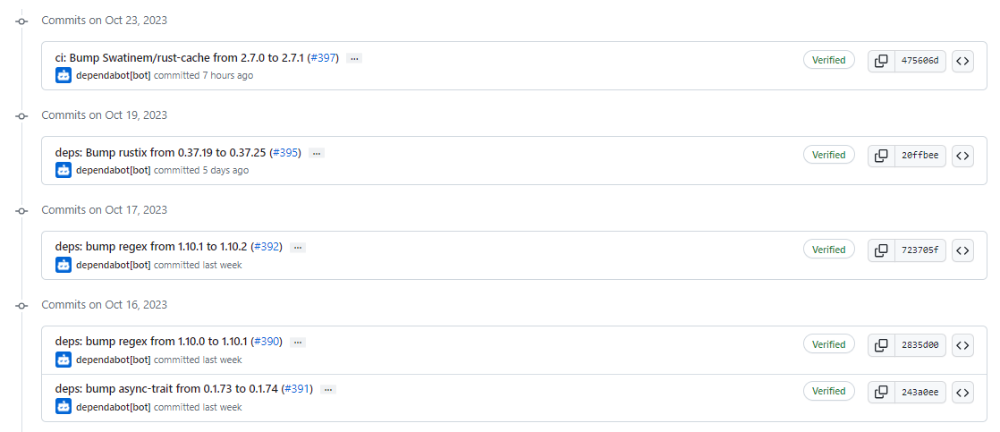

# 2023-10-22检索星球周报

## 🚀项目进展

### 1️⃣saturn

1. 检查证书中是否有唯一的 SAN, 每 12 小时有 2% 的几率进行更新证书操作
1. 增加更新证书的几率到 5%
1. 增加更新证书的几率到 10%
1. 增加更新证书的几率到 20%

###  2️⃣boost工具

1. devnet 增加对 yugabytedb 的支持
2. feat: 并行运行交易过滤器
   + 并行运行交易过滤器
   + 删除多余的返回
   + 重构以减少重复代码
3. chore: 发行 v2.1.0-rc2 版本
4. chore: 升级 @babel/traverse 从 7.18.0 至 7.23.2
5. 处理程序加载，删除索引标签。

###  3️⃣storetheindex

1. 在生产环境中添加 `dhstore-seka`
1. 在 us-east-2c 中部署 dhstore seka
1. 尝试使用更少的 cpu 进行部署，处理器个数从 28 减少至 18
1. 尝试在 2a 中是部署 dhstore
1. 调整 prod eks 节点组的大小，从5升至10
1. 增加集群自动缩放程序的内存

7. 调整使用最新的dhstore
8. 增加 http sync 过期时间至60s

### 4️⃣Station

##### desktop

1. desktop 升级至 0.24.0
2. fix: Station Core 降级至 v14.2.0
3. desktop 升级至 0.24.1
4. 升级filecoin-station/core 至 14.4.0
5. desktop 升级至 0.24.2
6. Wallet: fix dates.Closes [#1034](https://github.com/filecoin-station/desktop/issues/1034) ([#1035](https://github.com/filecoin-station/desktop/pull/1035))

7. 升级filecoin-station/core 至 14.4.1
8. desktop 升级至 0.24.3
9. 部分依赖项目的更新

##### zinnia

1. 部分依赖项目的更新

##  📢一周资讯

### 1. Filecoin News 76

Filecoin News 76 来了！

+ 21版Filecoin网络
+ Filecoin 主网 3 周年
+ 与@encodeclub 一起Open Data Hack
+ @FilecoinTLDR  文件币钱包指南

[more](https://filecoin.io/blog/posts/filecoin-news-76/)
