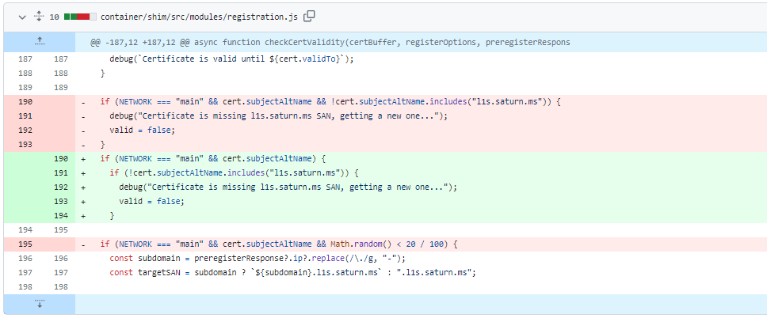
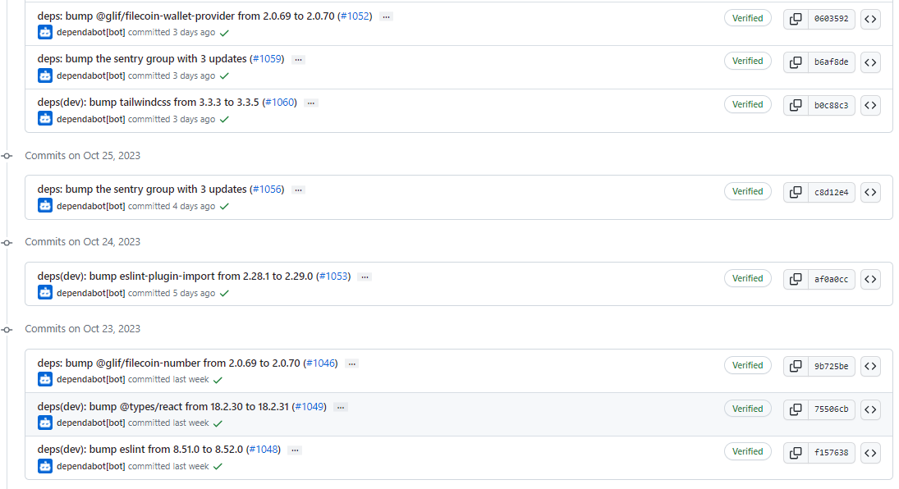
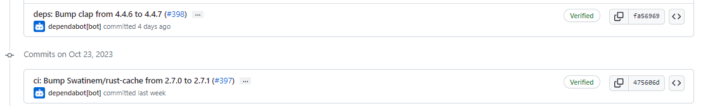
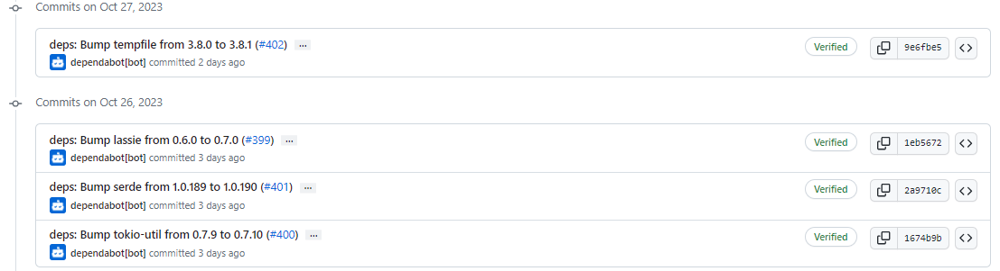
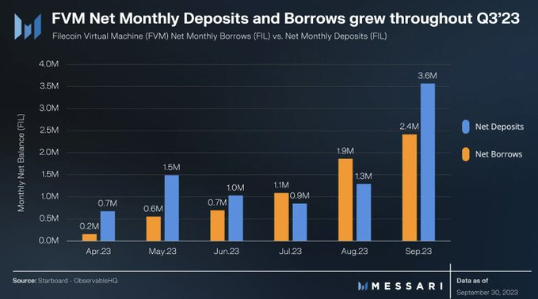
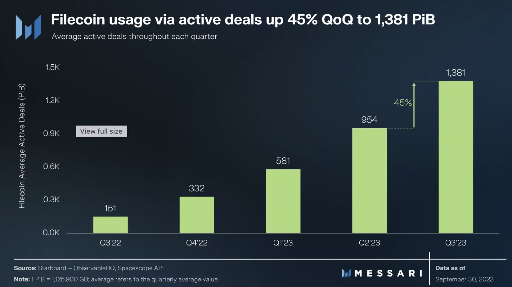
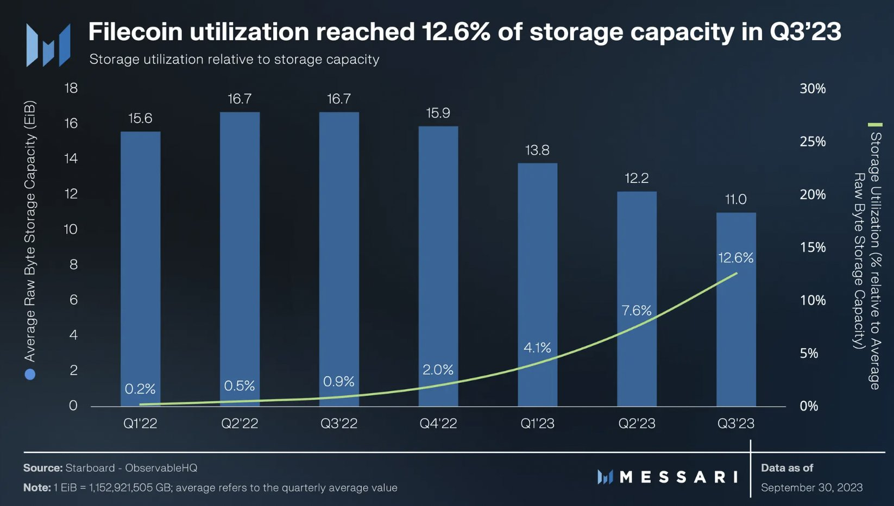

# 2023-10-29检索星球周报

## 🚀项目进展

### 1️⃣saturn

1. 现有所有节点都必须有一个独特的证书

2. 将所有依赖项目升级

###  2️⃣boost工具

1. fix: 处理迁移中 IsDirectDeal 列的 isexist 错误，使用字符串压缩
1. 创建Support ticket 模板
1. 修复 YAML syntax error
1. 增加 spans 和 debug lines 
1. 删除日志的行强制
1. 增加 cql timeout
1. booster-http refactor - 仅无需信任，改进压缩、日志记录和e2e测试和信任
1. feat(booster-http): 删除完整网关，仅提供 --serve-cars
1. 打印有关已删除选项的信息消息
1. 添加完整的 e2e+bifrost-gateway 测试
1. feat(booster-http): --piece 和 frisbii 的压缩级别标志，修复 GzipHandler 的使用
1. feat(booster-http): --log-file，默认为stdout，用于标准化 http日志输出
1. Chore(booster-http): 将片段处理程序代码才分为单独的文件
1. fix: 解决审核反馈
1. chore(deps): 更新 frisbii 的实体字节
1. fix devnet
1. fix: 等待发布确认计数
1. fix: 等待发布确认计数
1. fix: lint 错误
1. fix: 空指针问题
1. fix: comparison
1. fix: 更新交易过滤器
1. remove: go.work.sum
1. fix test with workaround
1. fix 交易持续时间测试
1. 对 migrate 命令增加 timeout 限制

###  3️⃣storetheindex

1. 生产环境中的 caskadht 规模进行，count数从 5 -> 1
1. 减少生产工作节点组的最大 ASG 大小，max_size 25 -> 10
1. 删除对 admin 导入的支持
1. 由于bitswap cascade traffic, cassette replicas 减少至0
1. 将ingress和indexstar副本减少至2
1. 移除 c6a8xl 节点组从dev和fix terranform
1. 将只读dhstore 移至内存，优化实例类型
1. 将 prod 上最后一个 dhstore 移动到内存优化节点

### 4️⃣Station

##### desktop

1. 升级至0.25.0
2. 更新部分项目依赖

##### zinnia

1. 更新 building-modules.md，zinnad => zinniad
1. 部分依赖项目的更新

##  📢一周资讯

### 1. **The demand for Filecoin storage shot up by 45% in Q3 2023.** 

[MessariCrypto](https://twitter.com/MessariCrypto)**在其最新报告中详细分析了** Filecoin 的现状。以下是有关 Filecoin 性能的 5 大问题:

1. **Filecoin 存储的需求是什么样的？**

截至第三季度末，主动存储交易（存储用户和存储提供商之间）存储的数据量为 1,381 PiB，较第二季度增长 45%。活跃交易的增加表明对 **Filecoin 去中心化存储的强劲需求。**

2. **使用了多少存储容量？**

**Filecoin 的存储利用率**相对于总可用存储容量从环比 7.6% 上升至 12.6%。这一改进是活跃交易增加和平均存储容量下降的结果，目前平均存储容量约为 11 EiB。

3. **谁在使用 Filecoin 存储？**

[MessariCrypto](https://twitter.com/MessariCrypto)指出，对于寻求经济高效的替代方案来存储大量档案数据的 Web2 客户来说，Filecoin 是一个有吸引力的选择。 截至第三季度，共有 1,891 个客户端在 Filecoin 网络上存储数据。其中，使用大型数据集（存储大小超过 1,000 TiB）的客户环比增长了约 25%。主要客户包括纽约市、**Victor Chang 心脏研究所以及 OpenSea 和 Solana 等** Web3 平台。

更多详细信息： [https://destor.com/en-us/filecoin-network-client-explorer…](https://t.co/UzE2V0hvtD)

4. **Filecoin 的检索市场表现如何？**

Filecoin 的土星项目正在运行一个快速且低成本的去中心化内容交付网络（CDN）。截至第三季度，超过 1,800 个节点在地理上分布，以满足 Filecoin 存储检索需求的主要部分。 了解有关检索市场的更多信息： [https://blog.filecointldr.io/filecoins-retrieval-markets-update-spotlight-on-project-saturn-9f233ed133ed…](https://t.co/YisLAcvJBK)

5. **Filecoin 的 DeFi 活跃度有多强？**

Filecoin 虚拟机（ [@fvmdev](https://twitter.com/fvmdev) **）于 2023 年 3 月推出，催生了基于智能合约的借**贷和质押应用程序，这些应用程序将 FIL 持有者与需要 FIL 承诺在网络上运行的存储提供商连接起来。 截至第三季度，约有 2,900 名质押者通过[@glifio](https://twitter.com/glifio) 、[@stfil_io](https://twitter.com/stfil_io)和[@HashKingGlobal](https://twitter.com/HashKingGlobal)等 DeFi 平台存入了约 900 万 FIL（约 3000 万美元）。同时，第三季度净借款达到 680 万 FIL（近 2300 万美元）。 Messari 报告称，在 FVM 上部署 Uniswap 合约的成功提议预计将迎来 Filecoin 网络中 DeFi 应用的新阶段。

有关协议收入、Filecoin 生态系统、网络更新和关键事件的更多详细信息，请阅读完整报告：

