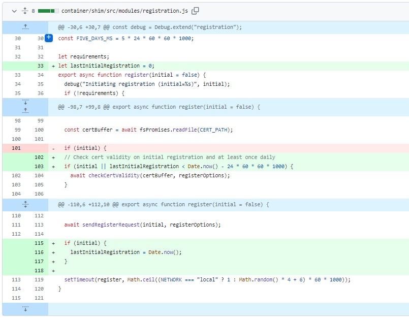
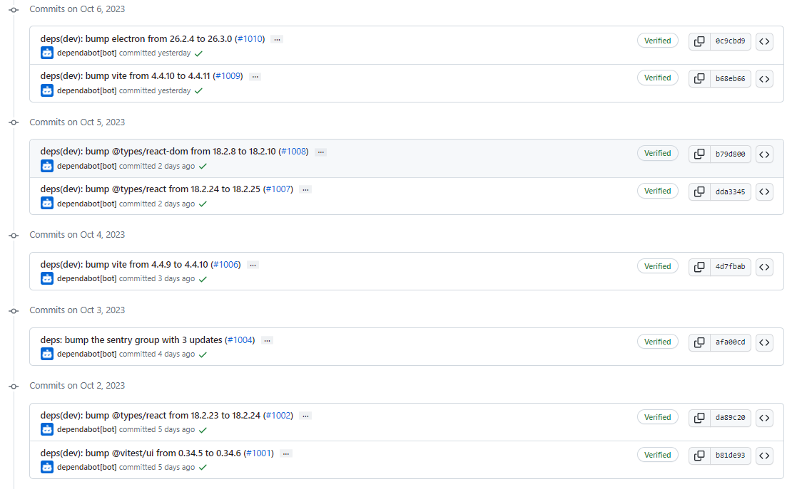
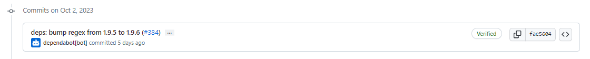
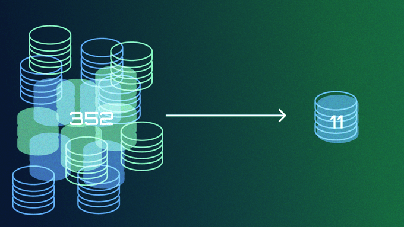
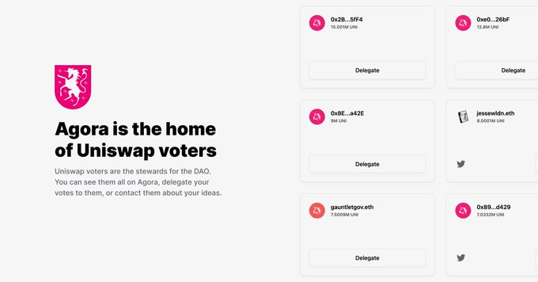

# 2023-10-8检索星球周报

## 🚀项目进展

### 1️⃣saturn

1. doc(requirements): 在唯一的 /24 CIDR 块中使用静态公共 IPv4 地址的 Linux 服务器
1. feat(registration): 每天至少检测一次证书的有效性

###  2️⃣boost工具

1. Ivan/http transport 升级
   + 添加将 http 下载分割为多块的功能。分块下载到临时文件中，然后合并为一个文件。通过 libp2p 下载时，始终只下载一个数据块；
   + 添加 NChunks 配置参数；
   + 修正测试，使其不仅能处理开放式范围请求；
   + 增加配置选项，禁止从私有 IP 下载 http；
   + 不跟踪 http 重定向；
   + 添加多流下载性能测试；

###  3️⃣storetheindex

1. feat: ipnisync
   + 将 ipnisync 与 libp2phttp 结合使用
   + 添加配置以退回到传统数据传输同步
   + 更新配置文档
   + 需要同步条目链
   + 修正测试用例中的预期错误文本
   + 修复 lint 警告
   + 更新注释
   + 分叉 mplex，因为 libp2p 不再支持它
   + 重新定位了 gostream，更新了 deps
   + 更新 circle CI 配置以使用最新版本的 go
   + 更新 libp2p
   + 不从 boxo 导入 car/v2
   + 更新索引提供程序配置
   + 更新到最新的索引提供程序
   + 更新 lotus、filecoin-ffi 子模块和 lotus API 参数
   + 文件创建
   + 更新 circle-ci 图像版本
   + 修复 itest
   + cbor-gen
   + 更新circieci lid-docker-compose 图像
   + 修复 circieci 图像
   + 更新 circieci docker 版本
   + 更新 devnet golang docker 映像
   + 将 devnet docker 升级到 ubuntu 22.04
   + 更新 go-car
   + 使用莲花版本 lotus@v1.23.4-rc1
1. 更新 ipni 依赖项
   + 重置和 mod tidy
   + 添加默认值，精简 go 版本
   + 更新 node/config/types.go
   + 更新用户界面
   + 修正变量名
   + 从比特交换中移除 mplex 库和 mux
   + mod tidy
1. direct data onboarding -disabled
   + 添加虚拟直接交易提供商
   + 添加初始 `import-direct` cmd
   + 更新了 make gen 和 make docsgen
   + 直接交易提供者
   + 加入直接数据的步骤
   + sql 表；直接数据输入状态；ORM
   + 到 Filecoin.SectorAddPieceToAny 的脚手架
   + 将 DirectData 更名为 DirectDeal
   + 删除 docker-tc
   + 将 AllocationId 类型修正为 uint64
   + 删除 DirectDeal 表中的 VerifiedDeal 字段
   + 更新 ifaces，添加快速检索和跳过 IPni-通知
   + 快速检索变为删除未封存副本
   + 在直接交易模型中添加检查点
   + 将初始状态存入本地数据库
   + 添加额外字段
   + 功能：添加 `boost allocate` 和 `boost get-allocations` 命令
   + 增加 allocate 和 get-allocations 命令
   + 增加 allocate 和 get-allocations 命令
   + 更新 lotus，取消注释检查代码
   + go mod tidy
   + 修改 FFI，修复 EthCall
   + docsgen
   + 直接上载数据：重构/提取 commp，重试时使用检查点，启动时重试
   + 为直接交易提取和重构 commp
   + 将导入分为导入和处理，并在启动时处理所有交易
   + 用检查点检查更新流程
   + 处理 commp 大小
   + 为 filplus 提供 devnet 支持
   + 锁定莲花版本
   + 将 Lotus 锁定为最新的 PR 版本
   + 填充 PieceDealInfo
   + 提升数据容量
   + 检查分配是否为零；在 sqlitedb 中设置 ClientAddress 和 ProviderAddress
   + 从状态中获取钱包的演员 ID
   + 添加开始和结束时间
   + 添加起始纪元密封缓冲区（startEpochSealingBuffer），并将起始纪元与链头进行比较
   + commpcalc; listActive
   + 网络用户界面：直接交易列表
   + 功能：用户界面：直接交易列表
   + 重构：简化数据库代码
   + 修复 devnet LID，修复标志名称
   + 重构：将读取的代码片段提取为通用函数
   + 壮举：为重试的扇区添加交易
   + 功能：为直接交易添加重试功能
   + 修复因数据帽丢失导致的 nil ptr 异常
   + 修复：分配错误，重构 func()s
   + 壮举：使重试/失败解析器与直接交易协同工作
   + 为直接上载数据添加 itest
   + 功能：为直接上载数据添加 itest
   + 重构：将数据帽代码从 ddo 测试函数移至 itest 框架中
   + 壮举：观察密封状态直至最终确定
   + 修复：观察直接交易的密封状态时不检查交易 ID
   + 重构：对直接交易和常规交易使用共同的通讯节流阀
   + 功能：观察密封状态，直到最终确定
   + 修复：观察直接交易的密封状态时不检查交易 ID
   + 修复：检查封印部门状态
   + 在 LID 中添加 IsDirectDeal
   + 在 cql 中添加键空间
   + 从添加列中删除键空间
   + 在 idxProv 上下文中使用 UUID
   + 更新 ipni 公告日志行
   + 恢复到不带 ddo 的 lotus 版本
   + 从主目录中删除 go.mod
   + 注释掉与 ddo 相关的代码；还原 itest 框架
   + 为直接交易注释掉 itest
   + 更新 node/impl/boost.go

### 4️⃣Station

##### desktop

1. 更新部分项目依赖

##### zinnia

1. 更新部分项目依赖

##  📢一周资讯

### 1.Explore the future of Filecoin Storage with Synthetic-PoRep!

+ 使用 Synthetic-PoRep 探索 Filecoin 存储的未来！查看这篇新博客文章，了解 Synth-PoRep 如何彻底改变存储效率，为存储提供商节省高达 98% 的存储空间并降低 Gas 成本。
+ [blog link](https://filecoin.io/blog/posts/revolutionizing-filecoin-storage-with-synthetic-porep-cutting-overheads-and-boosting-efficiency/)

### 2. Filecoin & Uniswap

Uniswap 将在 Filecoin 虚拟机 (FVM) 上定义 V3 的规范实现，FVM 是一个基于[@Filecoin](https://twitter.com/Filecoin)构建的可编程 EVM 兼容环境。

### 3. Daydreaming about [#LabWeek23](https://twitter.com/hashtag/LabWeek23?src=hashtag_click) in Istanbul, Turkey.

在土耳其伊斯坦布尔[#LabWeek23](https://twitter.com/hashtag/LabWeek23?src=hashtag_click) Daydreaming。  

2023 年 11 月 13-17 日

[Register](https://23.labweek.io/)

