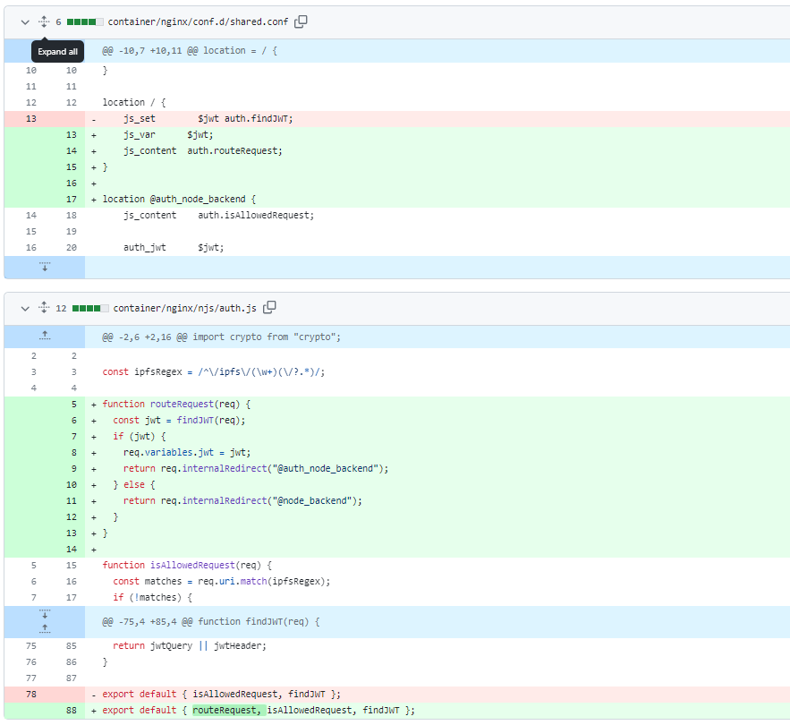
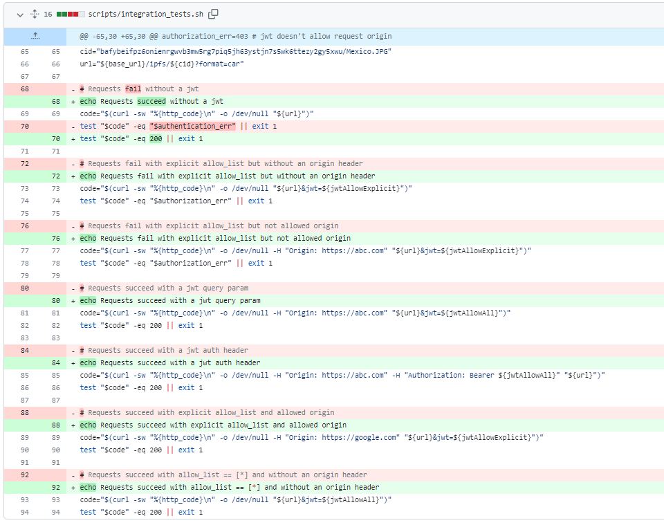
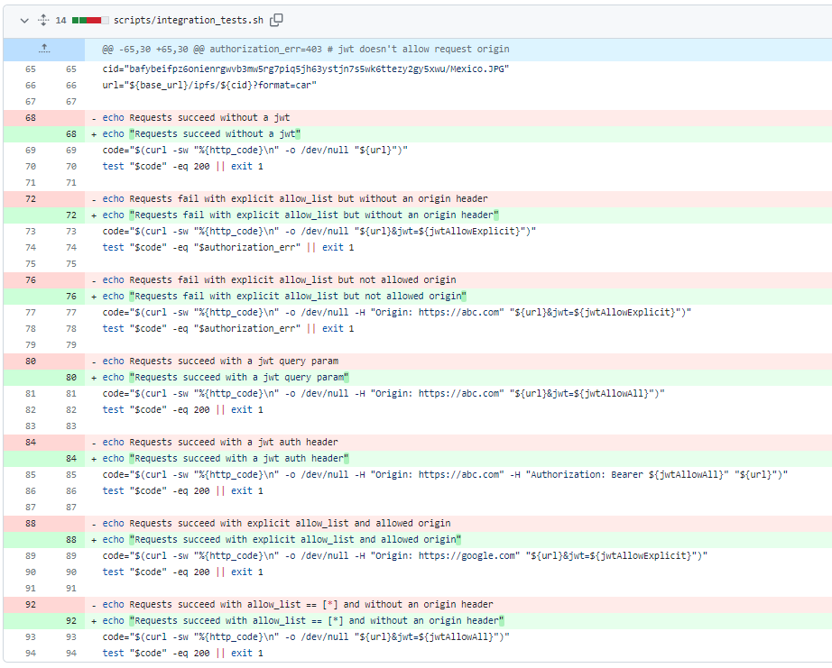
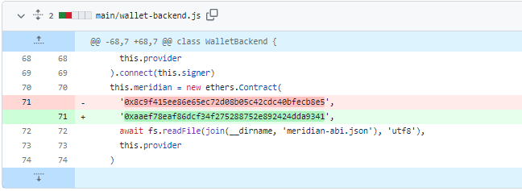

# 2023-11-12检索星球周报

## 🚀项目进展

### 1️⃣saturn

1. feat: 使 jwt 成为可选项
1. tests: 打印测试说明
1. tests: 修正预期结果

4. chore: 字符串去掉引号

###  2️⃣boost工具

1. fix: 优化添加索引的性能
   + 在从 boostd 调用 AddIndex 时，将 recs 分割成多个较小的块。事实证明，在所有索引过程中，Rpc 数据传输耗时最长；
   * 参数化 yugabyte 和片段目录并发设置。
1. humanize datacap

3. lid ui: 移除进度条；保持最新进度的更新

4. fix: 重构 connect-string，用于 YB 特定的 postgres 参数
   * 重构 connect-string

   * 添加额外的 YB-PGX 键
   * 修复附加键	

5. boostd-data 依赖于 main 的提交
6. 不在钱包命令中显示私人密钥

###  3️⃣storetheindex

1. 将最新版本部署到开发环境
   + 更新 `dev` 环境中的 storetheindex/storetheindex
1. 在 prod 环境中更新 storetheindex/storetheindex
1. 将最新的分配器部署到开发环境中
1. 减少工人数量，防止 OOM

5. 将最新的分配器部署到 prod，newTag 0.8.1 --> newTag 0.8.6
6. 将最新的 dhstore 部署到 prod
7. 减少轮询频率，因为出错的提供商会减慢工人的工作速度
   + 移除未使用的配置项 StoreBatchSize。

8. 将最新的 indexstar 部署到开发阶段
9. 将最新的 dhstore 部署到只读的 dhstore 实例中
10. 修复开发版 github-auth.yaml 中的拼写错误
11. 将最新的 dhstore 部署到开发环境
12. 将最新的 indexstar 部署到 prod
13. 关闭 telemetry experiment
14. 将 ASG 的大小改为原来的大小，max_size 10 => 5
15. 将 inga 移至子网 IP 更多的 c6a-8xl 实例
    * 在摄取流水线停止运行时，移至成本更低的实例，因为前一个实例未得到充分利用。前一个未得到充分利用。

    * 与新实例类型相关的工作群组有空闲 IP、这应该能解决调度问题。

16. 恢复 “关闭 telemetry as experiment”
17. 删除多余的 c6a-12xl 工作组
    + 不再需要，因为 inga 已迁移到 c6a8xl。

18. 删除启动时的临时数据传输 fsm 记录
    + 随着时间的推移，这些记录会占用大量空间，而且没有任何作用，因为不需要在重启时恢复数据传输会话。
19. 将最新版本部署到开发环境
    * 在 `dev` 环境中更新 storetheindex/storetheindex

20. 暂时阻止发布无法使用的 ad 链的发布商
    * 临时阻止发布无法使用的广告链的发布商。临时屏蔽到期后，不要立即清除屏蔽。允许通过一次以恢复阻止或删除阻止。
21. 限制删除旧数据传输记录的时间.
22. 将最新版本部署到开发环境
23. 更新 storetheindex 版本 version v0.8.6 => v0.8.7
24. 在 prod 环境中更新 storetheindex/storetheindex

### 4️⃣Station

##### desktop

1. 添加拒绝认可的地址

2. ci：安装 Python 3.12 删除的软件包

3. 添加 ToS。
   * 添加 ToS

   * 更新网址

   * 恢复临时更改

   * 修复警告

   * 修复测试

   * 修复测试

4. 功能：显示预定（待定）奖励与 MERidian 智能合约集成，以获取存储在合约状态中的待定（预定）奖励金额。

   + 定期调用 RPC API 更新此值。

   + 将该值传播到站点图形用户界面。

5. 支持：将 @filecoin-station/core 升级到 14.4.2

6. fix：计划奖励的工具提示格式

7. 更新至 v1.0.0
8. 更新合约

9. 更新至 v1.0.1
10. test: 更改钱包以测试预定奖励
11. 壮举：更简洁的计划奖励设计
    * 重构：统一计划奖励的格式
    * 修复：减少奖励和单位之间的空格
    * 特色：小数点后只显示 6 位数

12. 更新版本至 1.0.2

##### zinnia

1. 部分依赖项目的更新

##  📢一周资讯

### 1. ZK

在当今充满数据泄露、隐私问题和在线漏洞的数字环境中，建立信任从未像现在这样重要。零知识证明（zk 证明）提供了一种创新方法，可以在不泄露信息本身的情况下验证敏感信息。这些密码基元为真正的数据保密提供了一个优雅而先进的解决方案。

[more](https://protocol.ai/blog/zero-knowledge-proofs/)

### 2. IPC

行星间共识（IPC）是一种变革性的区块链架构，通过引入区块链中的区块链这一创新概念，实现了行星级的性能。这种开创性的方法可创建无限可扩展的网络，形成递归区块链或 "子网 "的动态树状网络。IPC 的使命是弥合 Web2 和 Web3 在性能和可用性方面的差距，以无与伦比的速度和功能为去中心化的地球级经济提供动力，与中心化系统相媲美。欲了解更多详情，请访问：https://istanbul.ipc.space。

