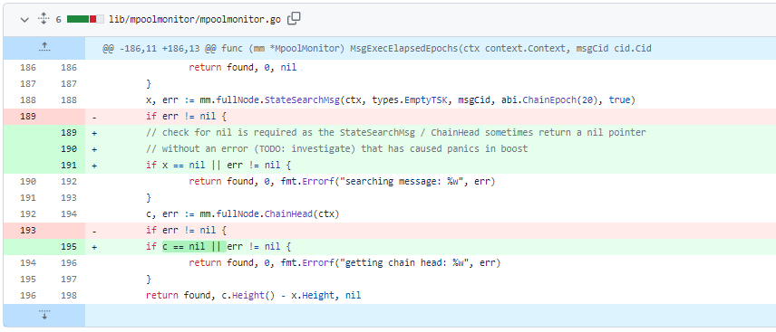
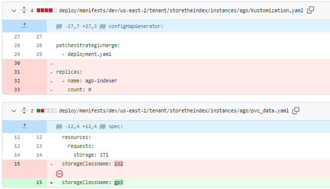
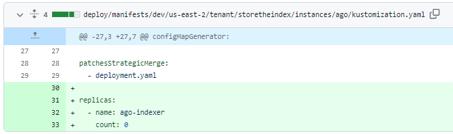
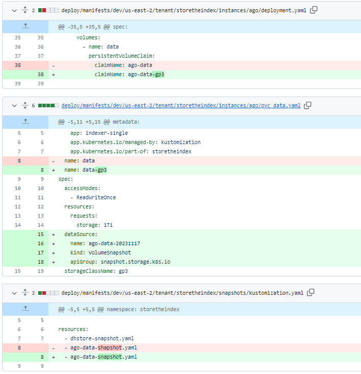
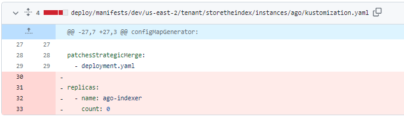
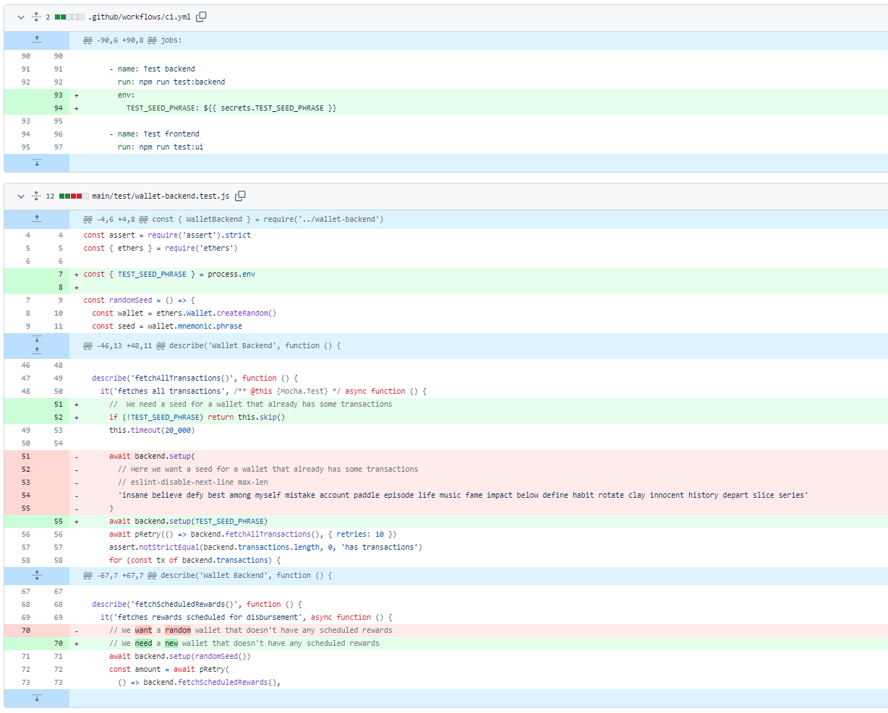
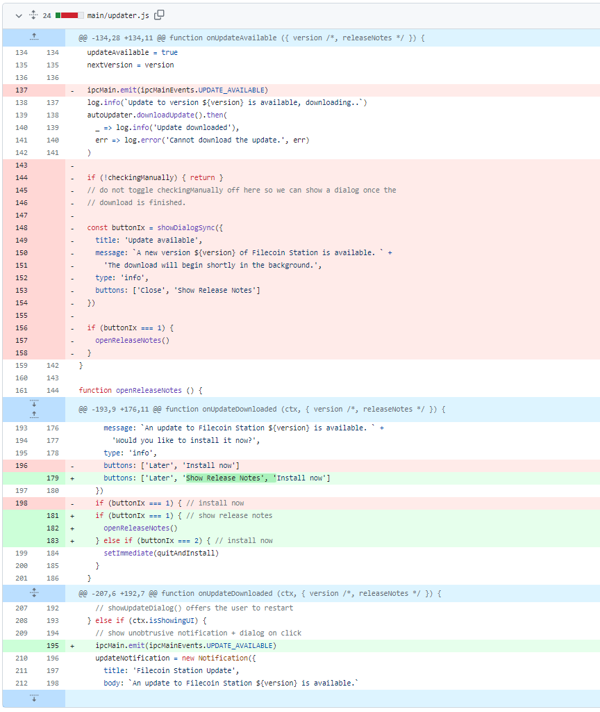
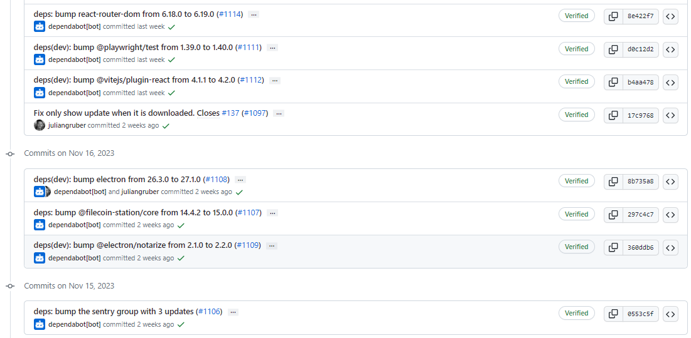
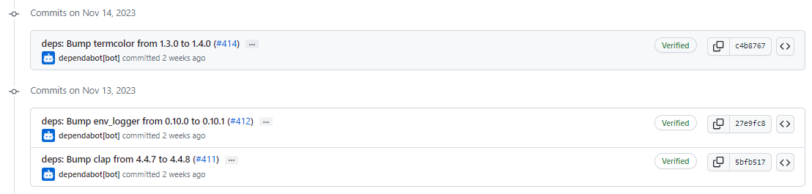
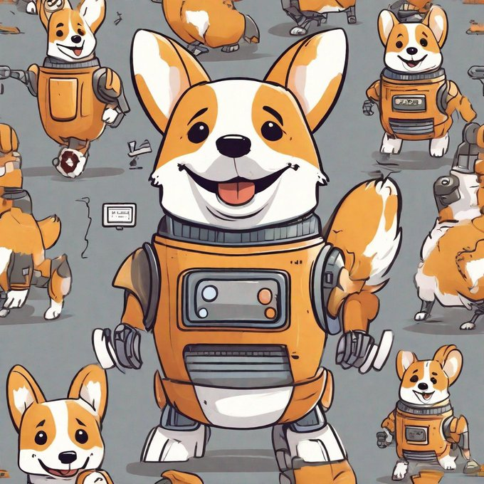

# 2023-11-19检索星球周报

## 🚀项目进展

### 1️⃣saturn

1. 将更新证书的几率提升至5%，10%，15%，然后分别进行测试
1. 检查证书中的唯一 SAN，每 12 小时将几率降至 1%，2%

###  2️⃣boost工具

1. fix: 修复 mpoolmonitor 中的 nil 指针恐慌问题

###  3️⃣storetheindex

1. 将新的 dhstore 部署到开发环境
1. 将最新的 dhstore 映像部署到开发中
1. 将最新的 dhstore 部署到 prod
1. 更新配置文件
1. 修复未指定地址的管理同步问题
   * 修复未指定地址的管理同步问题，当没有指定地址时，管理员同步命令会引起恐慌。已通过避免 nil multiaddr 得到修复。

   - 更新 go-libp2p 以修复计时器泄漏。
   - 更新版本
1. 将最新版本部署到开发环境
1. 在 prod 环境中更新 storetheindex/storetheindex
1. 在启动时删除所有临时数据的配置选项
   * 启动时删除所有临时数据的选项
   * 添加数据存储测试
1. 配置 dev sti 以在启动时删除临时数据
1. 更新开发环境中的 storetheindex/storetheindex
1. 停止前将 pvc 移至不同类型
1. 启动时不删除 tmp
1. 暂停更换 pvc，name: ago => ago-indexer
1. gp3 pvc 上的前数据

15. 暂停前等待新卷准备就绪

16. 创建 ago-data-snapshot
17. fix type

18. Unpause ago

### 4️⃣Station

##### desktop

1. 移除测试中使用的 pkey
   * 移除测试中使用的 pkey

   * 更新 main/test/wallet-backend.test.js

2. fix：计划奖励的格式化问题
   + 为格式化功能添加一些测试。修复这些新测试发现的问题。

3. 修复仅在下载更新时显示更新的问题。

   * 修复只在下载时显示更新的问题

   * 添加显示发布说明

4. 更新 @filecoin-station/core 至 16.0.1
5. 更新 desktop 至 1.0.3
6. 修复隐藏的 "模块日志另存为... "
7. 更新部分依赖项目

##### zinnia

1. 更新部分依赖项目

##  📢一周资讯

### 1. IPC

对IPC（星际共识）感兴趣吗？ 11 月 16 日在伊斯坦布尔发现更多！ 参加IPC活动并学习[@Lilypad_Tech](https://twitter.com/Lilypad_Tech)和[@fluence_project](https://twitter.com/fluence_project)等创新项目，积极利用IPC的能力。立即注册： [https://istanbul.ipc.space](https://t.co/SiLsNfK3Tf)

### 2.Lilypad

尝试过

[@Lilypad_Tech](https://twitter.com/Lilypad_Tech)的新 AI Studio 吗？

 [http://app.lilypad.tech](https://t.co/q5fJ8xku3l) 下面分享您的人工智能创作！  DALL-E 2、Stable Diffusion 和 GPT-4 等 AI 工具非常棒。然而，无论是新数据的培训还是使用，访问仍然受到限制。 

Lilypad AI Studio 让所有人都能免费使用高级人工智能。通过直观的网络界面探索 Lilypad 的生成模型……或者只是享受制作机器人柯基卡通的乐趣。

