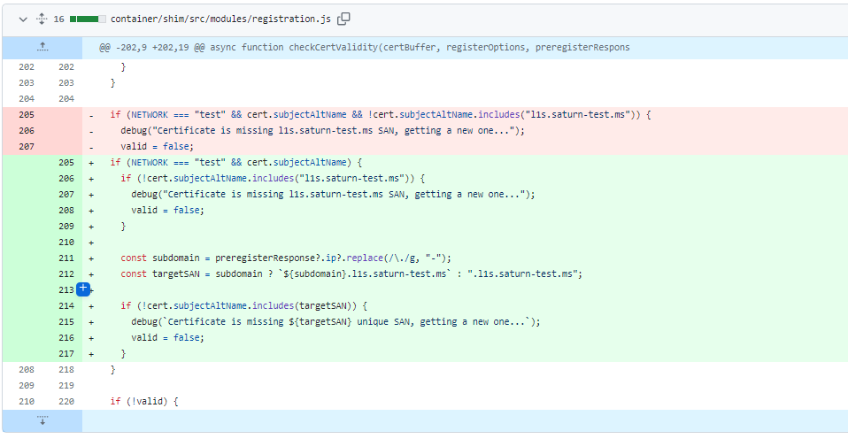
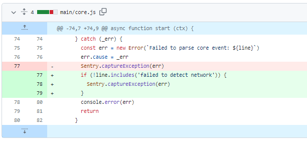
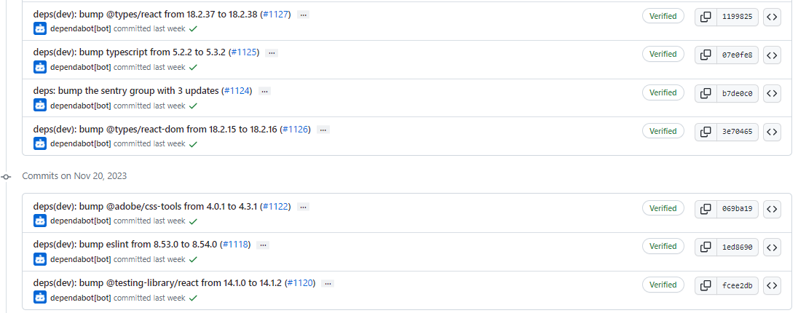
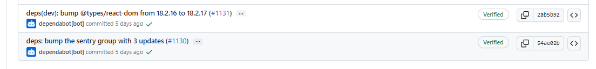
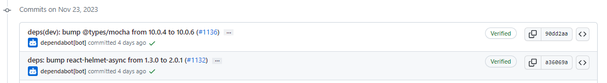
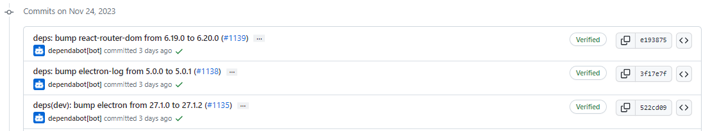
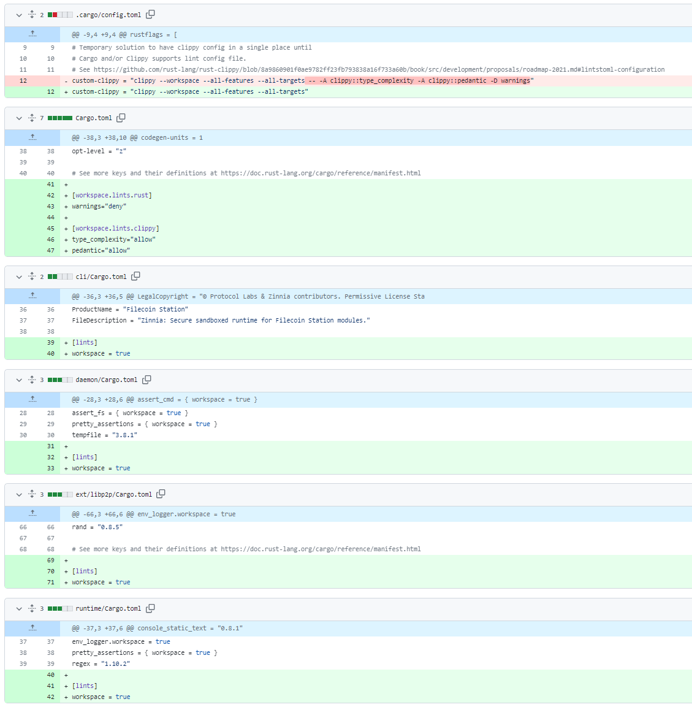

# 2023-11-26检索星球周报

## 🚀项目进展

### 1️⃣saturn

1. 在测试网中启用唯一证书验证

###  2️⃣boost工具

1. 添加按 ChainDealD 搜索
1. boostd-data: 添加 add-index debug cmd
1. 将 lotus 升级到 v1.25.0

###  3️⃣storetheindex

1. 部署新的 telemetry service
1. 更新核心
   + 更新 go-libipni 以获得泄露修复
   + 删除不必要的状态 ok 头设置调用
   + 移除布置会的管理员 API 端点
   + 移除不支持的管理导入命令
   + 删除未使用的函数
   + 更新版本
1. 将最新的 dhstore 部署到开发环境
1. 更新开发环境中的 storetheindex/storetheindex
1. 将最新的 indexstar 部署到开发中
1. 在 prod 环境中更新 storetheindex/storetheindex
1. 将最新的 dhstore 部署到 prod
1. 将最新的 indexstar 部署到 prod
1. 将 telemetry 技术部署到开发和生产阶段

### 4️⃣Station

##### desktop

1. 更新 filecoin-station/core 至 16-0-2
1. 更新 desktop 至 v1.0.4
1. 修复网络错误，填充 Sentry

4. 更新版本至 v1.0.5
5. CI： 增加自动批准电子日志更新补丁的功能
6. 部分依赖项目的更新

##### zinnia

1. feat: 将 Deno 升级至 v1.38.2
2. feat: 将 deno_std 升级至 0.207.0
3. chore: 将 lint 配置移至 Cargo.toml

4. chore: Release，更新版本 0.14.0 => 0.15.0

##  📢一周资讯

### 1. FILBangalore

[#FILBangalore](https://twitter.com/hashtag/FILBangalore?src=hashtag_click)注册正在进行中！

准备好在 Filecoin 和[@huddle01com](https://twitter.com/huddle01com)的推动下，与全球 web3 领导者进行为期 2 天的密集学习和交流。

+ 时间：2023 年 12 月 3-4 日
+ 酒店：Sheraton Grand
+ 注册： [https://fil-bangalore.io](https://t.co/XU6siH2611)

