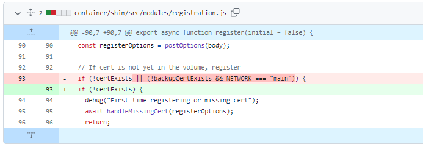
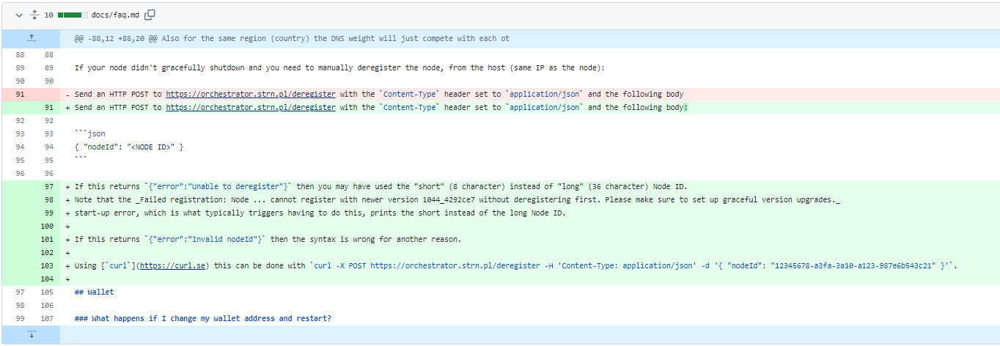
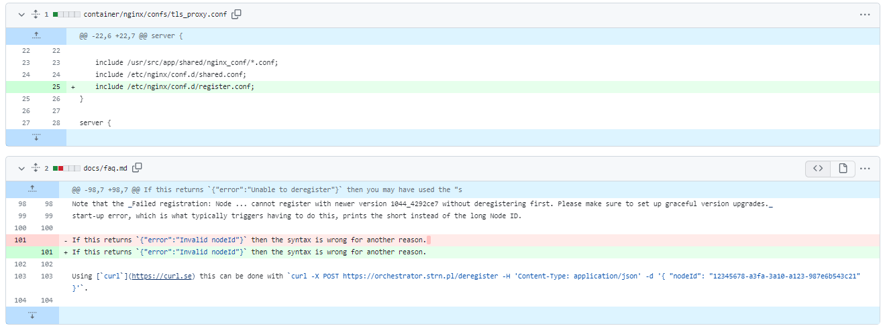
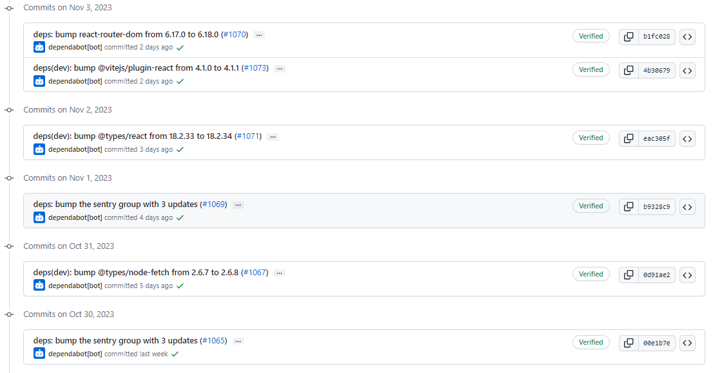
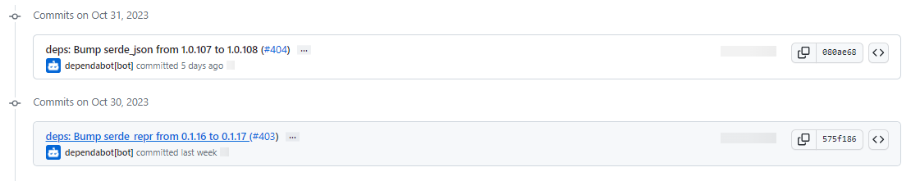

# 2023-11-5检索星球周报

## 🚀项目进展

### 1️⃣saturn

1. 不需要备份 cert 证书

2. JWT 验证

   + feat: 添加 jwt nginx 模块
   + feat: 将 CORS 标头添加到身份验证失败的请求中
   + ci: 向容器添加 jwt 公钥
   + test: 添加 jwt 集成测试
   + feat: 如果 jwt allow_list 存在，则不允许使用 origin header

3. docs: 明确手动注销

   

4. 导入注册路由到https server

   

###  2️⃣boost工具

1. 解决经济的安全问题通过升级 grpc 至 v1.56.3
1. boostx: 添加 Venus 到 stats cmd 中
1. fix: 使用新的 MaxSectorExpirationExtension
1. boostd-data: yugabyte 迁移问题
1. feat: 增加 boostd-data 指标
   + go mod tidy
   + 分离指标
   + 清除不正确的指标
   + 减少指标大小
   + 添加新的dashboards
   + 添加一些测试数据到boostd-data
   + 添加API指标到boostd
   + 升级 dashboard, 移除older
   + 删除视图名称信息
   + 使用独特的视图名称
1. 发布 v2.1.0-rc3 版本
1. fix: 加快数据插入 ydb 数据库的速度
1. yugabyte/service: car 索引的并行批量插入
1. fix yaml 格式

###  3️⃣storetheindex

1. 更新 github CD secret 对于所有的 pipelines
1. 更新项目依赖
1. 更新依赖项目的版本

### 4️⃣Station

##### desktop

1. 更新项目部分依赖

##### zinnia

1. 更新项目部分依赖

##  📢一周资讯

### 1. Filecoin and ETHGlobal in Istanbul!

准备好在伊斯坦布尔迎接[#Filecoin](https://twitter.com/hashtag/Filecoin?src=hashtag_click)和[@ETHGlobal](https://twitter.com/ETHGlobal)的激动人心的融合吧！

11 月 17 日至 19 日，Devconnect 之后，我们将举办一场令人难以置信的周末黑客马拉松。

超过 600,000 美元的奖品正在寻找获奖者！

立即申请： [https://ethglobal.com/events/istanbul](https://t.co/TKefqsFHBa)

### 2.Filecoin Labweek

呼叫 web3 创始人！ 11 月 16 日加入伊斯坦布尔的星际共识 (IPC) 团队，探索 Filecoin 可扩展性的未来。 聆听[@juanbenet](https://twitter.com/juanbenet)和其他人的演讲，他们揭示了将为全球范围的应用程序提供动力的革命性技术！ 

注册： [https://23.labweek.io/countdown-to-ipc](https://t.co/qA6BEbFUI2)

