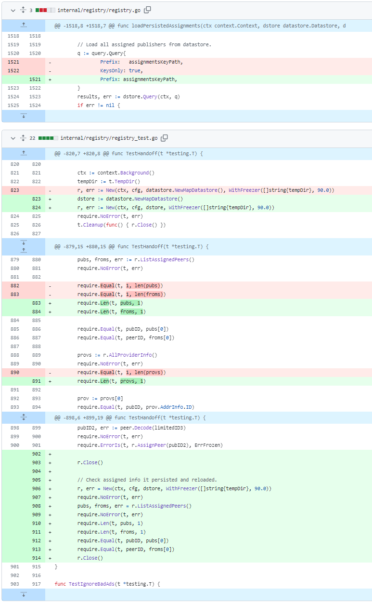

# 2023-12-10检索星球周报

## 🚀项目进展

### 1️⃣saturn

**L1-node**

1. feat: 使 jwt 成为可选项
   + test: 打印测试描述
   + test: 修正预期结果

2. chore: 添加引用字符串[skip ci]

###  2️⃣boost工具

1. 更新交易列表页面
   + 修复用户界面中的交易大小
   + 更新 react/src/DealDetail.js
2. 处理完成检查点

###  3️⃣storetheindex

1. fix: 修复加载持久化移交数据的错误
   + 当索引器从另一个冻结的索引器接收移交数据时，它会记住移交数据的来源。该数据会在重启时持续存在，但无法正确加载，并且在重启后无法加载源。

2. 在 dev 中创建新的 dhstore 节点
3. 使用新的 dhstore 节点
4. 重组配置，为 GC 和 小规模改进做准备
5. fix: 修复条码块读取失败时返回的错误
6. 添加应用程序接口，以行政方式将广告标记为已处理
7. 更新版本至 v0.8.10
8. 在生产环境中更新 storetheindex/storetheindex 版本
9. 将最新的版本部署到开发环境
10. 将带有 ipni-gc 可执行文件的索引镜像部署到开发环境
11. 在支持删除索引的 dev 上部署 dhstore
12. 使用新的 ipni-gc 部署索引器映像
13. 部署新的 ipni-gc
14. 更新内核，支持并发删除 dhstore
15. 提升 go-indexer-core 至 v0.8.5
16. 在生产环境中更新 storetheindex

### 4️⃣Station

**desktop**

1. CI: 添加自动批准 react-helmet-async 补丁更新
2. 工作站托盘显示总工作、钱包余额和计划奖励
   + lint fix
   + 计划奖励小数点后6位数
   + 修复模块错误
   + 将钱包余额格式化
   + 修复返回类型
3. 升级版本至v1.1.0

4. 部分项目依赖更新

**Zinnia**

1. 部分依赖项目的更新

##  📢一周资讯

### 1.Pragma India!

使用代码“FILBLR”即可获得免费通行证。行动迅速，不会持续太久！

:timer_clock: 2023 年 12 月 7 日

:ticket:[bit.ly/47IhE20](https://t.co/WaqwdXJ8vf)

**胡安加入ETHGlobal研讨会！**

