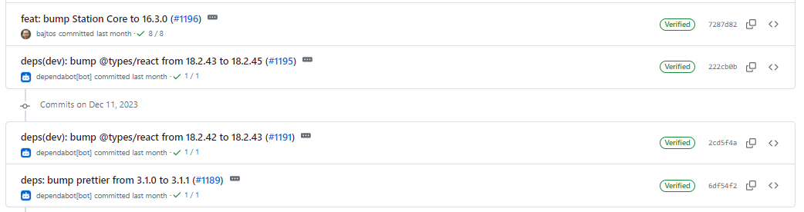
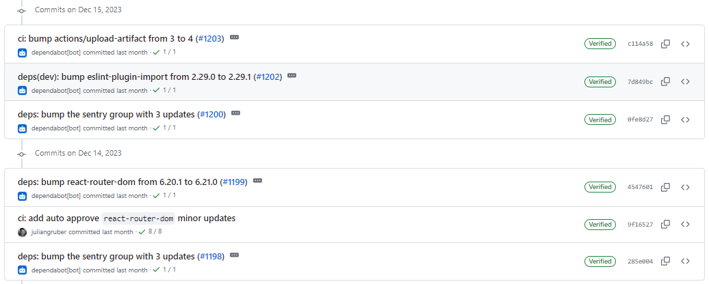
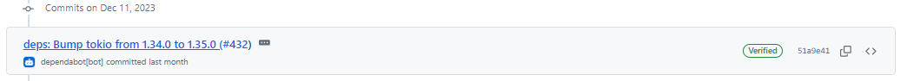
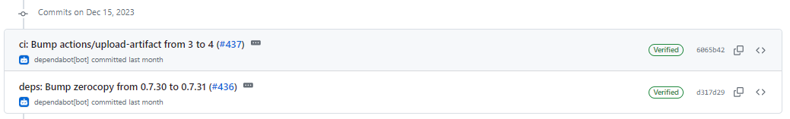
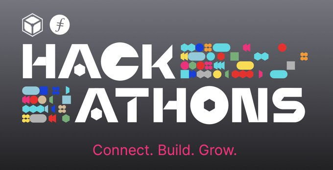

# 2023-12-17检索星球周报

## 🚀项目进展

### 1️⃣storetheindex

1.  添加 IPNI 垃圾收集功能

   * 增加 IPNI 垃圾收集功能

   * 如果可用，将 GC 状态保存在镜像文件中

     - GC 成功后，将数据存储保存在镜像上的压缩存档中。

     - 如果数据存储不存在，则从镜像上保存的存档中获取。

     - 如果镜像中没有，则从发布者处获取ad条目。

2. 在 docker 镜像中添加 ipnigc 可执行文件
3. 使用 storetheindex 配置
4. 默认索引器为 localhost
5. 如果ad不可用，则跳过删除索引
6. 可配置批量大小
7. 在只知道发布者的情况下删除所有内容
8. 执行守护进程命令
9. 在删除索引前处理ad链
10. 更新 storetheindex 至 v0.8.12
11. 允许删除 GC 所需的 s3
12. 部署支持索引删除的最新 dhstore
13. 减少轮询间隔，以考虑到较低的发布子传播率
14. 通过 provider ID 识别 ipni-gc 资源
15. 更新 storetheindex 至 v0.8.13
16. 在 prod 环境中更新 storetheindex/storetheindex
17. 将 assigner 更新为最新版本

###  2️⃣Station

**desktop**

1. feat: 将 Station Core 升级到 16.3.0
1. feat: 将 station 升级到 1.2.0
1. CI：添加自动批准 react-router-dom 的更新
1. 部分依赖项目的更新

**Zinnia**

1. feat: 将 "lassie "升级到 v0.8.0 
1. feat: 将 Deno 升级到 1.38.5
1. chore: release
1. 部分依赖项目的更新

##  📢一周资讯

### 1.Filecoin Hackathons

使用 Filecoin 和 IPFS 彻底改变网络。

平台使您（开发人员和企业家）能够解决现实世界的问题并开创突破性的应用程序。 

加入下一场黑客马拉松，塑造一个更加去中心化、有弹性和安全的互联网。

[https://hackathons.filecoin.io](https://t.co/XORx0brARa)

### 2.Explosive growth in the Filecoin ecosystem!

Filecoin 生态系统的爆炸式增长！

1. 2023 年加入的数据总量将增长 4 倍
2. 200 万 TB 的客户数据，涵盖研究、高等教育和网络3
3. 自 FVM 于 3 月推出以来，TVL 已达 1.65 亿美元，每月增长约 45
4. 启动数据和检索网络计算

