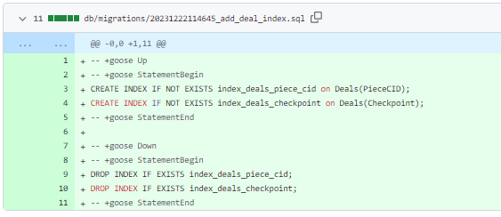
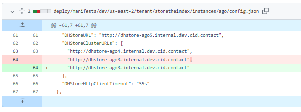
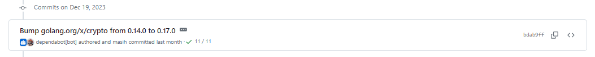
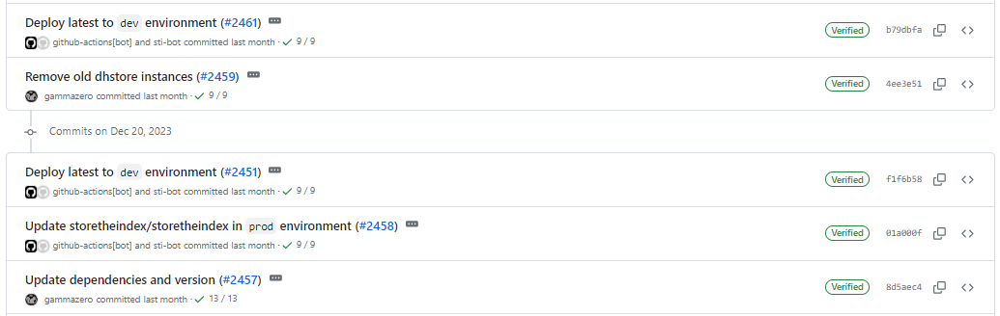
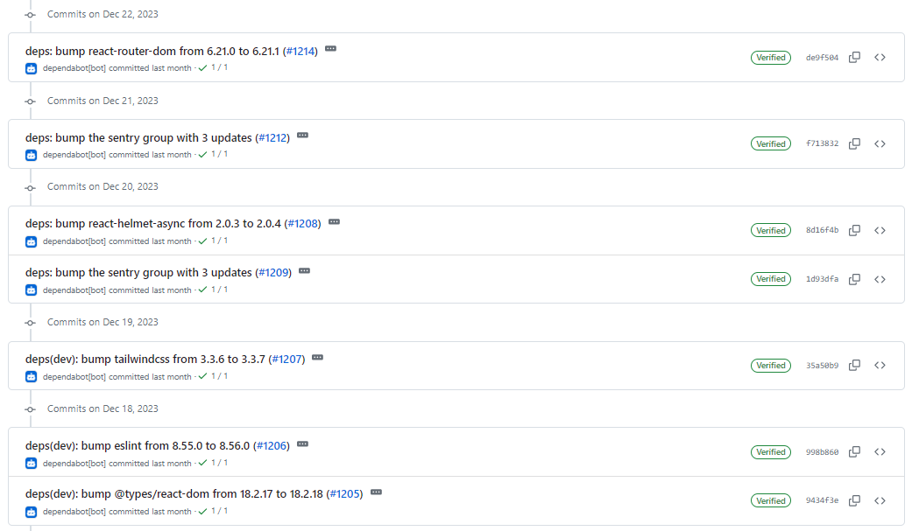
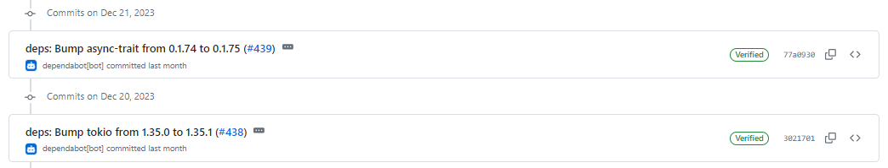
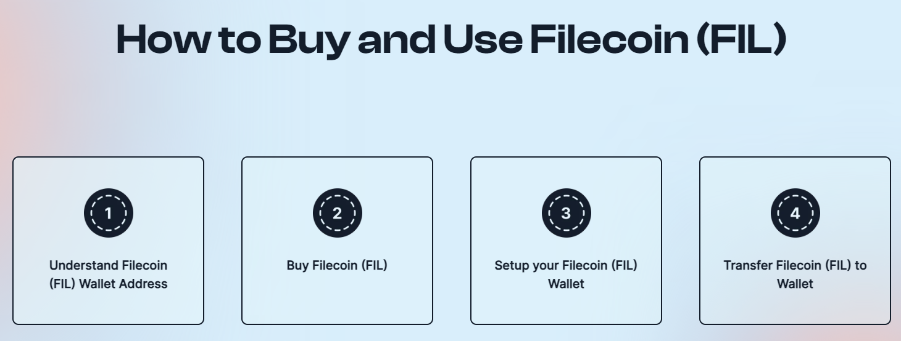

# 2023-12-24检索星球周报

## 🚀项目进展

### 1️⃣saturn

**L1-node**

1. 更新自述文件，说明如何申请节点的月收益
2. 将 "付款 "改为 "支付"。将 "接收收入 "改为"申请收入
3. 更新文档，说明节点收入的申报过程

###  2️⃣boost工具

1. fix: 配置禁用的 piece doctor，修复丢失的cfg
1. 预取状态声称将对 Lotus 状态的 O(n) 调用改为 O(1) 
1. 为交易数据库添加索引

4. 清理旧的 fund manager logs
5. doc: 修复区块服务的标志信息和错误信息

###  3️⃣storetheindex

1. 停止执行最久的两个 dhstores
1. fix: fix ago config

3. 删除旧的 dhstore 实例
4. 在 prod 中部署 dhstore tetra 以接管 seka 的写入工作
5. 部分依赖项目的升级

### 4️⃣Station

**desktop**

1. 部分依赖项目的升级

**Zinnia**

1. 部分依赖项目的更新

##  📢一周资讯

### 1. Be part of the Filecoin ecosystem

想成为 #Filecoin 生态系统的一员，但想知道如何获得 FIL？请阅读以下文章：

1. FIL 钱包地址类型
2. 在哪里购买 FIL
3. 兼容钱包
4. 如何转移 FIL

https://filecointldr.io/how-to-buy-filecoin

