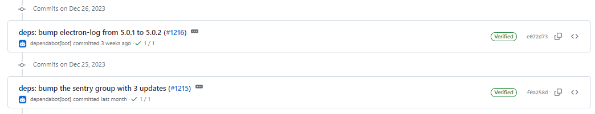
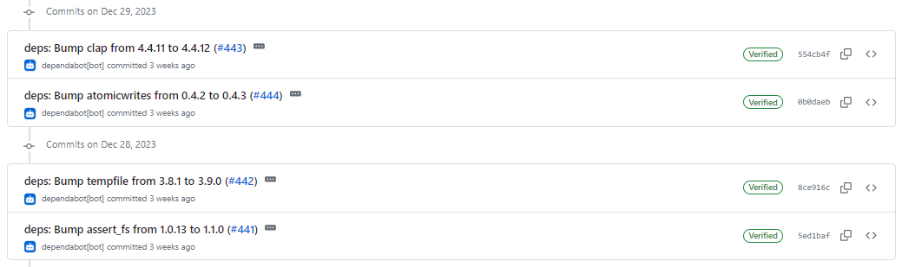

# 2023-12-31检索星球周报

## 🚀项目进展

### 1️⃣storetheindex

1. 在 GC 期间分段处理 ad 链
   + 删除提交标记
   + 如果未配置，则使用默认临时目录
2. 将最新版本部署到开发环境
3. 按模块同步 ad chain
4. 更新开发环境中的 storetheindex/storetheindex

###  2️⃣Station

**desktop**

1. 更新项目部分依赖

**Zinnia**

1. 更新项目部分依赖

##  📢一周资讯

### 1.Happy holidays

展望 2023 年，我们非常高兴能与大家一起成为社区的一员。  让我们为所有杰出的建设者、创新的创始人、技术精湛的开发人员和尽职尽责的存储提供商喝彩--团结起来，我们势不可挡！

节日快乐，祝 2024 年欣欣向荣！

