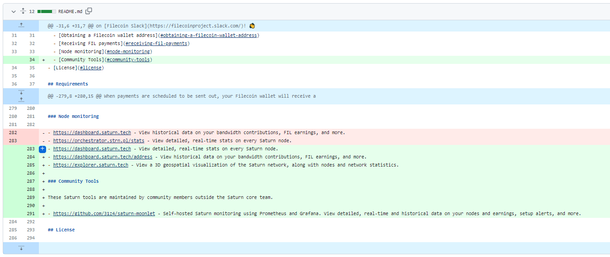
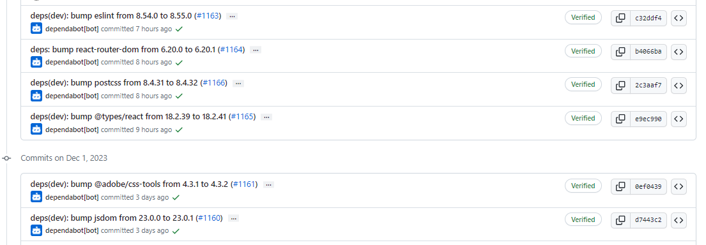
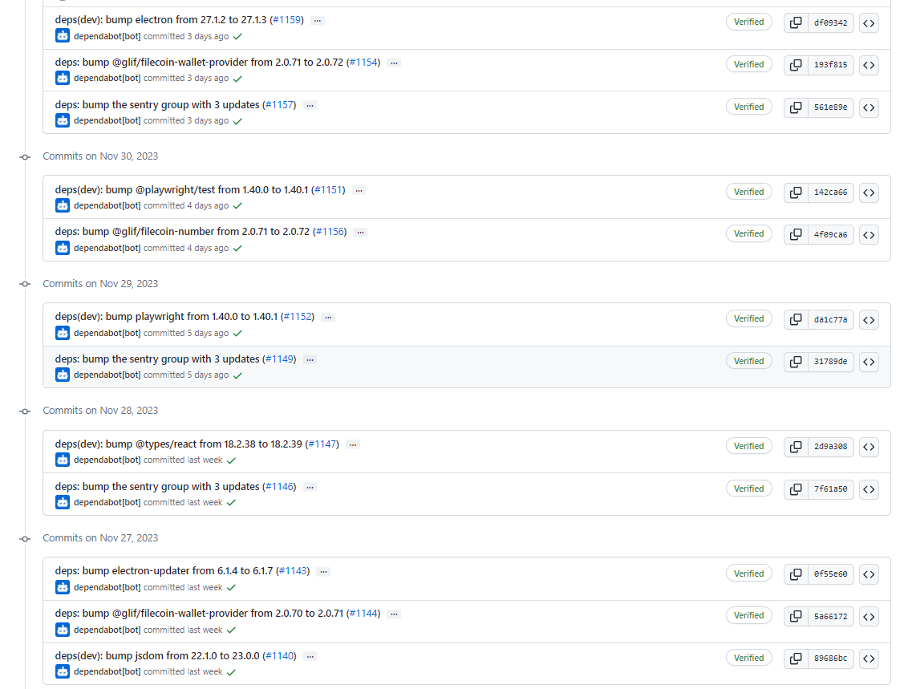
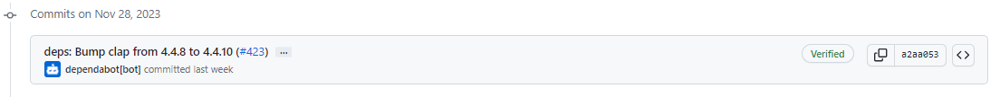
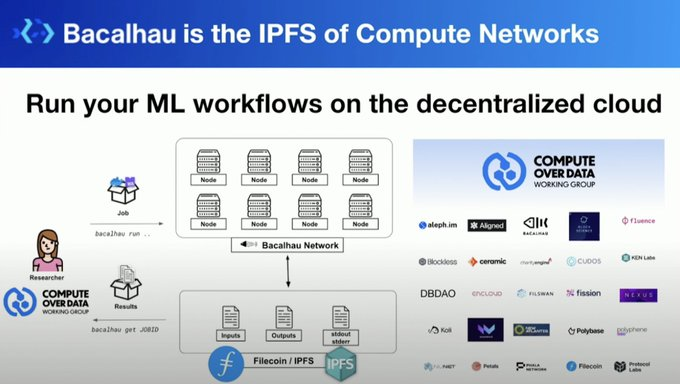

# 2023-12-3检索星球周报

## 🚀项目进展

### 1️⃣saturn

1. 完善并扩展 README 中的节点监控部分
1. 更新 README.md

###  2️⃣boost工具

1. fix: parametrise 添加索引并行性
   + 新增两个配置参数：
     + 用于boostd的AddIndexConcurrency，用于设置添加索引操作可分割成的并发任务数量
     + 用于boostd的insert-concurrency，用于设置添加索引操作可分割成的并发任务数量
     + 将默认添加索引并发数改为1
     + 检查最大插入批次大小
1. piece-directory: 确保正确的处理请求
1. fix: 将默认添加索引并发量设置为8
1. test: 进行一个 flaky test
1. booster-http: 添加 pprof-port 标志
1. fix：改进错误信息的格式
1. boostx：在 api 不匹配时打印警告而不是退出
1. release v2.1.1
1. feat: 数据段索引

###  3️⃣Station

##### desktop

1. CI：添加自动批准 jsdom 补丁更新的功能
1. CI：添加自动批准 react-helmet-async 补丁更新
1. 部分依赖项目的更新

##### zinnia

1. 更新部分依赖项目

##  📢一周资讯

### 1. Bacalhau

**什么是Bacalhau?**

Bacalhau 使计算作业能够在存储数据的地方运行，而不是首先将数据移动到集中式云数据中心。 

[@BacalhauProject](https://twitter.com/BacalhauProject)建立在[@IPFS](https://twitter.com/IPFS)和[#Filecoin](https://twitter.com/hashtag/Filecoin?src=hashtag_click)之上，旨在在分布式数据集和网络上工作。

**为什么是Bacalhau?**

1. 更快的处理速度
2. 更低的成本
3. 安全
4. 拥有大规模数据的处理能力

[docs](https://docs.bacalhau.org/)

### 2.FILBangalore 2023

在 FILBangalore 探索 IPC 的力量！ 在活动中[@juanbenet](https://twitter.com/juanbenet)将深入探讨 Filecoin 和 web3 的未来， [@momack28](https://twitter.com/momack28)将讨论使用 IPC 扩展 Filecoin 存储 + 计算的所有内容， [@hammertoe](https://twitter.com/HammerToe)将讨论使用 IPC 实现突破性扩展。

[link](https://fil-bangalore.io/)

