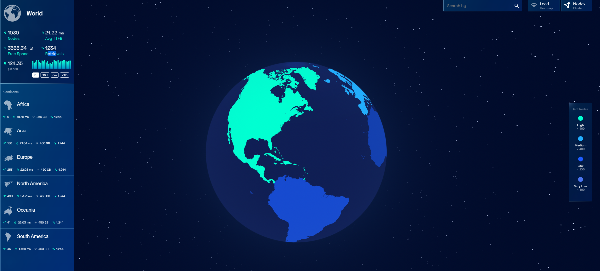
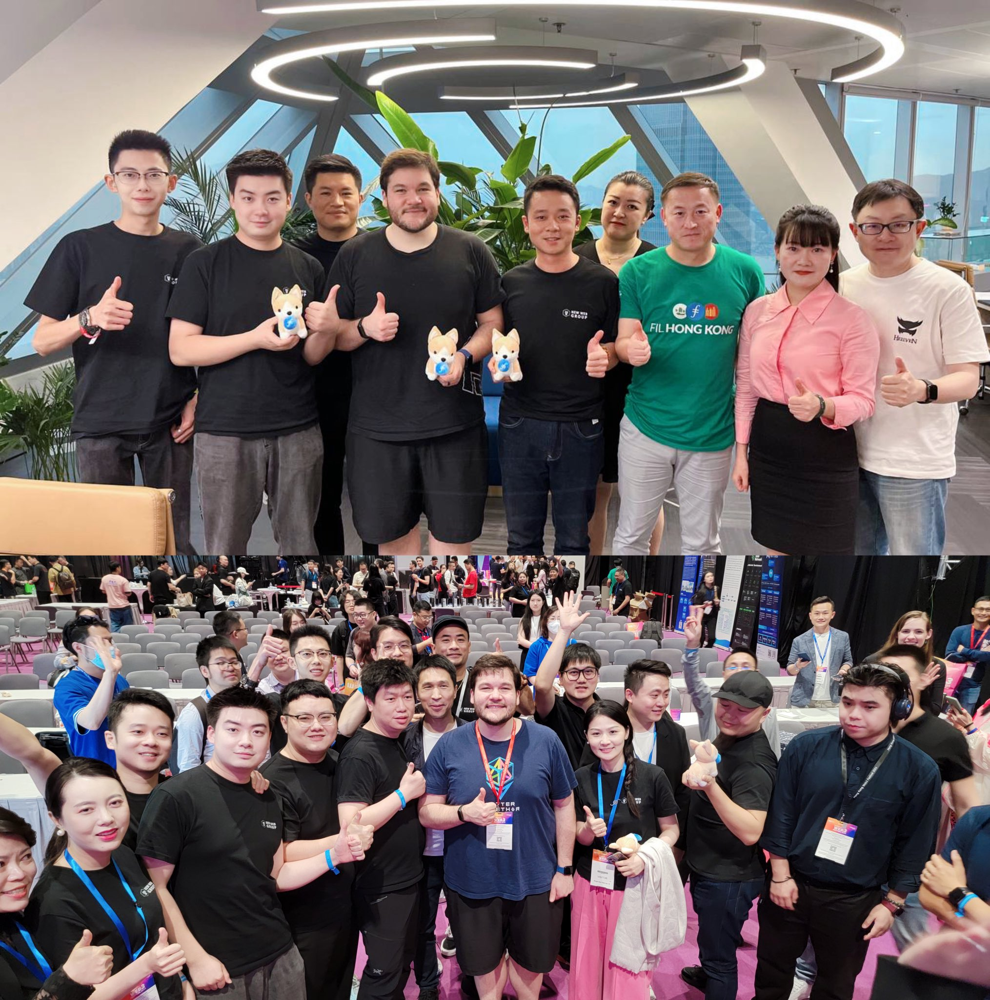

# 2023-4-21检索星球周报

## 🪐saturn数据播报

全球节点数量达到1030

TTFB达到21.22ms

retrievals数量达到1234

空余空间为3565.34TB

## 🚀项目进展

### 1️⃣saturn

**L1-node**

1.container/shim/src/fetchers/lassie.js-->修复服务器时间

2.docker_compose_update.sh-->移除Core-L1专用的配置

3.Dockerfile---->排除随机的peerId，以防止默认构建的破坏

4.docker_compose_update.sh-->允许不设置docker compose的更新环境

###  2️⃣boost工具

1.修复：备份--数据库连接挂起

2.修复：数据库迁移排序

3.升级：版本升级到1.7.0，lotus 版本v1.23.0-rc1

###  3️⃣storetheindex

1.将最新版本部署到inga

2.最新修复的新版本   从v0.6.3变成v0.6.4

3.更新ingest.md
更新发布者和公告发送者的链接和描述。

4.ago-indexer，IngestWorkerCount数目多次变更 15-->10-->13-->8-->16-->10

5.修复手动同步的死锁
手动同步创建了一个通道，将adProcessed事件写入其中。如果多个事件在被读取之前被写入该通道，这可能导致工作者阻塞，等待写入该通道。如果工作者被阻塞，他们将不会读取SyncFinished事件。如果SyncFinished事件没有被读取，那么dagsync的同步就不会完成。当这种情况发生时，原来的手动同步可能不会完成，通道也不会被读取，从而进入一个死锁状态。

通过让手动同步创建一个不能填满和阻塞的通道，修复了这个问题。这也将有助于防止阻塞其他试图写入adProcessed事件的工作者。

6.让工作者直接读取SyncFinishedEvents

移除从dagsync读取SyncFinishedEvents的不需要的goroutine，并将其放入工人读取的另一个通道，让工人直接读取事件。

* 为手动广告链同步增加超时时间

7.增加saturn Lassie事件记录器db的大小到1500

8.停止测试分支的ecr构建

### 4️⃣Station

1.更新依赖：将tailwindcss从3.2.7升级到3.3.1

2.将@glif/filecoin-number从2.0.48提升至2.0.57

3.将undici从5.20.0升级到5.21.0

4.将@types/react从18.0.28提升到18.0.35

5.@glif/filecoin-wallet-provider从 2.0.48 升级到 2.0.57

6.@typescript-eslint/eslint-plugin从 5.57.1 升级到5.59.0 

7.将typescript从5.0.3升级到5.0.4

8.测试：增加时延

9.将regex从1.7.3升级到1.8.0

##  📢一周资讯

1.检索市场团队的部分人员参与 IPFS þing
    - 2023年4月17日的演讲，涉及Rhea计划和saturn网络。

2.Saturn 进入web3

- 向所有节点运营商推广支付

3.web3 Festival 结束啦

4.huddle01与fvm研讨会进行中   4月17日-5月3日

5.saturn预售调整如下:大型space station只能通过小型space station升级，大型space station的FILS代币将减半至10000。
