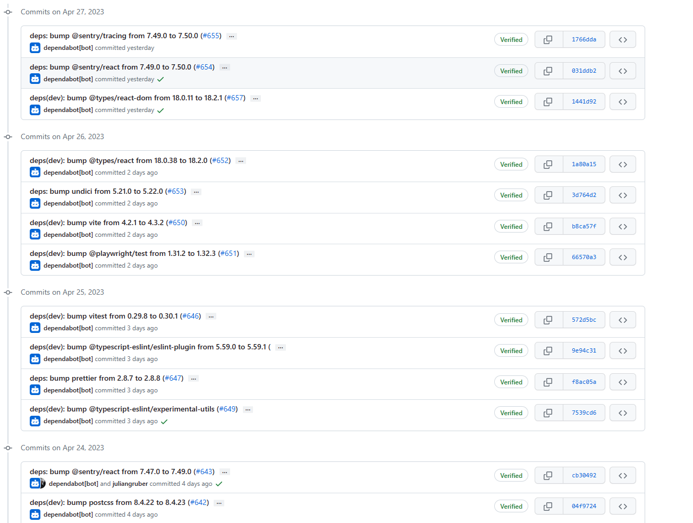
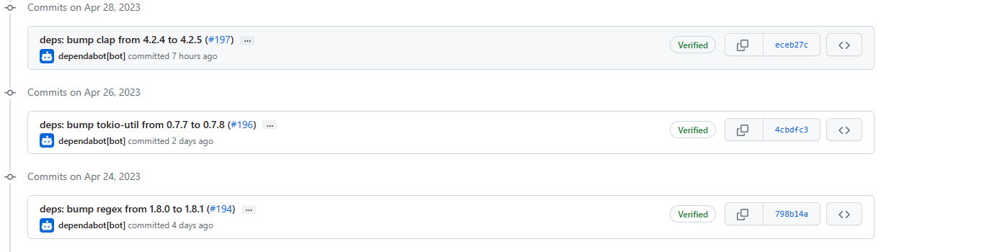

# 2023-4-28检索星球周报

## 🪐saturn数据播报

全球节点数量达到1030

TTFB达到21.22ms

retrievals数量达到1234

空余空间为3565.34TB

## 🚀项目进展

### 1️⃣saturn

**L1-node**

1.如果查询参数不存在，默认car_scope缓存键为'all'。

2.集成car_range nginx模块

3.更新 Lassie v0.8.2

4.在FAQ上运行更漂亮

###  2️⃣boost工具

1.修复：main里的docsgen

2.增加禁用资金标记的标志

3.发布v1.7.1版本 

4.修复：防止意外删除有效的部门指数公告

###  3️⃣storetheindex

1.添加dhfind-helga并将其与indexstar-canary连接起来

2.恢复 "将dhfind指向indexstar进行供应商查询"

3.将最新版本部署到prod环境

4.在prod中获取dhstore快照

5.恢复 "增加prod dhstore PVC至20Ti"

6.修复dhstore-helga的容器名称

7.将canary流量增加到20%

8.将dev中的dhfind和dhstore加入查询路径中。

9.在开发中显露出dhfind

10.在prod中关闭dhfind模拟模式
这样做是为了比较模拟与非模拟的性能，以及它对真实流量的查询指标的影响。

### 4️⃣Station

1.更新了许多依赖：

2.zinnia更新了许多依赖：

##  📢一周资讯

1. space station第一阶段的资金已经安全转入LP池

2. 推出Filecoin Web Services (FWS)，FWS是一个计算、存储和网络服务的堆栈，开发者可以用它来建立分散的应用程序。其旨在打造AWS、谷歌云和Azure的开源替代品。

   

   

FWS详见：[宣布 FWS。FWS（Filecoin网络服务）是一组... |作者：FWS |四月， 2023 |中等 (medium.com)](https://medium.com/@fw.services/announcing-fws-5e874e949fc6)

3.活动：**FVM Dataverse Hack**

💰高达60,000美元的奖品 
📅 5月1日至31日

FVM Dataverse Hack是构建项目的机会，这些项目可能成为Filecoin生态系统中的核心构建块：无论是帮助最终用户从去中心化存储网络属性中受益的产品，还是Filecoin岛经济的DeFi应用程序，或者将来可能帮助成千上万的开发人员在Filecoin上构建dApp的开发人员工具都能来参与。

比赛报名链接：[FVM Dataverse Hack: Build the new data economy with the Filecoin Virtual Machine - Devpost](https://fvmdataverse.devpost.com/)

