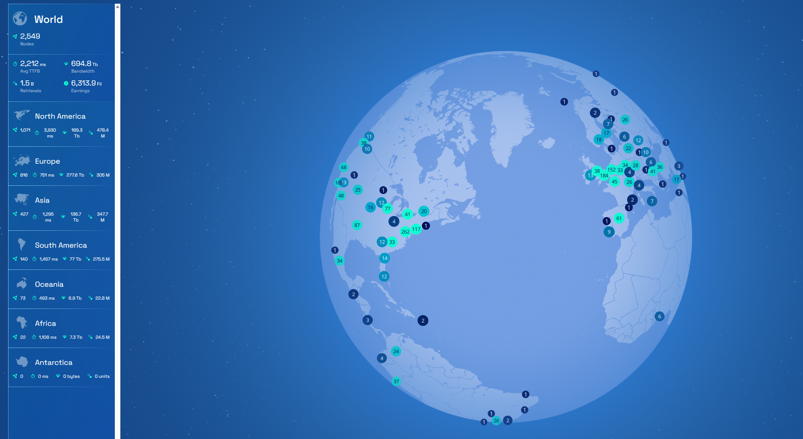

# 2023-5-14检索星球周报

## 🪐saturn数据播报

全球节点数量达到2549

TTFB达到2212ms

retrievals数量达到1.5B

带宽为694.8TB

## 🚀项目进展

### 1️⃣saturn

**L1-node**

1.合并来自filecoin-saturn/fix/no-bifrost-kubo的拉动请求

2.提高费率限制

3.更新lassie至v0.9.2

4.合并来自kylehuntsman/lassie/v0.9.2的拉动请求

5.增加sendfile_max_chunk和directio值

6.将工人连接数增加到20K

7.在容器启动时清理lassie目录中的遗留文件

8.将指令的最小大小增加到100米

9.禁用aio和directio

**L2-node**

1.更新L1发现终端

**caboose**

1.合并来自filecoin-saturn/feat/mirror的拉动请求

2.IsJustAKey不能像预期那样工作

3.将远程跟踪分支'origin/main'并入feat/mirror

###  2️⃣boost工具

1.修复：boostd数据传输命令的使用注释

2.修复：下载块的链接间距

3.修复：如果快照交易部门密封失败，则交易失败。

4.更新commp utils

5.发布 v1.7.3-rc1

6.更新README.md

7.为Boost启用列出的API方法

###  3️⃣storetheindex

1.将oden的工人从20人减少到10人

2.将现有的后端插入到canary中

3.记录提供者最后一次被看到的时间

4.删除投票覆盖，因为公告是由分配者转发的。

5.为互联网档案馆的顶级CID推出查询覆盖率检查

6.让sti节点成为第一个indexstar后端

7.用更多的Gs请求来更新libipni

### 4️⃣Station

1.zinnia v0.8.0和station core v0.9.0发布了

2.降`glibc`版本以兼容Linux/Docker

3.添加Zinniad作为主要模块运行时间

4.添加Bacalhau作为`实验`模块

5.改进station桌面的API

**desktop**

1.修复代码签名

2.将postcss-loader从7.2.4提升到7.3.0

3.修复更多的内核崩溃问题

4.将@typescript-eslint/parser从5.59.2升级到5.59.5

5.修复Core没有node_modules的问题

**Zinnia**

1.为 zinniad 添加 README

2.允许导入模块本地的JS文件

允许Zinnia模块导入其他的JavaScript文件，这些文件在模块目录下的其他JavaScript文件。模块目录被确定为主模块文件的父模块目录被确定为主模块文件（入口）的父目录。

3.在测试中利用ES模块

4.修复：在检查模块路径之前解决符号链接。当从文件系统加载模块时，先解决模块路径中的符号链接路径中的符号链接，然后再检查目标文件是否在模块的根目录（沙盒）内。

##  📢一周资讯

1.Filecoin News 66发布了

- Waterlily作为第一个道德生成性人工智能艺术平台正式启动
- IPC子网支持到Filecoin Spacenet
- 更多看这里：[文件币新闻 66 (filecoin.io)](https://filecoin.io/blog/posts/filecoin-news-66/)

2.目前约有1.7亿的FIL被锁定或烧毁，约占完全稀释的供应量的8%，或已铸造或归属的供应量的30%（流通供应）

3.brave最近宣布了自动 NFT 备份和增强的 Brave 钱包中的 Filecoin 支持！

4.发布filecoin和IPFS生态系统综述： 2023年5月完整报告

视频链接：[Filecoin & IPFS Ecosystem Roundup: May 2023 Full Presentation - YouTube](https://www.youtube.com/watch?v=kXnSklUL5NE&t=3018s)

