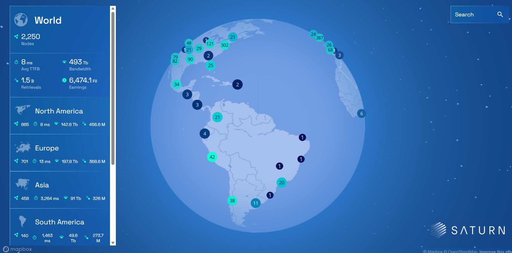
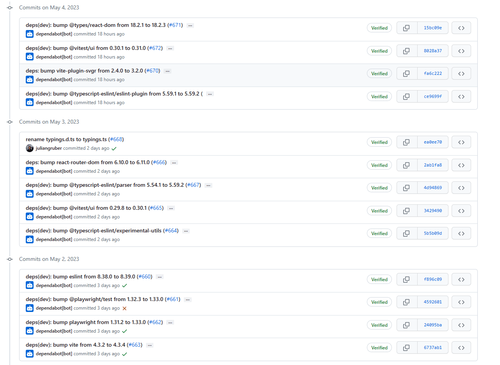
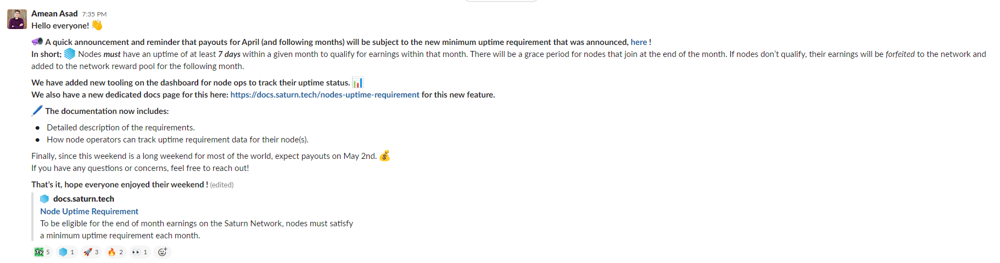

# 2023-5-6检索星球周报

## 🪐saturn数据播报

全球节点数量达到2250

TTFB达到8ms

retrievals数量达到1.5billion

带宽为6474.1TB

### saturn近期目标：

- 完成cdn域名从"[strn.pl](http://strn.pl) "到 "saturn.ms "的迁移。
- 寻找外部团队来建立Saturn客户门户
- 探索取代bunny DNS的下一步措施，bunny DNS已经成为网络增长和可扩展性的瓶颈。
- 为客户设计计量和计费
- 改进反欺诈

## 🚀项目进展

### 1️⃣saturn

1.Saturn explorer合约完成

地址:[Saturn Explorer (filecoin-saturn.github.io)](https://filecoin-saturn.github.io/saturn-network-explorer/)

2.文档网站上线：[Saturn Docs](https://docs.saturn.tech/)

#### L1-node

1.更新lassie至v0.9.0
聚集了事件指标，并修复了小的环境变量和日志级别的错误

2.Lassie度量的报告格式

3.合并来自filecoin-saturn/aa/uptime-req-ui的第41号拉动请求

###  2️⃣boost工具

1.在devnet中默认启用文件网关

2.为等待数据的离线交易添加取消按钮

3.更新Lotus和FFI版本

4.把g.activeRetrievals放在各地的锁后面

###  3️⃣storetheindex

1.将最新版本部署到inga

2.减少ingest工人的数量到5

3.删除prod中旧的dhstore pvc

4.在prod dhstore中使用新图片

5.将最新版本部署到prod环境

6.为新版本更新仓库和版本

7.提高dhfind的RAM以适应IPFS.io的流量

8.使用广告链中的最新地址

如果第一个广告没有提供者地址，那么就使用广告链中下一个可用的地址。这解决了在摄取长广告链时的一个问题，即收到的第一个广告缺少提供者地址。当这种情况发生时，索引器将恢复到其旧的行为，将当前的提供者地址更新为正在摄取的广告中的任何内容。这可能是一个旧的、不再有效的地址，直到摄取链中后来的广告才会更新为当前地址。这个修正使用链中最新的提供者地址，即使第一个广告缺少提供者地址。

9.修改撤消广告计数器的公制

10.在开发中部署新的indexstar

11.从黑客分支建立ECR

12.将inga添加到canary查询路径中

13.更新Saturn-lassie-event-recorder.tf

14.移除prod canary中现有的索引器

### 4️⃣Station

1.**Station Core 👉 Station Desktop 整合被推迟**

2.**Zinnia 👉 Station Core 整合被推迟**

3.SPARK是新的存储提供者检索检查器模块的名称，Station团队正在进行这项工作

具体可见：[filecoin-station/spark: 💥 Storage Provider Retrieval Checker as a Filecoin Station Module 🛰️ (github.com)](https://github.com/filecoin-station/spark)

4.重命名typings.d.ts为typings.ts

5.更新很多依赖

6.增加：在重新启动的过程中持续保存工作计数器

7.在linux-x64的构建中使用旧的glibc

在这个改变之前，`zinniad'的发布版本在某些Linux发行版上会崩溃

8.部署：将clap从4.2.5升级到4.2.7

##  📢一周资讯

1.Dataverse Hack研讨会

链接：[FILBuilders - Twitch](https://www.twitch.tv/filbuilders)

2.Saturn： 节点必须在某个月内有至少7天的正常运行时间，才有资格获得该月的收入。对于在月底加入的节点，将有一个宽限期。如果节点不符合条件，他们的收入将被没收，并加入到下个月的网络奖励池中。

我们在仪表板上增加了新的工具，供节点操作人员跟踪他们的正常运行时间状态

