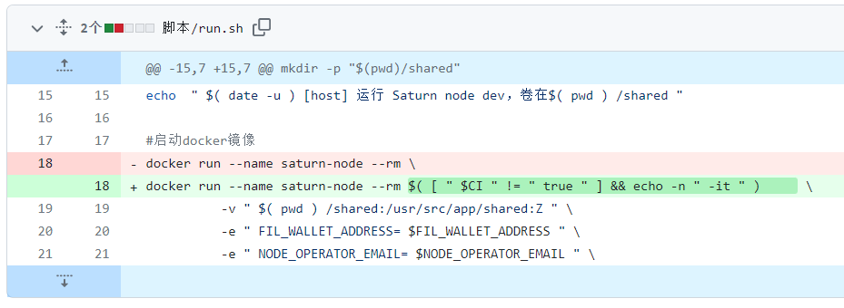

# 2023-6-11检索星球周报

## 🚀项目进展

### 1️⃣saturn

**L1-node**

1.更新`Dockerfile`文件的`car range`模块版本

2.更新`scripts/integration_tests.sh`文件的字节参数

3.**feat(deps)**: `Dockerfile`文件将 `lassie` 更新到 v0.12.0

4.`scripts/run.sh`文件中修改命令，允许用户可以不在`CI`为true时，用户进行交互

5.合并拉取了`filecoin-saturn/integrate_bifrost`项目

6.获取了新的证书

7.修复哈希摘要错误

8.将`strn.pl`重定向到`saturn.ms`

9.**feat(deps)**: 更新`lassie`到 v0.12.1

10.允许`CORS`重定向

11.测试新的范围请求版本

12.整合`filecoin-saturn/tc/range-reqs-v2`

13.更新`shim deps`

**caboose**

1.整合了`filecoin-saturn/test/mirroring`项目，添加镜像测试功能

###  2️⃣boost工具

1.发布了 `v1.7.3`

2.**feat**:添加配置命令

* 增加了配置命令
* 重构，增加了不同的命令
* 合并了一些函数，减少不同的输出
* 修理了一些问题

###  3️⃣storetheindex

1.在剩余的开发节点上将 DHStore 批处理大小增加 4 倍

2.在 dev 中显式设置 dhstore 无状态资源

3.增加 dhstore-stateless 实例的 CPU利用率

4.将每个 pod 的 FDB 存储进程增加到 5

5.在生产中创建 FDB CRD

6.按时间跨度将 heyfil 指标部署到开发和生产

7.公开开发分配器 p2p 端口以进行对等

+ 公开开发分配器 p2p 端口以进行对等
+ 添加服务外部资源
+ 配置产品分配器与开发分配器对等

8.删除对 storethehash valuestore 的支持

9.将核心更新到最新标记版本

+ 将`kubo`更新到最新
+ 新发行版本

10.部署最新的分配器

11.将最新的分配器部署到生产中

12.对等开发分配器到生产分配器

13.部署最新的开发

14.将 inga 索引器体积增加到 160G

15.在生产中部署最新版本的cassette

16.更新到最新的 go-libipni

17.添加额外的 gp3 存储类到生产中

18.inga 没有价值存储

19.inga的PVC增加到1Ti

20.为 inga 添加所需的容忍度

### 4️⃣Station

**desktop**

1.清理了一下代码，减少了一些不必要的log输出

2.将`filecoin-sation/core@13.0.2`升级到`filecoin-sation/core@13.0.3`

3.将`filecoin-sation` v0.18.2 升级到 v0.18.3

4.**core**：修复过于严格的错误处理

+ core: 修复过于严格的错误处理
+ `continue` 循环出现 `JSON.parse` 错误
+ 改进错误信息
+ 修复类型

5.更新许多依赖

**Zinnia**

1.更新了部分依耐项

##  📢一周资讯

**1.HackFS 2023 Week 2**

1. 6月5月，亲身体验Filecoin上的存储和检索，进入高效存储的世界！
2. 6月5日，将指导您使用 Filecoin 和FEVM 构建应用程序。 了解如何利用这些工具创建突破性的去中心化的应用程序。 📲
3. 6月5日，发现通用连接的力量——libp2p，在去中心化网络上无缝连接和协作！🌐
4. 6月6日，与 Patrick McClurg 一起释放 drand 和时间锁加密的潜力。 发现确保项目安全和信任的新方法。 🔒
5. 6月6日，与Elizabeth Griffiths一起探索 NFTdotStorage和Web3存储。 立即了解如何在您的应用程序中使用这些强大的工具！ 📱
6. 6月6日，DeveloperAlly 将向您展示如何通过去中心化计算使数据变得有用。 利用去中心化计算的力量来解锁前所未有的可能性。 🚀
7. 6月7日，加入patrickwoodhead探索Saturn和 IPNI：查找和获取 Web3 内容。 探索如何有效地访问和利用Web3的内容。
8. 6月7日，在 RoryArredondo 的指导下，在项目反馈会议中获得有关您项目的宝贵反馈。 完善您的想法并将它们提升到一个新的水平！ 💡
9. 6月7日， 🤩 系好安全带，迎接第 2 周的 **HackFS2023**！ 请继续关注第 3 周和第 4 周 🚀

**2.ConsensusDays 23**

共识是去中心化系统的核心，随着 Nakamoto 的工作量证明 (PoW) 算法的引入和随后区块链技术的爆炸式增长，它已经占据了中心舞台。然而，它也给区块链网络带来了严重的可扩展性瓶颈。

为了让去中心化云计算和去中心化互联网普及并取代当前的技术和架构，它们需要支持类似的工作负载，每秒数十亿次交易、低延迟和高安全性，此外还有更强大的隐私保证、审查制度阻力和可用性。大量的理论和应用挑战已经使区块链和共识研究成为极其活跃的研究领域。

ConsensusDays 23 旨在提供一个论坛，用于讨论具有科学兴趣和实际应用的早期但具有高影响力的研究。这是 2021 年开始的第三届活动，一直吸引着来自学术界和工业界的高质量贡献。它不仅欢迎传统范围内的共识研究，而且还欢迎在更广泛的分布式系统领域内的相邻主题中工作。

今年，PL将追根溯源，将共识日组织成一个纯粹的虚拟活动。PL也将停止会议，再次欢迎新颖的投稿和在过去 12 个月内在其他地方发表的投稿。

**3.Filecoin存储了1 EiB的数据**

**4.为什么人工智能需要区块链？**

> 像 Filecoin 这样的去中心化物理基础设施网络 (DePIN) 提供支持。

具体归纳为以下几点：

1. 降低基础设施成本
2. 创作者验证
3. 注入民主和透明度
4. 数据贡献激励

链接：[Why AI Needs Blockchain](https://blog.filecointldr.io/four-non-philosophical-reasons-why-ai-needs-blockchain-82347f081016)
