# 2023-6-18检索星球周报

## 🚀项目进展

### 1️⃣saturn

**L1-node**

1.移除 L2 节点

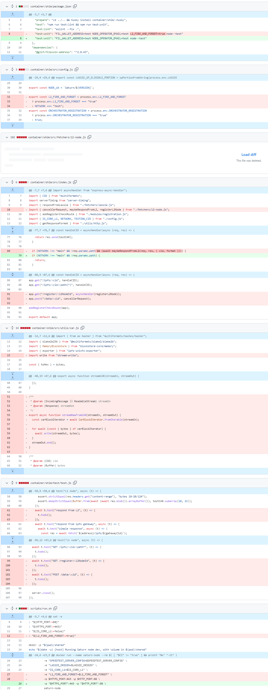

2.整洁化代码

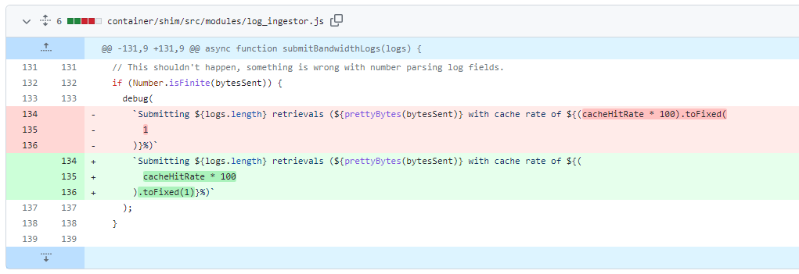

3.固定Debian版本

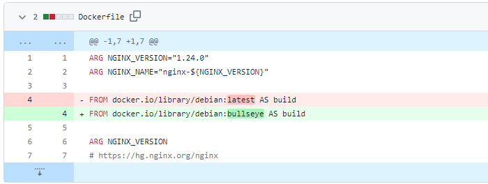

4.设置Lassie没有并发SP限制

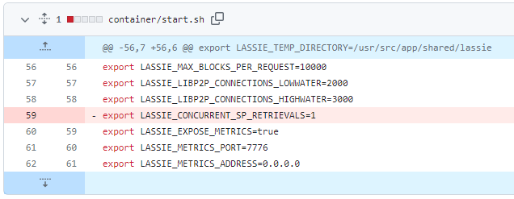

5.增加每次迭代加载和删除的文件数量

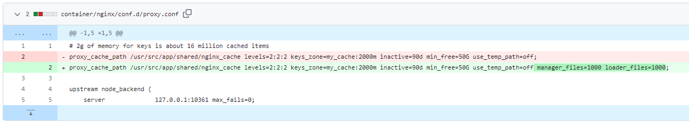

6.更新lassie至0.12.2

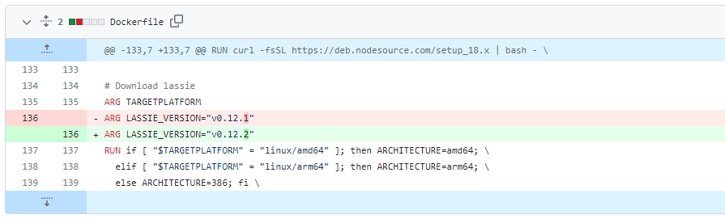

7.使用GHA缓存

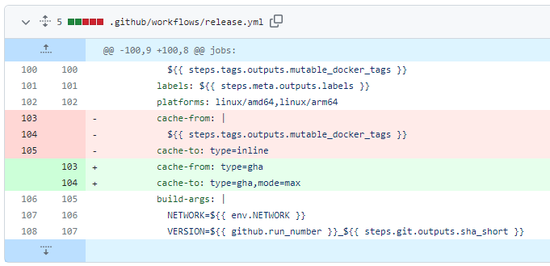

8.添加卷曲轮询器的最大尝试次数

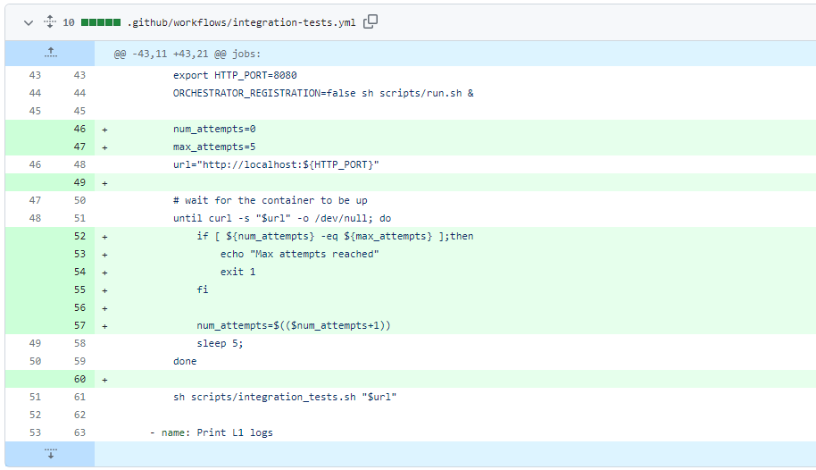

9.设置`Docker Buildx`

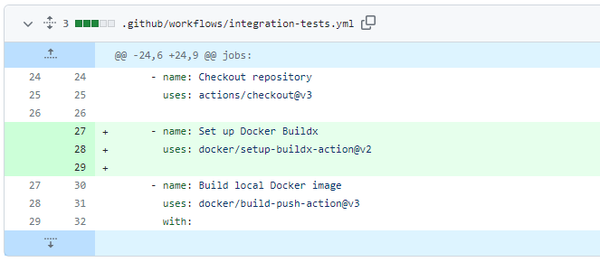

10.更改任务名称

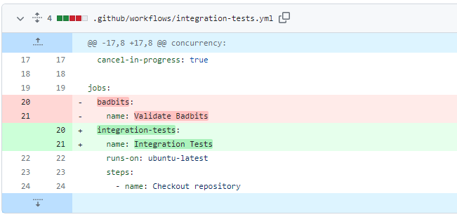

11.将分支`main`合并到`integration-test-ci-improvements`

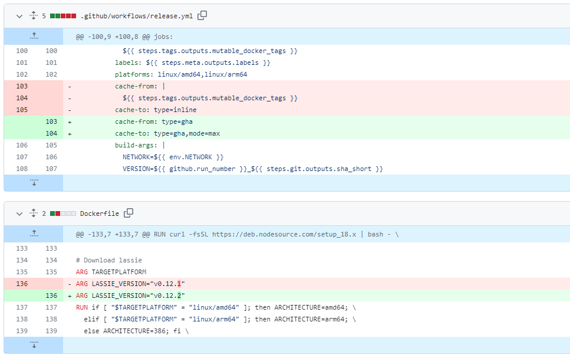

###  2️⃣boost工具

1.**feat**: 内存池警告

+ 内存池监视器
+ 添加默认配置
+ 重构代码，使用独立模块
+ 修复锁定问题
+ 更改内存池方法
+ 更改配置，应用建议
+ 文档生成器
+ 添加监控配置类型

2.添加监控报警UI元素

+ **feat**: 添加监控警报UI元素
+ 将 UI 连接到 `mpool` 监视器
+ 修复类型
+ 修复int类型
+ 修复js
+ 修复用户界面
+ 更改方法名称
+ 修复`gas`限制
+ 设置正确的轮询间隔

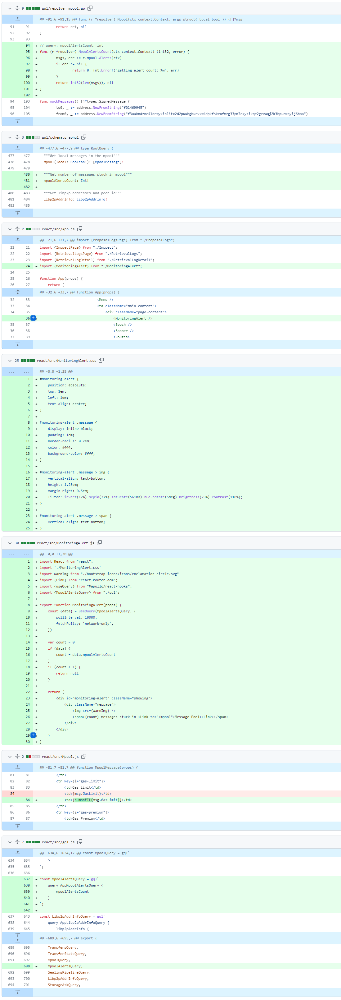

3.添加标志以允许重新启动 `devnet`

+ 使 `devnet `可通过数据重新启动
+ 重命名标志
+ 更新自述文件
+ 措辞调整

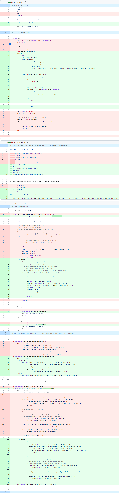

###  3️⃣storetheindex

1.将最新的实验性 `dhstore` 部署到 `ago2`

2.将 `inga` 摄取工人数量增加到 15

+ 将 `inga` 摄取工人数量增加到 15，增加工人数量，以便它可以更快地赶上新的 `small announcements`，同时继续吸收更大的链
+ 断开 kepa 和 dido 的读取连接

3.升级开发至 K8S 1.23

+ 将开发 K8S 集群升级到“1.23”，因为之前的版本没有
  EKS 不再支持。
+ 根据需要更新所有节点组

4.将生产环境中的最大` r6a.xlarge `实例增加到 5 个

+ 我们用了三个新的 FDB 索引器来耗尽此实例类型

5.重新连接` kepa `和 `dido `进行读取，Inga 准备就绪探测失败

6.在生产环境上为 FDB 创建工作节点组，使用`c6a.8xlarge`CPU 优化准备中的实例类型，以在“prod”上运行 FDB

7.从K8S中删除冗余用户，从 dev 和 prod 上的 K8S `aws-auth` 配置映射中清理非现有用户

8.使 `inga` 的使用 worker 数量与其他人持平

9.修改新生产环境索引器的分配器配置

* 修改新生产环境索引器的分配器配置
* 修复 e2e 测试
* 点对点

10.断开`oden`

11.增加 prod `dhstore` 的 CPU，`dhstore` 耗尽 CPU时影响读取延迟

12.为 prod `dhstore` 提供更多 RAM，增加 CPU 改善了延迟

13.覆盖 `dhstore stateless` 中的应用程序标签以限制服务选择器，不要在无状态实例中重复使用`app=dhstore`标签，以避免其他服务选择无状态实例并将流量路由到它们。

14.将新的 `Indexstar` 部署到 dev 环境中

* 部署新的`indexstar`到dev
* 更新开发索引星配置
* 设置前为提供商后端
* 设置前为后备后端

15.部署缓存在`cassette`中，将缓存过期时间设置为 24 小时，缓存大小为 1M。

16.将最新的 `Indexstar` 部署到生产环境

* 将最新的`indexstar`部署到生产环境
* 更新生产环境` indexstar` 的配置

17.将最新版本部署到盒式磁带，并选择不缓存 404s 由于添加缓存，成功率降低了 30%

18.更新依耐项和版本

* 更新依赖和版本
* 跳过 CI 中的 e2e 测试，因为它经常超时

19.将最新版本部署到开发环境

+ 更新`dev`环境中的storetheindex/storetheindex
+ 文件：- kustomization.yaml
+ 对象：- 定制
+ 镜像：- 407967248065.dkr.ecr.us-east-.amazonaws.com/storetheindex/storetheindex：20230613213049-15fa58f86dfb4ec6569faf87d9ccad7a56054f0c

20.在生产环境中更新 storetheindex/storetheindex

+ 文件：- kustomization.yaml
+ 对象：- 定制
+ 镜像：- 407967248065.dkr.ecr.us-east-2.amazonaws.com/storetheindex/storetheindex:0.7.1

21.部署最新的分配器

22.部署最新的 heyfil

23.增加 heyfil 的 CPU 限制

24.部署最新的 Indexstar 来为 iframe 提供服务

25.增加 cera 上的 worker 数量，观察它与其他索引器相比如何

26.`Indexers` 可容纳更多 workers

27.设置 worker 数量以获得最高测量吞吐量

28.由于 404 率较高，将 oden 添加为产品中的 Indexstar 后端，由于从后端排除 oden，indexstar 在 prod 中返回的 404 错误率高于 200 错误

29.将 FDB 支持的实例连接到生产读取路径

30.从读取路径中排除 FDB 支持的实例

31.增加` inga workers` 数量

+ 增加 inga dhstore 批量大小
+ 更新部署 /manifests/prod/us-east-2/tenant/storetheindex/instances/inga/config.json

32.部署修复查找不正确的 IPNI 非流响应的错误

33.将产品上的磁带内存限制增加到 10Gi

34.在生产环境中断开`oden`

35.更新 `core` 并将 `dhstore` 作为值存储，新`core` 将 `dhstore` 作为值存储实现，而不是作为引擎的选项。

### 4️⃣Station

**desktop**

1.pkg：修复 Windows 上的install-core

2.合并 https://github.com/filecoin-station/desktop 的分支“main”

3.修改了 job 的最初值

4.更新至0.18.3

5.更新使用 notarytool 进行公证

6.更新 caniuse-lite

7.更新 @filecoin-station/core@v13.1.0 版本

8.更新至0.19.0

9.在macOS系统中添加通用版本

+ Create `universal` builds on macOS
* try building separately

* use one build step per arch

* add arch to file name

* Revert "use one build step per arch"

This reverts commit 4d4b398.

* wip

* bump `@filecoin-station/core`

* use after-pack hook to rebuild core

* clean up

* `universal` seems to work!

* undo file name change

* clean up

* update `electron-builder`

* set `x64ArchFiles` (bacalhau arm64 is actually x64)

* fix bacalhau path

* Revert "fix bacalhau path"

This reverts commit f054187.

* Revert "set `x64ArchFiles` (bacalhau arm64 is actually x64)"

This reverts commit 4d974e8.

* disable `USE_HARD_LINKS`

10.更新版本至0.20.0-0

11.更新许多依赖

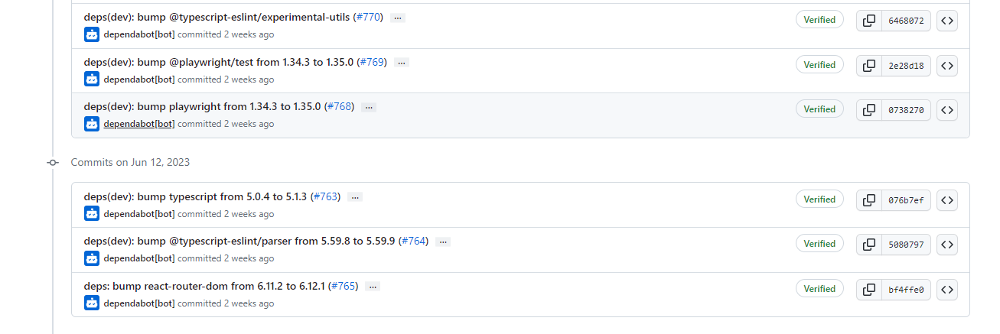

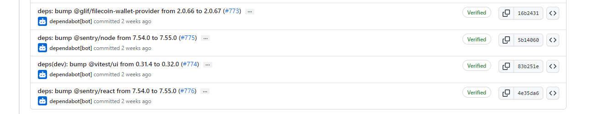

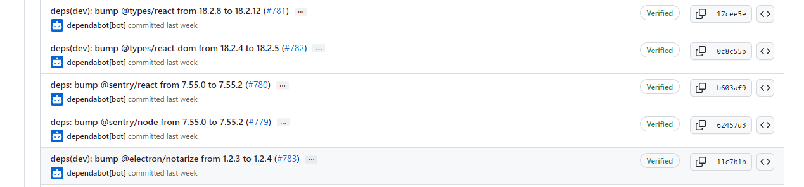

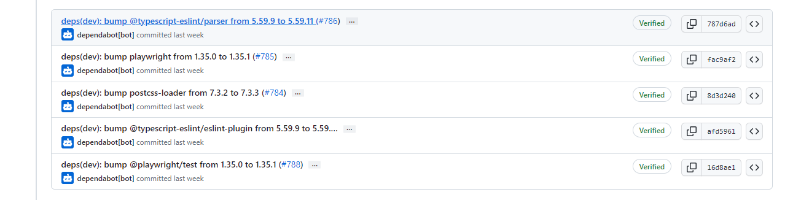

**Zinnia**

1.**feat**: IPFS检索客户端的实现

2.**feat**: 更新Deno到2023.06.08

3.**chore**:Release

4.**chore**:记录如何调整发布工作流程

5.其余依赖项更新

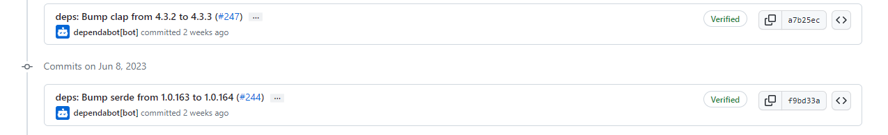

##  📢一周资讯

**1.Filecoin daily 与 filfi 的合作** 

+ FilFi 是一个DeFi 协议资产流动性，它创建Filecoin资产流动性，💹提供质押池、流动性质押、联合节点、算力交易、FIL基金等服务。

**2.STFIL Protocol 已经容纳了有300K+的FIL**

+ 📍30 万+ FIL 和 ~220 stakers 以及 23 个 SP 已加入！

**3.2023 年 FIL 巴黎展会上体验科技与文化的融合，Filecoin 社区将于 7 月 15 日至 21 日在巴黎 Son de la Terre 举行**

协议实验室 Launchpad 峰会，发现 Filecoin 的力量。 [#FilecoinUnleashed](https://twitter.com/hashtag/FilecoinUnleashed?src=hashtag_click)前往巴黎参加[#ETHCC](https://twitter.com/hashtag/ETHCC?src=hashtag_click)。受到有远见的演讲者的启发，与其他社区成员联系，并了解 Filecoin 如何改变数据存储。

📅日期：2023年7月16日至21日
🇫🇷  地点：法国巴黎
🔗申请：https://filecoinunleashed.io/

