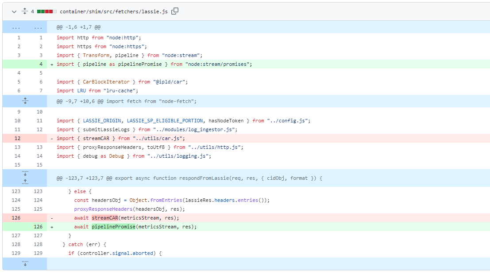
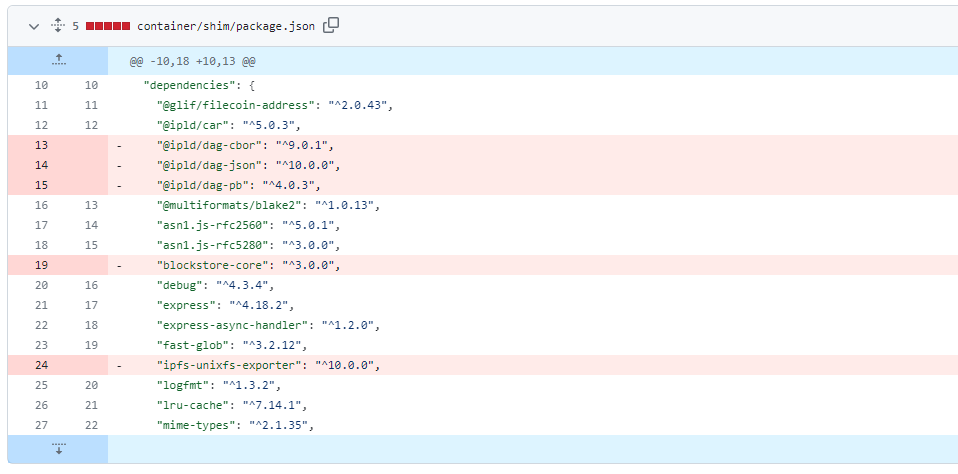
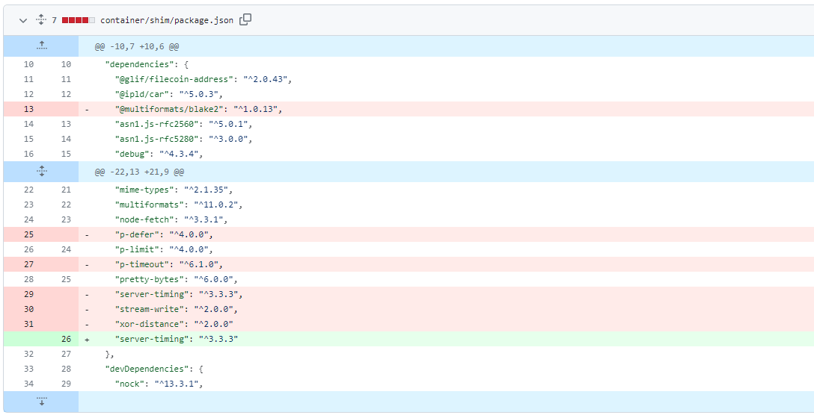
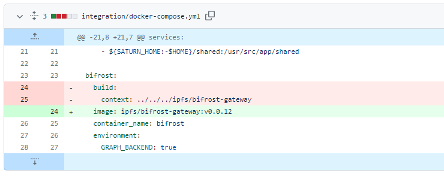
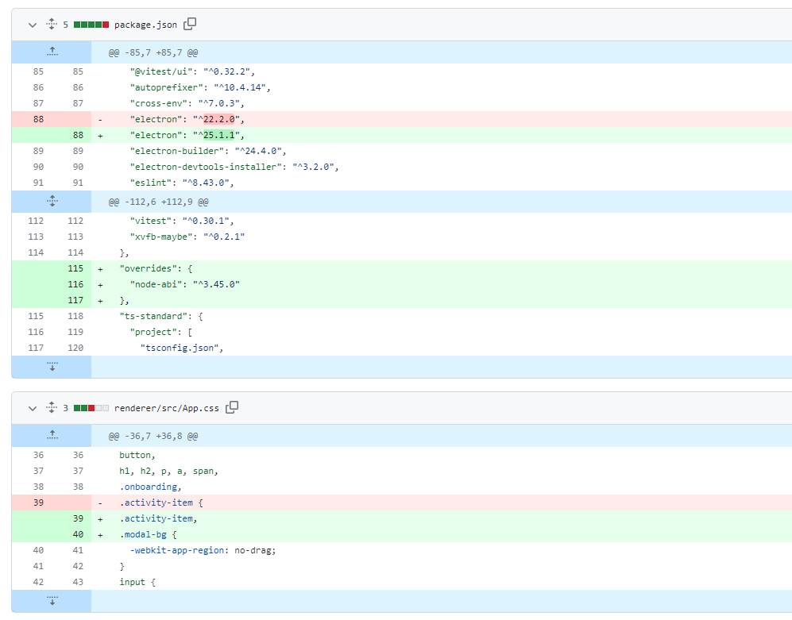
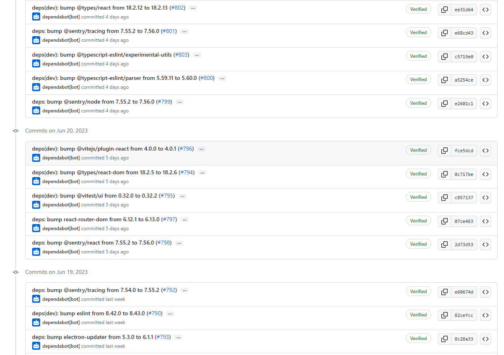
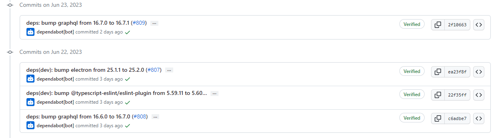

# 2023-6-25检索星球周报

## 🚀项目进展

### 1️⃣saturn

**L1-node**

1.添加注释，节点正常运行时间要求将从 7 天增加到 7 月的 14 天

2.删除 car streaming, 只要 pipe

3.删除一些没有使用的依赖

4.删除更多的依赖

5.使用 bifrost gateway 发布的image

6.更新lassie至 v0.13.0

###  2️⃣boost工具

1.更新 Lotus 和 Boxo 版本

* 更新以使用 go-libipni 中的包

* 功能：更新 Lotus 版本

* 更新 boxo (#1492)

* feat：更新boxo

* 重构：依赖于 repo:Jorropo/lotus 分支:boxo2

* Chore：使用替换指令临时更新 go-fil-markets

* feat：切换itests框架ExtractFileFromCAR以使用非全局IPLD注册表

* feat：将 booster-bitswap 客户端获取切换为通过 go-ipld-legacy 使用 go-ipld-prime 全局变量去FMMT

* Chore：更新依赖项并迁移到 boxo

* 修复：更新 boost-gfm

* 修复：阻止 itests 框架通过与 Lotus 冲突的 go-libp2p 默认值过早设置 Listenaddrs

* 修复：文档生成

* Chore(deps): 更新 boxo v0.10.0 的 deps

* Chore（deps）：更新 boost-gfm

* 修复（booster-http）：boxo v0.10.0 更新

* Chore(deps): 更新以删除 kubo 依赖

* 修复（gen）：更新文档gen

* feat：将 boost-gfm 更新至 v1.26.6

* Chore（deps）：更新 Lotus 到 master

###  3️⃣storetheindex

1.将生产索引器节点上的工作线程数增加到 100，增加产品中所有索引器节点上的工作线程数量，以避免摄取率降低。

2.更新至最新的go-libipni

3.将最新版本部署到开发环境中

+ 更新`dev`环境中的storetheindex/storetheindex
+ 文件：定制.yaml
+ 对象：定制化
+ images：- 407967248065.dkr.ecr.us-east-2.amazonaws.com/storetheindex/storetheindex:20230619213623-c7cb6b316f12e1b1f5817e1ebf33f920b66ec69a

4.将版本更新至v0.7.2

5.更新生产环境中的storetheindex/storetheindex

+ Files: kustomization.yaml
+ Objects: Kustomization
+ Images: 407967248065.dkr.ecr.us-east-2.amazonaws.com/storetheindex/storetheindex:0.7.2

6.部署 fdbmeter 来收集 FoundationDB prometheus 指标

7.升级到最新的 fdbmeter，以修复流程role的指标数据。

8.删除多余的镜像拉取策略覆盖，无需每次都拉取镜像。

9.在inga上启用写入镜像，以便其摄取的广告不会被其他节点重新下载。

10.部署对 Indexstar 结果聚合的修复

11.删除不再支持翻译重构标志，indexstar不再支持重构转换。

12.从 cloudfront cid.contact 中删除冗余的重构路由，不再支持重构路径。 删除它的缓存配置。

13.使用最新同步跟踪的 go-libipni，更新 go-libp2p。

14.通过将 dhstore 批次减少到 16 来调查高 FDB 存储延迟

15.减少写入 DH 存储的批量大小以调查 FDB 高存储服务器延迟。 这应该会增加事务数量，但会在服务器之间提供更好的分布。

16.将 inga 迁移到具有更多 CPU 的实例类型

17.在生产环境中扩展私有子网。

18.更新`dev`环境中的storetheindex/storetheindex

+ 文件：定制.yaml
+ 对象：定制化
+ image：407967248065.dkr.ecr.us-east-2.amazonaws.com/storetheindex/storetheindex:20230622104442-1cacc0c953964bd82b8948722ce5a8f969d1de9b

19.将 inga 的 worker 数量减少到 10 人

20.排除 inga 并将 FDB 支持的索引器添加为提供程序后端

21.用于最新同步跟踪修复的新版本

+ version: v0.7.3

22.添加 inga 作为提供商后端

23.调查未显示的扩展提供商记录

24.恢复“通过将 dhstore 批次减少到 16 来调查高 FDB 存储延迟”

25.恢复“将 inga 的工人数量减少到 10 人”

26.将 dhstore porvy 移至计算优化实例类型

27.稍微减少provy上的资源以使其适合

### 4️⃣Station

**desktop**

1.更改version 0.20.0-0 为 version: 0.20.0

2.升级到最新 electron

* 升级到22行最新版本

* 更新到最新的 Electron，修复模态问题

* 升级`node-abi`子依赖

3.更新版本至v0.20.1

4.将filecoin-station的core更新至@filecoin-station/core@13.3.1

5.更新版本至v0.20.2

6.更新许多依赖

**Zinnia**

1.fix：mkdirp lassie temp_dir，`temp_dir` -> `lassie_temp_dir`

2.chore: Release

3.docs: 修复构建模块中的标题级别

4.docs: 修复解释 ESM 导入沙箱的文档

5.fix: 当 zinniad 启动的时候删除Lassie temp

6.feat: 添加新的 Zinnia API，向模块公开运行时和 V8 版本。

7.chore: Release

##  📢一周资讯

**1.FilecoinUnleashed!** 

距离`FilecoinUnleashed` 发布还有不到 1 个月时间👏

在 `ETHCC` 期间加入我们，了解 `Filecoin` 如何改变数据存储并解锁开放数据经济。

✔️专家讲座
✔️ 网络
✔️ 独家获取最新进展

注册👇
https://filecoinunleashed.io

**2.Filecoin Orbit 香港聚会**

@stfil_io欢迎@Filecoin和 web3 构建者、存储提供商，探索 #FVM #DeFi🔥

🗓️ 26/6, 19:00-21:30
📍香港中环👉 http://lu.ma/filecoinorbithk

赞助@FilFoundation  🙏

共同主持人@852web3@OooshTechLab支持@followin_io@852devxyz👏

**3.黑客松最终决胜者**

👛 Wallet OTP
🌐 DecentralAI
🔊 Cosmicwaves
🎣 Daggle
😍 web3stash
⛺️ Hearthside Hangouts
💬 Chitty chat
🔭 Subpr0br
🐶 DefiKicks

detail：https://twitter.com/ETHGlobal/status/1671574641360478220

**4.protocollabs  Launchpad 峰会**

📅7月16日至21日，@protocollabs  Launchpad 峰会在巴黎举行。

 🇫🇷 体验一系列激动人心的深度探索、鼓舞人心的演讲者和城市探索。

🔗立即申请：https://bit.ly/3J50D7Z

**5.filecoin.energy**

👀 您检查过的能源仪表板吗？ https://filecoin.energy 

届虚拟可持续区块链峰会`SBSEarth`，了解有关使用 web3 实现彻底透明度的更多信息。 

🎟️ 注册http://sbs.tech 

📆8月16日

