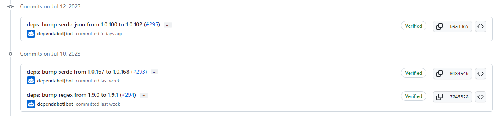

# 2023-7-16检索星球周报


## 🚀项目进展

### 1️⃣saturn

**L1-node**

1.禁用 /local/nodes orch 请求

2.将“Traceparent”添加到 Access-Control-Allow-Headers

3.报告 traceparent


4.修改 var变量


5.将traceparent添加到lassie日志中


6.在header中添加TranceParent


7.更新Lassie的版本至 0.14


8.将构建的节点运行在更大的host上，代替原来的Ubuntu-latest


9.重新讲lassie版本修改为 0.13

10.报告 $body_bytes_sent 而不是 $bytes_sent


11.将lassie版本升级到 0.14.2

12.以10%的几率清理旧的CAR文件


###  2️⃣boost工具

1.依赖版本的升级


###  3️⃣storetheindex

1.使用 pcache 将新的 indexstar 部署到 dev

2.恢复“使用 pcache 将新的 indexstar 部署到 dev

3.部署最新的indexstar

- 使用新的pcache
- 消除了对fallbackBackend的需要


4.使用 pcache 部署新的 dhstore

* 使用 go-libipni v2.0.10 中的 pcache 部署新的 dhstore


5.恢复“使用 pcache 部署新的 dhstore

6.使用带有固定 flag 的 image

7.从 dev 中删除 dhfind 实例

8.从生产中删除 dhfind 实例

9.将 dhstore 无状态实例减少到 2 个，它们没有得到充分利用。 将 dev 和 prod 上的副本数量减少到 2。

10.生产环境中单独的 FDB 数据分发器。

+ 在 FDB 集群的 prod 上运行专用数据分发器，以便调查存储服务器上的 OOM 错误。

11.将最新的 Indexstar 部署到生产环境


12.使用 pcache 将最新的 dhstore 部署到 prod

13.使用新的 FDB 索引器作为提供程序后端。

+ 这是必要的，因为有 17 个 fdb 索引器已知但 inga 不知道的提供程序。
+ 不再需要为 FDB 负载测试删除这些内容，因为 Indexstar 提供程序缓存会删除任何重要的查询负载。

14.停止 dido、kepa 和 oden 索引器


15.从老版本中恢复 FDB prod 集群

+ 产品上 FDB 节点的自我恢复明显延迟，导致摄取停止。 这是由于节点上不断增长的写入延迟造成的，并最终导致协调器失效，导致集群无响应。
+ 为了解决这个问题，排除了具有较大滞后的特定存储节点，并将最大代数从 0 更改为 200。
+ 这些变化还引入了专用的速率维护节点以减少存储服务器上的负载。

16.删除旧的未使用的快照

17.升级到最新的 FDB 控制器以便于错误修复。


18.删除索引计数器功能，该计数器的维护成本非常高，而且最终几乎没有什么价值。 如果我们将来想要它，应该在 dhstore 中实现。

- 删除索引逻辑
- 清理数据存储以删除索引计数记录

19.在开发中部署最新的版本


20.在开发环境中更新 storetheindex/storetheindex

```yaml
Files:
- kustomization.yaml
Objects:
- Kustomization 
Images:
- 407967248065.dkr.ecr.us-east-2.amazonaws.com/storetheindex/storetheindex:20230713175039-e46f6e6bd679c9fcd9eaf3e2663f27f33bbc8eeb
```

21.将 FDB 7.2 和 7.3 二进制文件添加到控制器以准备升级

+ 在准备升级基础数据库时，请添加带有最新补丁的两个更高版本的二进制文件。

22.将生产 FDB 升级到 7.3.7

+ 调查rocksdb存储引擎内存泄漏问题。
+ 将生产FDB集群升级到7.3.7。

23.升级期间增加生产环境中 FDB 的最大代数

+ FDB升级时增加max gen，使其能够继续进行。
+ 通过将角色绑定提升到集群级别来调查产品中的经理角色绑定问题。

24.恢复“升级期间增加产品中 FDB 的最大代数”

+ 这将恢复提交 1239ba4。


### 4️⃣Station

**desktop**

1.其他依赖版本的更新


**Zinnia**

1.版本依赖的更新



##  📢一周资讯

### 1.FundingCommons

+ 时间：7 月 15 日至 16 日
+ 与PL和 FTC 团队一起参加为期 2 天的会谈、研讨会、开源技术等，所有这些都专注于 publicgoods 的可持续融资。
+ 注册参与地址：https://lu.ma/t96plcws


### 2.FilecoinUnleashed

+ 如果您在巴黎参加#ETHCC，请了解 Filecoin 如何改变数据存储和解锁开放数据经济的最新信息。

+ 🗓7月18日

+ ⏰ 下午 2 点 - 晚上 7:30（欧洲中部时间）

+ 📍旋风Le Studio 加入候补名单👇

  https://t.co/nKgyN6BvDq

### 3.Investigating FIL Circulating Supply  report

+ 1️⃣预测未来流通供应量显示FIL的最大供应量将在1.04-12亿FIL之间达到峰值
+ 2️⃣这比理论最大值 20 亿 FIL 少了 40%

### 4.SBS_Tech 会议

+ @SBS__Tech 是可持续发展会议还是 web3 会议？
+ 答案：两者都是🤝
+ 关注@RRansil，团队负责人@FilecoinGreen，深入探讨这个问题并加入第一个完全虚拟的#SBSEarth。
+ 🗓️8月16日 📍在线注册：https://sbs.tech

### 5.FilecoinUnleashed 主要内容

+ 👏 #FilecoinUnleashed 距离发布还有不到一周的时间。

+ 不要错过：
  ✔️ ZK 与 @sidgandhi_xyz @Polybase 深入探讨

  ✔️ 与 @aronchick 进行关于“去中心化计算”的演讲

  ✔️ @JuanBenet 的主题演讲

+ 将于 7 月 18 日在#EthCC 举行。
+ 加入候补名单👇
  https://filecoinunleashed.io https://twitter.com/Filecoin/status/1679159461326233600/video/1

### 6.Lava SDK Alpha

+ Lava SDK Alpha 已上线！ 该开源 SDK 可帮助开发人员使用多链、管理 API 以及构建可直接访问区块链数据的后端和前端环境。
+ 获取 Filecoin RPC：https://docs.lavanet.xyz/filecoin-dev


