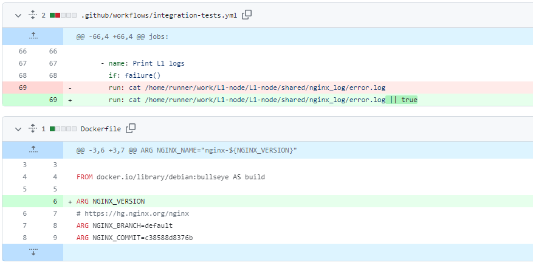

# 2023-7-23检索星球周报

## 🚀项目进展

### 1️⃣saturn

**L1-node**

1.将清除旧 CAR 缓存的几率提高到 50%

2.改进GHA缓存并提升NJS版本

3.Dockerfile ARG 顺序修复

4.统一静态代码分析

5.设置单一语言

6.修复ARG

7.报告 lassie 服务器计时标头

8.所有网络均清除了无根 CID CAR文件

9.预登记流程处理

10.如果当前速度测试有效，则不运行速度测试

11.修改jobs名称

12.更新部分[依赖](https://github.com/filecoin-saturn/L1-node/commit/309ac317a389088f104d88fe638b93849befd0df)

13.文档跟踪父变量

14.只对GET请求进行报告

###  2️⃣boost工具

Boost release/v2

+ feat: 添加本地索引目录
+ refactor: 从main合并到lid分支
+ merge: main到lid
+ 添加免费check
+ chore: 将版本提升至 1.6.1
+ 修复旧交易验证状态
+ fix: 更新 go-unixfsnode 足以确保 unixfs-preload 可用
+ 发布 v1.6.2-rc1
+ 使用完整路径
+ 修复错误
+ 使用 graphsync、go-data-transfer 和 go-fil-markets 的分支
+ refactor: 使用 graphsync、go-data-transfer 和 go-fil-markets 的分支
+ refactor: 从数据传输v1转换为v2凭证类型
+ fix: 索引提供者验证凭证类型
+ fix: 将索引提供程序引擎链接系统传递给 graphsync 的传输配置器
+ feat: 使用 boost-gfm 的标记版本
+ fix: 检索客户端导入
+ feat: 莲花的标记版本
+ feat: 需要 go 1.19
+ lint: 修复 lint 错误
+ fix: itests
+ fix: cbor-gen、docsgen
+ fix: 更新 CI lint 版本
+ fix: lint
+ fix: docgenfix: go mod tidy
+ fix: 协议代理 TestOutboundForwarding
+ fix: docsgen
+ fix: 更新 filecoin-ffi 子模块
+ fix: 普罗米修斯重复注册恐慌
+ fix: 清理导入
+ fix: legs voucher处理
+ chore: 发布 v1.6.2-rc2
+ release v1.6.2-rc2
+ fix test
+ fix: 不稳定的 TestLibp2pCarServerNewTransferCancelsPreviousTransfer
+ fix: 不稳定的 TestDealCompletionOnProcessResum
+ fix: 关闭时偶尔出现恐慌
+ feat: 查询 UI
+ 日志插入
+ 修复显示错误
+ 重构代码
+ 缩短状态字符串
+ 删除评论
+ 应用建议
+ feat: 添加下载块链接到检查页面
+ fix(devnet): 更新 golang 和 Lotus 默认版本
+ fix(devnet): 将 golang 升级到 1.19
+ chore(devnet): 升级莲花默认版本
+ Chore(devnet): 删除未使用的稳定环境
+ booster-http: 实现 IPFS HTTP 网关
+ feat: 实现http api网关
+ feat: 使用 go-libipfs lib
+ feat: 碰撞助推器-bitswap 信息次要版本
+ feat: http 网关指标
+ fix: TestHttpInfo
+ feat: 默认情况下仅提供块和 CAR，可以选择提供原始文件（jpg、mov 等）
+ fix: 下载根块的正确链接
+ feat: 添加片段后清理离线交易数据的选项
+ chore: 在 makefile 中添加对多个 Node.js 版本的支持
+ chore:  release v.1.7.0-rc1
+ release v.1.7.0-rc1
+ fix version
+ fix: dagstore 初始化所有参数
+ fix: 显示验证离线交易的 comp 状态
+ fix: boost 运行缺少暂存区目录
+ merge(wip): main到lid
+ fix: 不稳定的 TestNewHttpServer
+ feat: 按二进制名称对代理版本进行分组
+ fix: 现在将统计信息包装在 nil 检查中
+ test(fix): 测试网址不正确

* fix: 使 devnet 适用于 cover

* feat: 支持 boostd-data 中的完整地址配置

* chore: 修复 boostd-data 的 linting

* feat: 使用addr代替盖子的端口

* chore: 更新 devnet 以使用 cover 设置

* chore: 解决关于 lint 更改的反馈
* feat: 如果开始纪元过去了，交易就会失败
* 如果开始纪元过去，则交易失败
* 添加建议
* test: 在启动测试时添加交易到期

---

* fix: makefile

* fix: 数据库迁移顺序

* fix: 正确的 rootcid 格式

* fix: 防止意外删除有效的行业指数公告

* fix: 添加缓存测试并且不宣布缓存状态

* fix: 向扇区状态数据库添加唯一索引

* fix: 密封和非密封扇区状态冲突

* fix: 确保索引提供程序包装器在数据库迁移完成后启动

* chore: go mod tidy

* fix: download block

* LID yugabyte db impl

* feat: yugabyte db impl

* feat: 针对 dockerized yugabyte 运行 yugabyte 测试

* fix: 使用自己的 yugabyte docker 镜像

* fix: 使用 yugabyte 2.17.2.0 docker 镜像

* feat: piece doctor yugabyte impl

* fix: go mod tidy

* refactor: 删除 SetCarSize，因为它不再被使用

* refactor: 删除将索引标记为错误的功能（未使用）

* feat: 实现删除命令

* refactor: 合并测试参数

* feat: 添加 lid yugabyte 配置

* fix: 将 yugabyte postgres 端口映射到标准端口

* fix yugabyte CI

* fix: CI 中的 yugabyte 测试

* docker-compose.yml ; Dockerfile.测试； 连接到 `yugabyte` 而不是 localhost

* 添加标签

* 测试 lid

* make gen

* fixup

* 将couchbase settings 移动到构建 tag

---

+ 从 couchbase 迁移到 yugabyte 的脚本
+ feat: 从 couchbase 迁移到 yugabyte 的脚本

+ fix: 减少 yugabyte 插入的批量大小
+ 更改服务 GetIndex / AddIndex 以返回通道而不是数组
+ feat: yugabyte db impl
+ feat: 针对 dockerized yugabyte 运行 yugabyte 测试
+ fix: 使用自己的 yugabyte docker 镜像
+ fix: 使用 yugabyte 2.17.2.0 docker 镜像
+ feat: piece doctor yugabyte impl
+ fix: go mod tidy
+ refactor: 删除 SetCarSize，因为它不再被使用
+ refactor: 删除将索引标记为错误的功能（未使用）
+ feat: 实现删除命令
+ refactor: 合并测试参数
+ feat: 添加 lid yugabyte 配置
+ fix: 将 yugabyte postgres 端口映射到标准端口
+ 修复 yugabyte CI (#1433)
+ fix: CI 中的 yugabyte 测试
+ docker-compose.yml ; Dockerfile.测试； 连接到 `yugabyte` 而不是 localhost
+ 添加标签
+ 测试 lid
+ make gen
+ fixup
+ 将couchbase settings 移动到构建 tag

---

+ wip: 服务 GetIndex 返回记录通道而不是数组
* feat: 从 AddIndex 和 GetIndex 返回通道

---

+ local index directory: 恢复工具
* LID 初始灾难恢复工具

* wip

* do not block on individual error

* 实例化 lid

* report

* 捕获信号

* fixup

* 注释掉已经在进行中的comment

* fixup

* 使用 init: true 启动容器

* 记录我们没有未密封的副本

* 与 boost sqlite db 和piece store 进行匹配处理

* fixup

* fixup

* use logger

* fixup

* disable stacktrace

* fixup

* 将片段存储从灾难恢复结构中提取出来

* 添加更多健全性检查

* 比较 IsUnsealed 与 storage find

* 改进safeIsUnseal

* fixup

* better logs

* 扩展repodir

* 正确计算下一个偏移量fixup

* 将扇区 ID 添加到日志中

* 增加偏移量

* 发现过期交易后中断

* more logs

* fewer logs

* better logs

* better error

* refactor

* 重构minerApi

* better logs

* add time around add index

* pd.Start

* LID 基准测试工具

* feat: LID 基准测试工具

* fix: 工作台线程安全

* refactor: 结构化日志记录

* refactor: postgres批量插入

* lid bench: 添加foundationdb impl

* lid fdb: 修复 Tx 大小调整、并行块放置

* lid fdb: 更高效的样本生成

* feat: 件数数组/每件块数

* lid bench: 打印添加率

* lid bench: 使 cassandra put 更加健壮

* lid bench: 使 cassandra put 更加健壮

* 台式工具仪表

* instrument postgres

* more instrumentation

* 检查 getoffsetsize 是否有错误

* 每 10 秒发出一次指标

* ignore errors

* 添加 postgres-drop

* use directly tables

* fix: go mod tidy

* 使用 INSERT INTO 代替临时表

* 尝试捕获 sig

* 删除事务提交

* fixup

* 添加 postgres-init

* fixuop

* 拆分创建和初始化

* fixup

* 如果不存在则删除

---

* feat: postgres 的批量插入查询

* feat: 添加标志以使用 tmp 表插入 postgres

* refactor:合并来自 nonsense/lid-bench 的更改

* refactor:只使用一个数据库（不创建基准数据库）

* refactor:删除未使用的参数

* refactor:命令结构

* fix:cassandra - 不要对 PayloadToPieces 使用批量插入

* fix:创建表CQL

* fix:增加碎片插入并行度的有效负载

* fix:使用简单的复制策略

* feat：使用 yugabyte cassandra 驱动程序

* fix:删除工作台二进制文件

* 更新指标端点

* 修复随机生成的棋子cid

* 修理

* fix:cassandra bitswap 基准测试

* 删除基础数据库

---

* fix:由于合并错误而导致测试失败

* fix:不稳定的TestMultipleDealsConcurrent

* 更多日志

* 片医生和扇区状态管理器重构 (#1463)

* 修复计时器。重置并改进日志

* 恢复随机化

* 片断文档：处理错误

* 调整件检查

* 重构unsealsectormanager

* 重构片医生

* 添加随机端口

* 忽略测试

* 将版本添加到boostd-data

* 修复开始中的ctx

* fix:添加阅读器模拟来修复测试

* fix:在测试重启时将新的片段目录传递给提供者

* 修复同步问题

* 请注意，恐慌不会在测试中传播

* carv1 恐慌片目录

* 打印恐慌

* fix:使用支持Seek inpiece reader模拟的阅读器

* fix:每次调用时重置模拟汽车读卡器

* fix:TestOfflineDealDataCleanup

* 添加检查 nil 取消功能

* 将 LevelDB 的最小检查时间缩短至 5 分钟

* 检查扇区状态mgr是否已初始化

* 用于取消标记的调试行

* 注释掉 TestMultipleDealsConcurrent -- 片状测试 -- 在本地工作

* 添加SectorStateUpdates pubsub

* 添加关闭

---

* 添加模拟扇区状态管理器

* 添加包装测试

* 修理

* 清理

* 清理

* 更好的名字

* t.跳过测试

* 删除 println 上面的 TODO 以防止恐慌

* 添加刷新状态的单元测试

* 重命名测试

* 更多案例

* 更多测试

* 更新描述

* 更好的评论

* 更好的名字和评论

---

* 从主分支合并到盖子分支 (#1483)

* 修复 statx 输出字符串 (#1451)

* fix:不稳定的 TestMultipleDealsConcurrent (#1458)

* 添加通过 http 提供索引提供商广告的选项 (#1452)

* feat：通过 http 提供索引提供商广告的选项

* fix:配置命名、主机名解析

* fix:更新 docsgen

* fix: 日志公告地址

* feat：添加索引器直接公布网址的配置

* refactor:始终通过 pubsub 进行公告

* fix:文档生成

* 测试：添加空公告地址主机名的测试用例

* 添加“boostd索引公告最新”命令(#1456)

* feat：boosted 指数公布-最新

* 功能：添加announce-latest-http命令

* fix:默认直接公布url

* feat：更新到索引提供者 v0.11.2

* 向索引提供商发出信号以跳过公告 (#1457)

* fix:向索引提供商发出信号以跳过公告

* fix:确保多哈希列表器跳过错误的类型为 ipld.ErrNotExists

---

* 发布 v1.7.3-rc2 (#1460)

* fix:改进停滞检索取消（#1449）

* 重构停滞检索取消

* 添加带超时的ctx

* 实施建议

* 更新错误包装

* fix:仅为未付费检索设置较短的取消超时

---

* feat: 启用 booster-http 的监听地址 (#1461)

* 启用监听地址

* 修改测试

* 修复 nil ptr (#1470)

* fix:使用提案 CID 导入离线交易数据时检查错误 (#1473)

* 修复错误的早期检查

* 更新错误信息

* 修复（服务器）：正确取消图形同步请求（#1475）

* 将 UI 默认监听地址设置为 localhost (#1476)

* feat: 在 mpool UI 中显示消息参数 (#1471)

* 显示消息参数

* fix:mpool nil 指针

* 固定宽度

---

* 阅读交易提案消息后重置阅读截止日期 (#1479)

* fix:阅读交易提案消息后重置阅读截止日期

* fix:增加客户请求的截止日期

* feat: 在 UI 中显示已用的纪元和 PSD 等待纪元 (#1480)

* 显示纪元

* 修复devnet UI，使用BlockdDelaySecs

* 修复 lint 错误

* 更新 gql/resolver.go

---

* 发布 v1.7.3-rc3 (#1481)

---

* 更新本地索引目录 ui (#1477)

* feat: 更新本地索引目录ui

* 注释掉扳手，因为 docker 没有构建

* 重新排列菜单

* refactor:删除扇区列表

---

* feat：表面索引错误 (#1490)

* feat：记录恐慌（而不是仅仅打印到标准输出）（＃1491）

* 将标记的部分拆分为未密封/密封的表（#1493）

* refactor:删除 couchbase 测试 (#1496)

* refactor:删除片段目录 couchbase 测试 (#1497)

* LID 的 GraphQL 解析器 (#1494)

* 在制品

* 改名

* 扇区UnsealedCopies和扇区ProvingState

* fix:片段目录测试 (#1498)

* 仅适用于密封扇区的日志行

* 更多日志

+ feat：标记的碎片（#1501）

* 检查该部门是否有未密封部门的交易 (#1502)

* 检查该部门是否有未密封部门的交易

* 简化

* 重命名标题

* 让医生忽略过期/削减的交易 (#1503)

* 忽略过期/削减的交易

* 修复模拟

* 为checkPiece添加计时器

* 将 ChainHead 移离 checkPiece

* 为 fullnodeApi 添加 nil 检查

* 添加调试线

* 修复分页

* LID 登陆页面：添加有关标记和非标记片段的统计信息 (#1508)

* 在制品

* 修理

* 添加调试线

* 修理

* feat：将标记的片段页面拆分为标记/标记，因为未密封（＃1509）

* fix:显示没有标记的作品（#1511）

* 禁用虚拟面板-块统计； 交易数据 (#1510)

* 修复标记块中未密封的字段

* 修复主要合并问题

* 修复Go模式

* 在 LID UI 页面上添加信息框 (#1516)

* 功能：在 LID UI 页面上添加信息框

* 更新react/src/LID.js

---

* feat：用 migrate yugavbyte 替换 migrate couchbase 命令 (#1518)

* 删除多余的 makefile (#1519)

* 删除多余的makefile

* 将 migrate-lid 添加到 Makefile

* 更新gitignore

* 将 booster-bitswap 和 booster-http 移动到 make 并进行安装

* fix:检查页面 - 不要尝试获取 ro

---

* feat: 将 mpool 中每条消息的发送纪元、时间、经过的纪元和经过的时间添加到 UI (#1523)

* 添加消息纪元/时间详细信息

* 实施建议

* 使用矩库

* 修复警报错误

* 更新轮询间隔

* 添加日志

* 修复 devnet：使用 ws 而不是 http 连接到 boostd-data

* feat：使遗留交易成为可选（#1524）

* 使遗留交易成为可选

* 修复生成

* 修改项目，创建新项目

* 显式处理遗留流

* 分离出协议

* 修复 lint 错误

* 在 CI 中启用 itest

* 修复ci

* 应用建议

* 修复冲突解决后的错误

* refactor:简化遗留交易响应代码

---

* refactor:删除 couchbase 实现 (#1535)

* 更新 Lotus 和 Boxo 版本 (#1466) (#1537)

* 更新以使用 go-libipni 中的包

* 功能：更新 Lotus 版本

* 更新 boxo (#1492)

* feat：更新boxo

* refactor:依赖于 repo:Jorropo/lotus 分支:boxo2

* 杂务：使用替换指令临时更新 go-fil-markets

* feat：切换itests框架ExtractFileFromCAR以使用非全局IPLD注册表

* feat：将 booster-bitswap 客户端获取切换为通过 go-ipld-legacy 使用 go-ipld-prime 全局变量

* 去FMMT

* 杂务：更新依赖项并迁移到 boxo

* fix:更新 boost-gfm

* fix:阻止 itests 框架通过与 Lotus 冲突的 go-libp2p 默认值过早设置 Listenaddrs

* fix:文档生成

* Chore(deps): 更新 boxo v0.10.0 的 deps

* 杂务（deps）：更新 boost-gfm

* 修复（booster-http）：boxo v0.10.0 更新

* Chore(deps): 更新以删除 kubo 依赖

* 修复（gen）：更新文档gen

* feat：将 boost-gfm 更新至 v1.26.6

* 杂务（deps）：更新 Lotus 到 master

---

* feat：将 boost-gfm 更新到 v1.26.7 (#1538)

* fix:片医生测试（#1540）

* refactor:为遗留交易构建索引（#1539）

* feat：http 索引公告 (#1418)

* feat(indexprovider): 宣布http传输

+ refactor:隔离扩展的提供者逻辑

+ feat：公布http索引

+ 重构（indexprovider）：使用metadata.Default

+ 修复（包装器）：修复编译错误

* 修复http ep签名错误

* 更新评论

---

* feat: 通过两个 API 检查工件的开封状态 (#1548)

* fix:指标和 Grafana (#1546)

* 修复grafna，指标

* 从名称中删除 dagstore

* fix:添加缺失的 PieceDeal (PieceCid) 索引 (#1551)

* fix:迭代所有交易到索引块（#1549）

* fix:迭代所有交易到索引块

* 添加测试，使用多重错误

* 添加和更新评论

* refactor:单独的 yugabyte / leveldb 测试以便于本地测试（#1553）

* feat：在 UI 中重构 mpool 页面 (#1530)

* 修改GQL

* 修复计数类型

* 修复锁

* 修复js

* 将配置迁移到 v5 (#1560)

* 将配置迁移到 v5

* 更改默认版本

* 杂务：发布 v2.0.0-rc1 (#1561)

* 升级到索引提供程序 v0.13.4 (#1559)

+ 升级到最新的索引提供程序库。

* feat：添加 IPNI itest (#1563)

* ipni 测试

* 重构测试

* 添加到circleCI

* 添加索引主题

* 打印 f.Boost 公开的协议 ID

* 动态生成主题名称

---

* IPNI 用户体验 (#1562)

* feat：IPNI UX

* 更新react/src/Ipni.js

---

* 功能：服务器端配置

* 将peerID添加到boost提供者检索传输查询返回的多地址中（#1568）
* 添加peerID到多地址
* 修复错误拼写错误
* 在普通 http 上撤消 http-libp2p
* fix:将索引器配置重命名为索引提供程序配置 (#1573)
* 修复检索输出路径 (#1574)
* 更新 README.md (#1576)
* 更新说明 (#1580)
* tempo：增加最大迹线大小（#1579）
* 使用 go-block-format

---

+ 修复 BitswapPublicAddresses 默认值

###  3️⃣storetheindex

1.禁用 prod fdb 中的替换并取消部署 dhstore stateless

+ 当生产 FDB 即将出现时，禁用写入并禁用替换实例。

2.将产品 FDB 配置中的 E 符号替换为零

+ 看来运算符没有优雅地处理 e 符号。
+ 减少存储节点上的内存以调查持续的高内存使用率。

3.优化产品 FDB 配置以保持低于最大内存

+ 细化 prod FDB 旋钮，使总内存消耗保持在最大值以下。

4.在产品上恢复 dhstore 无状态并升级到 FDB 客户端库 7.3.7

+ 产品中的 FDB 集群已备份并正在运行。 恢复写入流量。
+ 升级 fdbmeter 和 dhstore 以使用最新的兼容 FDB 客户端库。

5.将产品 FDB 移至 Redwood 存储引擎

+ 将存储服务器从 5 台减少到 3 台，并迁移到 Redwood 存储引擎，因为升级后节点仍然会超过 RocksDB 中的最大配置内存限制并被杀死。
+ 数据移动时禁用写入。

6.将最新的 dhstore 部署到 dhstore-ago2

7.开发部署 dhstore

* 部署最新的dhstore到dev
* 包括 dhstore-stateless

8.将最新的 caskadht 部署到开发阶段

9.增加 dhstore qiu 上的压缩并行度并停止写入阈值

+ 作为调查不断增长的压缩债务的一部分，案例写入以获得延迟增加停止写入和最大压缩并发数。

10.在 dhstore-qiu 恢复期间将 inga 指向 dhstore-helga

+ 在 qiu 恢复期间，将 inga 的 dhstore 替换为具有可用空间且没有压缩债务的 dhstore。
+ 在 qui 上设置压缩阈值进行实验，并更新理解新标志的最新图像。

11.将 helga 移至更大的实例

+ 为了避免 OOM 终止进程，请将其移动到更大的实例并为其提供更多资源。
+ 在此期间，将其升级到最新的 dhstore。

12.降低压缩阈值回到 qui

+ 经过实验，qiu 正在运行的当前节点类型上的 20 并行度似乎足以以每小时约 40GiB 的速度赶上压缩债务。
+ 降低压缩阈值以保持压缩像以前一样积极。 我们可能需要根据写入负载进一步减少这些。 目前，这些限制似乎会导致稳定的读取放大（在 helga 上），它使用与默认值相同的阈值。

13.扩展 prod dhstore pvc 以获得最大空间

+ 将 dhstore PVC 增加到 16Ti，这样如果我们需要切换到它，它就有最大的空间。

14.在 dhstore-qiu 上使用与当前为 dhstore-helga 设置相同的设置

15.由于 helga 空间不足，请切换 inga-indexer 以写入 dhstore-qiu

### 4️⃣Station

**desktop**

1.CI：添加自动批准 Vite 更新

2.添加自动批准补丁更新

3.ci：添加自动批准 @testing-library/ 更新的功能

4.依赖项目的版本更新

**Zinnia**

1.依赖项目的版本更新

##  📢一周资讯

### 1.Filecoin Unleashed

**content:**

1. 开幕词
2. LILYPAD：为什么分布式计算是 FILECOIN 和 WEB3 的下一个前沿
3. 由 ZK PROOFS 提供支持的数据库：为什么我们构建 PolyBase 以及它如何帮助 FILECOIN
4. 真正的去中心化计算——扩展去中心化执行的边界
5.更大、更好的区块链
6. 超越界限：探索凤凰公会之旅
7. 在 Filecoin 虚拟机上编程
8. WEB3 的变革力量：重塑世界
9. 为雄心勃勃的建设者释放增长动力
10.分布式计算中的博弈论
11. 主题演讲

**link**: https://www.youtube.com/watch?v=_UL6Q54mITY&t=10627s

### 2.SBS Earth

注册 #SBSEarth, 距离第一届完全虚拟的活动还有不到一个月的时间。

加入 @FilecoinGreen  参加一整天的关于 web3 和可持续发展交叉点的讨论。

**8月16日**

在线注册 https://sbs.tech

### 3.ETH Global

我们非常高兴地宣布 Filecoin 将参加 @ETHGlobal  在巴黎举行的 Pragma 会议！  

加入ETHGlobal, 与 #web3 最聪明的头脑一起探索 Filecoin 和 #Ethereum 的未来。

📆  2023 年 7 月 20 日
📍  法国巴黎
✨  立即申请：https://bit.ly/44tutvz
