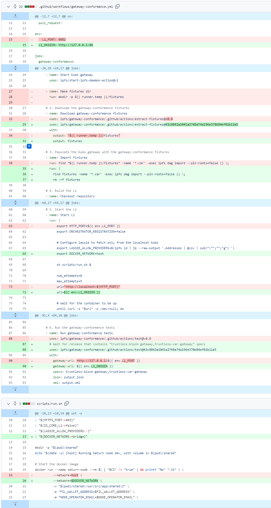
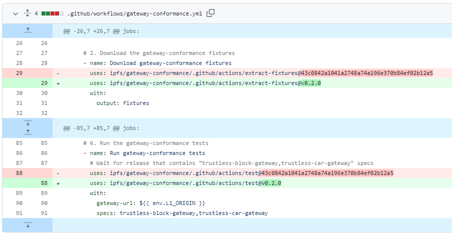
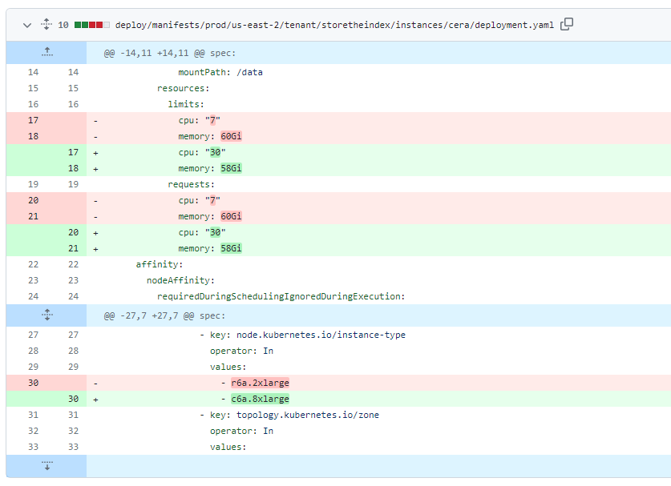

# 2023-7-2检索星球周报

## 🚀项目进展

### 1️⃣saturn

**L1-node**

1.将范围请求模块升级到v0.6

2.添加轮询器的最大尝试次数

3.使用 GHA 缓存进行集成测试

4.integration-tests.yml

+ 新增load:true属性
+ 新增uses: docker/setup-buildx-action@v2
+ 修改job名称，badbits: name: Validate Badbits ---> integration-tests: name: Integration Tests

5.更新lassie的版本至 0.12.2

6.添加 njs 模块以设置 ipfs 响应标头

7.将 ipfs 标头添加到原始响应中

8.设置accept-ranges:none

9.运行容器在本地网络

10.使用最新的gateway-conformance仓库

11.更新gateway-conformance版本

12.将分支“main”合并到 gateway-conformance

13.使用多种语义条件

14.合并来自filecoin-saturn/gateway-conformance的[#499](https://github.com/filecoin-saturn/L1-node/pull/449)拉取请求

15.删除剩余的 lassie 临时文件

16.当磁盘已满时将min_uses设置为2，在测试网络中降低min_free

17.将自述文件中的节点正常运行时间要求文档从 7 天更新为 14 天

18.统一 docs.saturn.tech 和自述文件中的节点正常运行时间要求文档

###  2️⃣storetheindex

1.减少分配给 FDB 日志进程类的未充分利用的存储

+ 日志进程类使用很少的存储，但是给出了16Ti卷。 将其减少到 2Ti 并根据需要增长。

2.更新FoundationDB/fdb-kubernetes-operator至v1.19.0

3.将专用协调器添加到 FDB prod 集群

+ 向 FDP prod 集群添加 3 个专用协调器，并将每个 Pod 的存储服务器减少到 2 个，以便调查存储服务器上的内存争用。

4.在同步失败后，添加一个最新的错误提示

5.从生产环境的provider后端中去除FDB支持的索引器

+ 在对 FDB 支持的索引器进行负载测试时，将它们从提供程序端点中排除，以避免错误的提供程序信息聚合。

6.将最大未完成 IO 操作增加到 256

+ FoundationDB使用带有O_Direct接口的AIO与磁盘交互。 未完成 IO 操作的最大数量默认为 64。如果该值太低，则速率保持者会限制接受的写入速率，从而导致日志和存储服务器中的内存和磁盘之间的滞后越来越大。
+ 将最大未完成 kob 提高到 256 以观察对延迟的影响。

7.将cera移至计算优化实例类型

8.增加产品 FDB 上的获取键和重定位并行度

+ 为了研究移动中增加的数据，由于磁盘上有空闲 IOPS，因此增加了并行度并获取关键并行度字节。

9.重新同步时重写镜像可配置 

* 重新同步时重写镜像可配置
* 不要为每个CAR写入镜像头文件

10.依赖于 go-libipni 的合并版本，ipni/go-libipni v0.2.5-0.20230628005641-f3760efb1b43

11.将最新版本部署到开发环境

12.由于 inga 陷入困境，删除 oden 作为提供商后端

13.推出对 dhfind 提供商聚合的修复

14.同步良好时清除 LastError

15.将最新版本部署到开发环境

+ 更新 storetheindex/storetheindex在开发环境中

16.更新 alva 索引器以使用与其他索引器相同的图像

17.使用 LastError 提供程序信息部署最新的 Indexstar

18.ipni/go-libipni版本更新至 v0.2.7

19.部署新的 dhstore-ago2 并替换 dhfind-ago2

+ 新的 dhstore 具有 dhstore 和 dhfind 功能
+ Deoloy 新的 dhstore
+ 使用指向 ago-indexer 的providersURL 配置新的dhstore
+ 在indexstar中，将dhfind-ago2替换为dhstore-ago2
+ 将 dhfind-ago2 副本数量减少到 0

20.恢复“部署新的 dhstore-ago2 并替换 dhfind-ago2，新功能：

- Deoloy 新的 dhstore。
- 使用指向 ago-indexer 的providersURL 配置新的dhstore。
- 在indexstar中，将dhfind-ago2替换为dhstore-ago2。
- 将 dhfind-ago2 副本数量减少到 0
- 使用固定版本的DHashClient

21.更新至最新的ipni/go-libipni v0.2.8

22.将最新版本部署到开发环境，更新`dev`环境中的storetheindex/storetheindex

23.将最后一个 dev dhfind 替换为 dhstore

- 更新indexstar后端以用dhstore替换dhfind
- 将 dhstore 更新为新映像并指定
- 将 dhfind 副本计数设置为 0

24.在 `dev` 环境中更新 storetheindex/storetheindex ([#2053](https://github.com/ipni/storetheindex/pull/2053))

25.storetheindex版本更新至v0.7.5

26.增加 dhstore-ago2 的 PVC 大小至16Ti

27.在调查 inga 问题时添加旧索引器作为提供商后端

+ “inga”是唯一的提供商后端，但它崩溃了。 因此，没有找到提供者，因此也没有查找。

28.将 inga 恢复到 0.7.3 以调查 CPU 使用率过高的情况

29.将工作线程数量从 5 增加到 50，以调查摄取对 CPU 峰值的影响。

30.恢复“恢复“在调查‘inga’问题时添加旧索引器作为提供程序后端

31.禁用 inga 上的索引计数器以恢复 prod 中的服务

32.使索引计数可配置并默认禁用

33.将索引计数选项合并为一个同时影响读/写路径的选项

34.Bump版本以发布索引计数器配置，更新至v0.7.6

35.将最新版本部署到生产环境，更新`prod`环境中的storetheindex/storetheindex

### 3️⃣Station

**desktop**

1.更新版本至0.20.3

2.添加自动批准 dependentabot PRs

3.`filecoin-station@core`更新至13.4.1

4.更新版本至0.20.4

5.添加自动批准更多依赖项

* 添加自动批准@sentry更新

* 添加`打字稿`

6.更新许多依赖

**Zinnia**

1.relax timer测试超时，https://github.com/filecoin-station/zinnia/actions/runs/5374177743/jobs/9749361834?pr=264

2.bump dtolnay/rust-toolchain

3.fix: 删除 Lassie 请求超时

4.docs: 在自述文件中提到 Rusty Lassie

5.feat: 使用授权保护 Lassie 服务器

6.fix: 将 Lassie 超时更改为 1 天

+ refactor: 共享 Lassie 配置

7.将zinnia更新至 0.13.0

8.docs: 解释 IPFS 检索超时

9.依赖更新: 

##  📢一周资讯

**1.可持续区块链峰会以虚拟形式举行，我们正在寻找演讲者。**

+ 您是否积极参与利用 Web3 创建更可持续的未来？
+ 申请地址：https://airtable.com/shrDMbSOehx2XDiho
+ 截止时间：6月30日

**2.FilecoinUnleashed**

+ 举办时间：7 月 18 日
+ 举办地点：Le Studio
+ 申请地址：https://filecoinunleashed.io/

**3.ETHGlobal** 一场非凡的黑客马拉松，争夺 40 万美元的份额

+ 举办地点：巴黎布隆尼亚宫
+ 时间：7月21日-7月23日
+ 申请地址：https://ethglobal.com/events/paris2023
