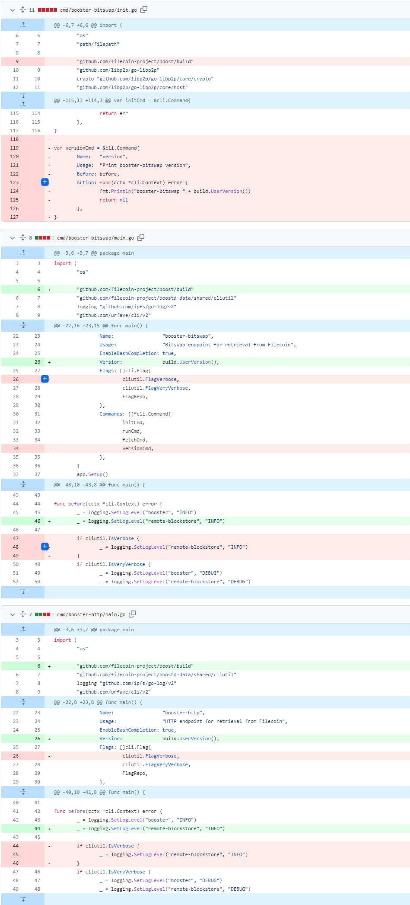

# 2023-7-30检索星球周报

## 🚀项目进展

### 1️⃣saturn

**L1-node**

无

###  2️⃣boost工具

**Boost release/v2**

1.feat:

+ 将 `corshandler` 添加到IPFS网关
+ 使用cors库
+ 保持模组整洁
+ 重构测试
+ 删除多与的cors

2.修复 booster-http 和 booster-bitswap 的版本标志

3.feat: 手动发布存储交易消息

+ 外部 PSD 控制
+ 修复 proposalCid，更新UI和错误
+ 修复 docsgen，清理突变
+ 修复解析器 arg，返回

4.使用共享片段读取器进行块存储获取（修复冲突）

+ feat: 添加本地索引目录
+ feat: 使用 `boost-gfm` 的标记版本
+ feat: 需要 go 1.19
+ chore: 发布 v1.6.2-rc2 (#1340)
+ 发布 v1.6.2-rc2
+ booster-http: 实现 IPFS HTTP 网关
+ feat: 实现http api网关
+ feat: 使用 go-libipfs lib (而不是复制到 extern)
+ feat: 碰撞助推器-bitswap 信息次要版本
+ 功能：http 网关指标
+ fix: TestHttpInfo
+ feat: 默认情况下仅提供块和 CAR，可以选择提供原始文件（jpg、mov等)
+ fix: 下载root的正确链接（#1355）
+ feat: 添加片段后清理离线交易数据的选项（#1341）
+ chore:在makefile 中添加对多个Node.js 版本的支持(#1356)
+ chore:发布v.1.7.O-rc1(#1357)发布v.1.7.0-rc1
+ feat:按二进制名称对代理版本进行分组(#1369)

---

+ feat:支持boostd-data 中的完整地址配置chore:修复boostd-data的 linting
+ feat:使用addr代替盖子的端口
+ chore:更新devnet 以使用cover设置feat:如果开始纪元过去了，交易就会失败· LID yugabyte db impl
+ feat: yugabyte db impl
+ feat:针对dockerized yugabyte运行yugabyte测试
+ feat:实现删除命令refactor:合并测试参数
+ feat:添加 lib yugabyte配置
+ feat:从couchbase迁移到yugabyte的脚本feat: yugabyte db impl
+ feat:针对dockerized yugabyte运行yugabyte测试

---

+ refactor:删除SetCarSize，因为它不再被使用refactor:删除将索引标记为错误的功能
+ feat:实现删除命令
+ refactor:合并测试参数
+ feat:添加盖子yugabyte配置refactor:结构化日志记录refactor: postgres批量插入feat:件数数组/每件块数(#1314)
+ feat: postgres 的批量插入查询
+ feat:添加标志以使用tmp表插入postgres
+ refactor:合并来自nonsense/lid-bench的更改
+ refactor:只使用一个数据库（不创建基准数据库)
+ refactor:删除未使用的参数
+ refactor:命令结构

---

+ feat:通过http提供索引提供商广告的选项
+ feat:添加索引器直接公布网址的配置
+ refactor:始终通过pubsub进行公告
+ feat: boosted指数公布-最新
+ feat:更新到索引提供者v0.11.2
+ 发布v1.7.3-rc2专长：更新到索引提供者v0.11.2
+ 发布v1.7.3-Rc2

---

+ feat:启用booster-http的监听地址(#1461)
+ feat:在 mpool UI中显示消息参数(#1471)
+ fix:阅读交易提案消息后重置阅读截止日期
+ fix:增加客户请求的截止日期
+ feat:在U中显示已用的纪元和PSD等待纪元(#1480)
+ fix devnet Ul，使用BlockdDelaySecs·修复lint错误
+ update gql/resolver.go

---

+ 发布v1.7.3-rc3(#1481)
+ feat:更新本地索引目录ui.refactor:删除扇区列表
+ feat:表面索引错误
+ feat:记录恐慌(而不是仅仅打印到标准输出)
+ refactor:删除couchbase测试
+ refactor:删除片段目录couchbase测试
+ feat:标记的碎片

---

+ feat:用migrate yugavbyte替换migratecouchbase命令(#1518)
+ refactor:简化遗留交易响应代码

---

+ refactor:删除couchbase 实现(#1535)
+ 更新Lotus和Boxo版本(#1466)(#1537)
+ 更新以使用go-libipni中的包重构：删除Couchbase实现(#1535)
+ 更新Lotus和Boxo版本(#1466)(#1537)
+ 更新以使用go-libipni中的包
+ 功能:更新Lotus版本功能:更新Lotus版本
+ 更新boxo(#1492)
+ feat:更新boxo更新boxo(#1492)
+ 壮举：更新Boxo
+ refactor:依赖于repo:jorropo/lotus
+ 分支:boxo2· feat:将boost-gfm更新到v1.26.7(#1538)
+ 重构：依赖于repo：jorropo/分支：boxo 2
+ feat：将Boost-GFM更新到v1.26.7(#1538)
+ fix:片医生测试（(#1540)·FIX：片医生测试(#1540号)
+ refactor:为遗留交易构建索引(#1539)
+ feat: http索引公告(#1418)
+ 重构：为遗留交易构建索引(#1539)
+ 壮举：http索引公告(#1418)
+ feat(indexprovider):宣布http传输
+ refactor:隔离扩展的提供者逻辑
+ feat:公布http索引
+ Feat(索引提供者)：宣布http传输
+ 重构：隔离扩展的提供者逻辑。
+ 壮举：公布http索引
+ feat:通过两个API检查工件的开封状态(#1548)
+ refactor:单独的yugabyte / leveldb测试以便于本地测试
+ feat：通过两个api检查工件的开封状态(#1548)
+ 重构：单独的yugabyte/level db测试以便于本地测试
+ feat:在UI中重构mpool页面(#1530)
+ chore:发布v2.0.0-rc1(#1561)
+ 专长：在UI中重构mpool页面(#1530)
+ 杂务：发布v2.0.0-Rc1(#1561)
+ 升级到索引提供程序v0.13.4(#1559)
+ 升级到索引提供程序v0.13.4(#1559)
+ feat:添加IPNl itest (#1563)。
+ 壮举：添加IPNl最(#1563)
+ IPNI用户体验 IPNI用户体验
+ feat: IPNIUX。壮举：IPNIUX
+ feat: 使用共享片段读取器进行块存储获取
+ feat: 使用共享片段读取器进行块存储获取

5.feat:在UI中显示 ad 链头

6:feat:

+ 从数据存储中获取矿工地址的实用程序
+ 更新cmd/boostx/boostd.go

7.修复迁移配置错误

###  3️⃣storetheindex

1.在开发者上按状态部署heyfil 过滤，在heyfil开发实例上测试按状态过滤矿工。

2.将 HeyFil PVC扩展至1Gi

3.在 dhstore-qiu上分配更多存储空间

4.更新dev中的 dhstore

5.将go-libipni更新到v0.3.0

6.修复引导程序中的panic，如果引导配置函数LoadTempBootstrapPeers未定义，则引导会发生混乱。

7.由于dhstore-ago2空间不足，在dev中创建一个新的dhstore节点，创建并运行后，后续PR会切换ago-indexer和indexstar来使用它。

8.使用最新镜像部署dhstore-ago39.删除重构

+ 删除重构服务器
+ 不需要单独的查找处理程序包·更新go-libipni

10.更新ago-indexer并使用dhstore-ago3

11.去除JSON记录后额外的换行符，json.Encoder.Encode已在每条记录后添加换行符

12.为telemetry服务创建ECR

13.将最新的indexstar镜像部署到dev

14.排除FDB索引器作为提供程序后端

+  lndexstar star 正在从这些索引器中选取提供程序，这些索引器在写入离线FDB存储时都出现错误。这会导致来自提供商/端点的提供商错误报告错误。此PR更新了Indexstar，使其不再从这些索引器获取提供程序更新。

15.部署telemetry服务到dev环境中

16.关闭开发上的FDB

+ 现在关闭开发中的FDB集群，因为由于内存问题，它不用于写入路径。删除dhstore等依赖服务。从分配器中删除相应的索引器。
+ 分配器在其池中将没有索引器，但它将继续通过gossipsub传播请求，这些请求会被ago拾取，因为ago 与分配器对等。

17.在开发部署清单中包含telemetry服务

18.将noop索引器添加到分配器以避免崩溃环回分配器至少需要一个索引器。在该条件得到缓解之前，添加一个假索引器以便服务启动。

19.添加缺少的遥测部署配置，修正部署配置问题

20.扩大memory，限制最大ad chain depth以防止占用大量内存

21.关闭产品上的 FDB及其支持的索引器

22.删除所有未加密的索引器及其记录

23.更新telemetry服务图像

24.缩小memory

25.通过删除并发距离跟踪来修复遥测内存使用

26.使用固定指标名称部署最新版本

### 4️⃣Station

**desktop**

1.telemetry: 应用核心修复，忽略 ERR_TLS_CERT_ALTNAME_INVALID

2.更新filecoin-station/core 至 13.4.2

3.更新desktop version 0.20.5

4.更新部分依赖项目

**zinnia**

1.更新部分依赖项目

##  📢一周资讯

### 1.Project Yellowstone

**Solana**的整个区块历史记录都加载到了Filecoin上，这样基础设施提供商、Solana的个人用户、探索者和索引编制者都可以访问，而无需支付BigTable 或gatekeeper税。

### 2.加入DSAlliance 超级国家

参加关于DSA Golden Gate 版本的现场AMA，该版本将Filecoin网络的数据上架或"封存"成本大幅降低达90%!

美国东部时间7月27日12:00

[Register](https://t.co/K1jqj7E870)

### 3.我们致力于打造比以往更环保的下一代互联网。

加入SBSEarth 的对话，第一个虚拟的 SBS__Tech由@FilecoinGreen.

时间:8月16日

[Register](https://t.co/jzwe15LFkO)

### 4.不要错过在拉斯维加斯加入 Filecoin 社区的机会！

FILVegas将强调人工智能对数据完整性的需求，并有以下主题演讲@MarkYusko和凯尔-萨马尼.将强调人工智能对数据完整性的需求，并有以下主题演讲@MarkYusko和凯尔-萨马尼。

内华达州拉斯维加斯米高梅公园内华达州拉斯维加斯米高梅公园

2023年10月2-6日2023年10月2-6日

[Register](