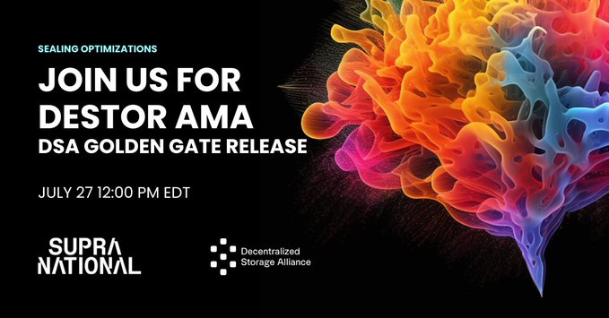

# 2023-7-30检索星球周报

## 🚀项目进展

### 1️⃣saturn

**L1-node**

无

###  2️⃣boost工具

**Boost release/v2**

###  3️⃣storetheindex

### 4️⃣Station

**desktop**

**zinnia**

##  📢一周资讯

### 1.Project Yellowstone

**Solana**的整个区块历史记录都加载到了Filecoin上，这样基础设施提供商、Solana的个人用户、探索者和索引编制者都可以访问，而无需支付BigTable 或gatekeeper税。

### 2.加入DSAlliance 超级国家

参加关于DSA Golden Gate 版本的现场AMA，该版本将Filecoin网络的数据上架或"封存"成本大幅降低达90%!

美国东部时间7月27日12:00

[Register](https://t.co/K1jqj7E870)

### 3.我们致力于打造比以往更环保的下一代互联网。

加入SBSEarth 的对话，第一个虚拟的 SBS__Tech由@FilecoinGreen.

时间:8月16日

[Register](https://t.co/jzwe15LFkO)

### 4.不要错过在拉斯维加斯加入 Filecoin 社区的机会！

FILVegas将强调人工智能对数据完整性的需求，并有以下主题演讲@MarkYusko和凯尔-萨马尼.将强调人工智能对数据完整性的需求，并有以下主题演讲@MarkYusko和凯尔-萨马尼。

内华达州拉斯维加斯米高梅公园内华达州拉斯维加斯米高梅公园

2023年10月2-6日2023年10月2-6日

[Register](https://fil-vegas.io/)