# 2023-7-9检索星球周报

## 🚀项目进展

### 1️⃣saturn

**L1-node**

1.新模板和常规配置

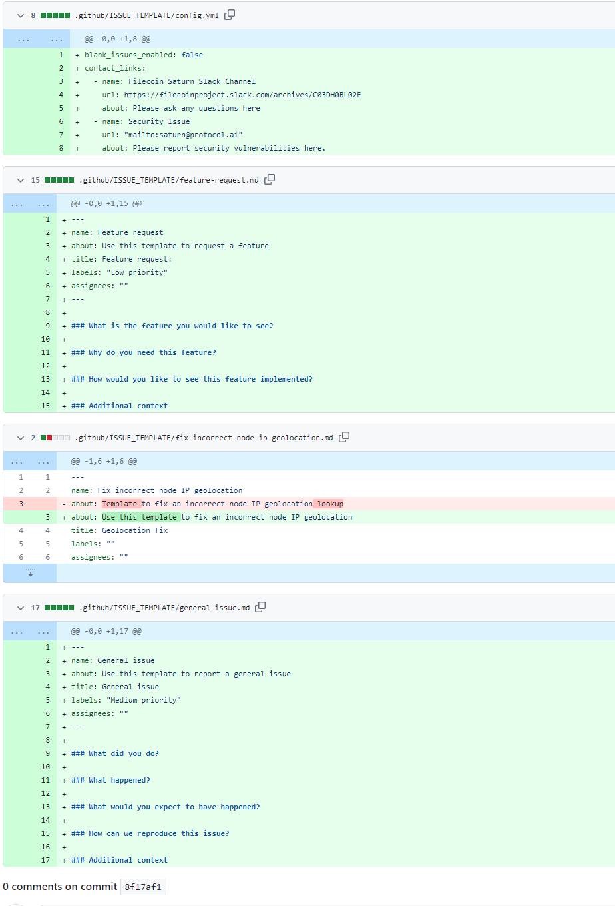

2.迁移测试网域

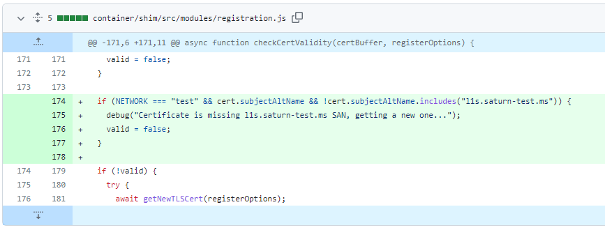

3.检查节点ID是否有效

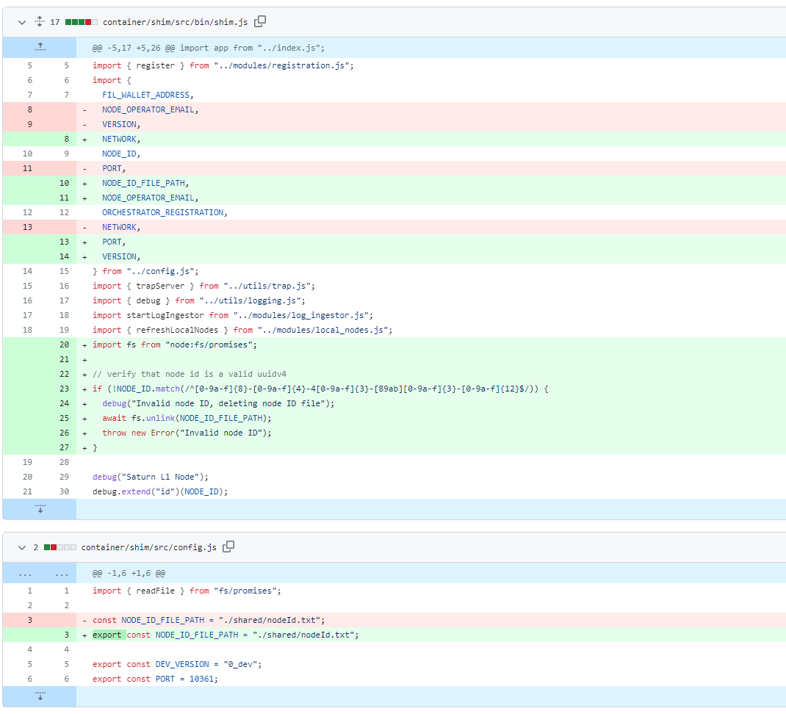

###  2️⃣boost工具

1.feat：将 mpool 中每条消息的发送纪元、时间、经过的纪元和经过的时间添加到 UI 

* 添加消息纪元/时间详细信息
* 实施建议
* 使用矩库
* 修复警报错误
* 更新轮询间隔

2.chore：发布 v1.7.4版本

###  3️⃣storetheindex

1.将最新版本部署到开发环境

+ 更新`dev`环境中的storetheindex/storetheindex

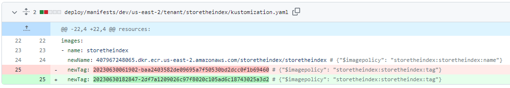

2.调查 FDB 中不断增长的队列滞后

+ 对于常规事务和批处理事务，双倍最大队列提交字节数和每个存储的队列内字节数的最大限制。

3.减少磁盘页面的 FDB 缓存

+ 调查 MVCC 内存问题：由于硬限制字节加倍，因此减少磁盘页面缓存。

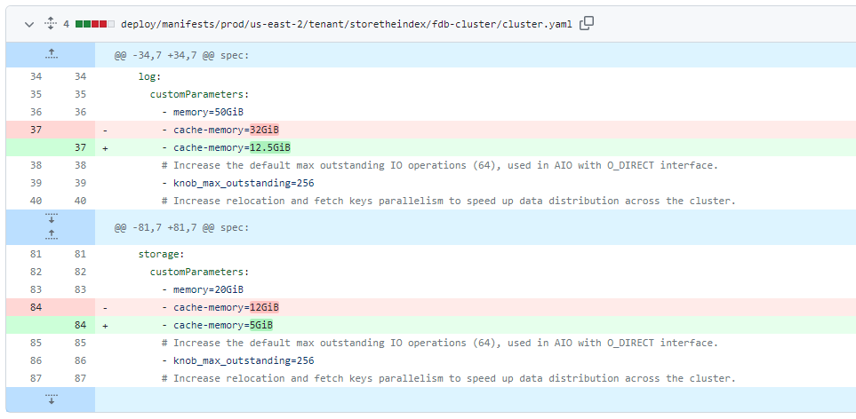

4.将 FDB 日志进程缓存减少至 12GiB

+ 调查日志进程可能由于缓存内存配置中的小数点而无法启动。

5.将存储内存限制增加至 28GiB

+ 为了利用所有可用内存，请将内存限制增加到 28GiB，因为 Pod 仅运行 2 个存储服务器进程。

6.在生产FDB集群中调优RocksDB存储引擎

+ 碰撞默认块和块缓存。 增加读取和压缩并行性。
+ 删除 FDB 存储限制以恢复正常，因为 RocksDB 设置似乎是阻碍因素。

7.在 prep 中的 dev 上添加 c6a.8xl 节点类型以升级 FDB

+ 在 dev 上设置节点组以升级 FDB，使其与 prod 设置匹配。

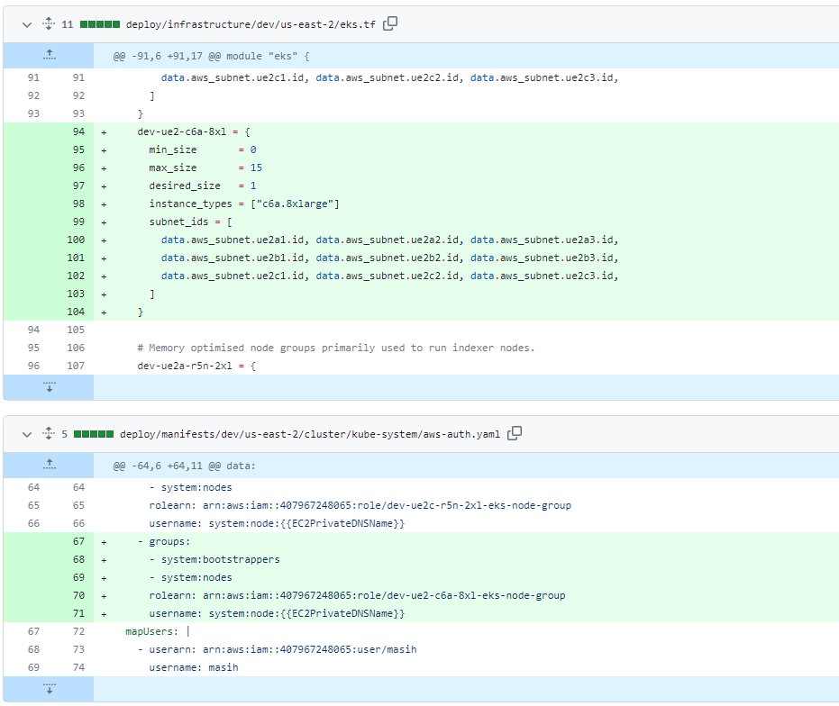

8.在开发中使用与 prod 相同的 FDB 配置

+ 为了使开发测试与生产测试具有可比性，配置开发 FDB 集群，使其与生产节点匹配。

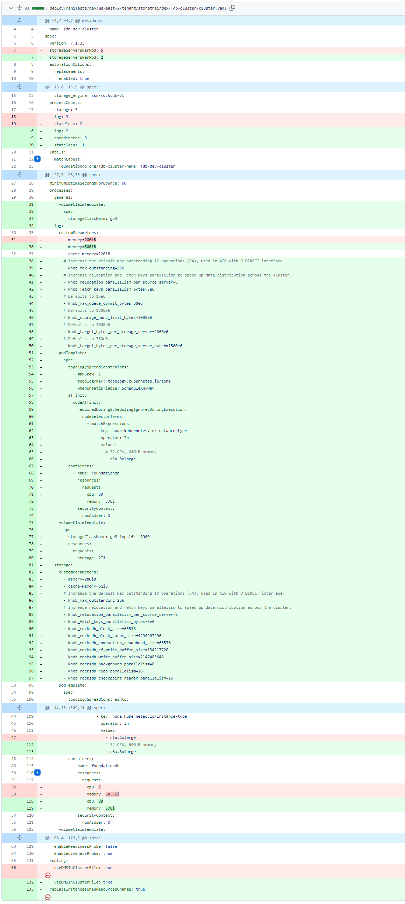

9.feat: add tornado tenant

10.feat：暂停自动检索名称空间 CD

+ 暂停自动检索命名空间中的持续交付，以防止对自动检索空间清单的更改对当前正在运行的 tornado tenant 应用程序进行更改

11.作为租户为 Tornado 团队创建 KMS 密钥

+ 创建专用的 KMS 密钥，用于管理 Tornado 团队使用的机密的加密和解密。

12.删除自动检索作为租户，因为它现在已被“tornado”租户取代。

13.在 prod 上部署新的 dhstore 实例

+ 由于“dhstore-porvy”接近充分利用其给定存储，因此部署一个新的 dhstore 实例与匹配的 dhfind 实例。
+ 一旦服务启动，一个单独的 PR 将切换 `inga` 以使用新的 dhstore 实例而不是 `porvy`。

14.配置 inga 以写入新的 dhstore

+ 更改“inga”以写入新配置的“dhstore”实例，并将“porvy”移动到 dhstore 集群 URL 以处理删除。

15.扩展 dev-ue2a-r6a-xl 节点组的子网

+ 扩展“dev-ue2a-r6a-xl”的子网，因为 IP 已用完，并且节点未得到调度。

16.更新到新的 dhstore

- 更新到支持 dhfind 的新 dhstore
- 使用提供商 URL 配置每个 dhstore

* 升级dhstore-qui

17. 用新的 dhstore 替换 dhfind

- 将 dhfind 副本计数设置为 0
- 在indexstar配置中用dhstore替换dhfind

* 关闭 dhfind-qui

18.将 dhfind stateless 替换为新的 dhstore stateless

19.使用 dhfind 指标将 dhstore 更新到新版本, 使用 dhfind 指标将 dhstore 更新到新版本, 在 dhstore-stateless 上启用 dhfind

20.使用 dhfind 指标更新到新的 dhstore

21.在具有持久存储的开发和生产环境中部署 HeyFil API

+ 在开发和生产上部署最新的 HeyFil 服务，该服务引入了用于查询 SP 信息的 REST API 以及本地存储，以便在重启时快速恢复指标。

22.部署最新到 Heyfil

+ 部署最新版本以支持 HEAD 方法并修复 API 服务器中的panic。

23.删除 ber 和 cali 索引器

24.部署最新到 heyfil

25.在 HeyFil 中部署对 big int 聚合的修复

### 4️⃣Station

**desktop**

1.ci：添加自动批准@vitest/ui 更新

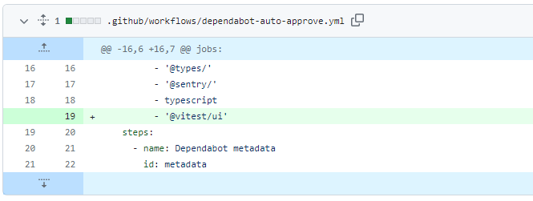

2.ci：添加组 dependentabot @sentry 更新

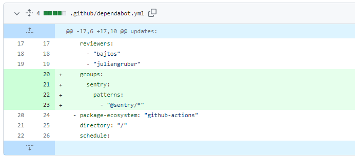

3.ci：添加自动批准 prettier 的更新

4.ci：添加自动批准 postcss 更新

5.其他依赖版本的更新

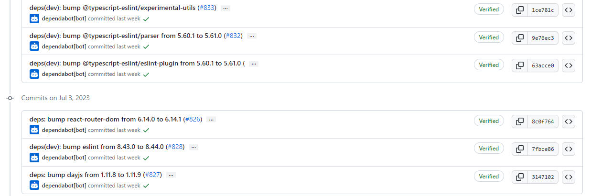

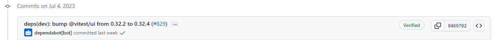

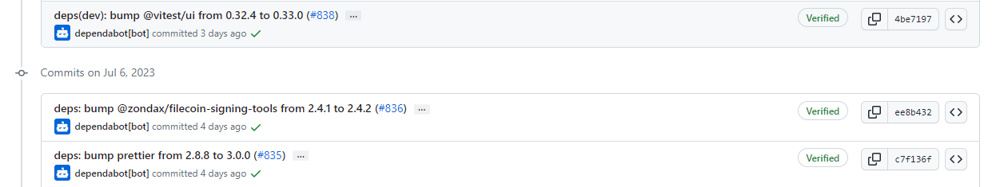

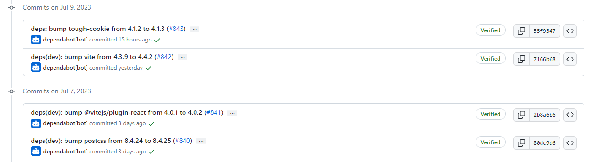

**Zinnia**

1.版本依赖的更新

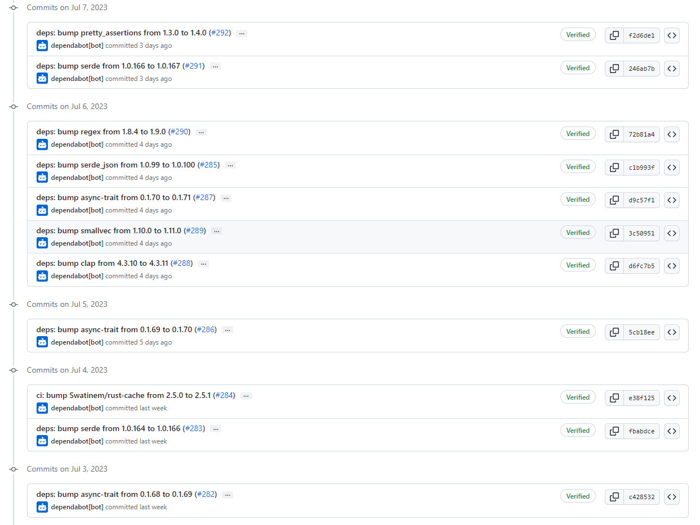

##  📢一周资讯

+ **juanbenet**
  + [@juanbenet](https://twitter.com/juanbenet)(胡安), 协议实验室(PL)创始人，将作为 **FilecoinUnleashed** 主讲人，前往 **EthCC** ，他将深入探讨 Filecoin 社区的最新突破。 
  + 7 月 18 日[Le Studio](https://filecoinunleashed.io/)

+ **资助巴黎下议院**

  + 关于活动

    + 第六届 Funding the Commons 活动将于 7 月 15 日至 16 日在法国巴黎美丽的背景下举行。该活动在著名的索邦大学举办。

    + Funding the Commons 专注于可持续公共产品资助的新模式以及开源网络中的价值协调。我们在 Web2、Web3、研究、慈善事业和行业之间架起了公共产品社区的桥梁。我们通过传统会议和“开放空间”形式召集建设者、学者和资助者来实现这一目标。

  + 活动时间
    + 7 月 15 日星期六，上午 9:00 至下午 6:00 GMT+2 · 2 节课，巴黎，法兰西岛

+ **FilecoinTools**
  + FilecoinTools 是一组构建在 Filecoin 网络之上的计算和存储技术。该堆栈包括各种组件，例如计算、存储和网络资源，开发人员可以使用它们来构建去中心化应用程序。
  + 了解更多：[https: //docs.filecoindata.tools/about/](https://t.co/xTbBU9tXnG)

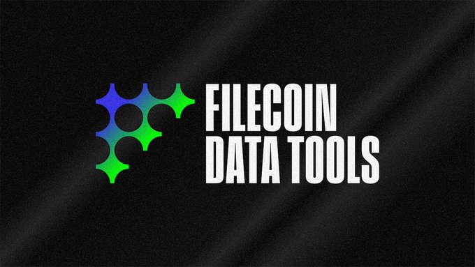

+ **DeveloperAlly**
  + [FilFoundation](https://twitter.com/FilFoundation) 的DeveloperAlly将前往EthCC。
  + 并演讲”[@Lilypad_Tech](https://twitter.com/Lilypad_Tech)：为什么分布式计算是 Filecoin 和 Web3 的下一个前沿” 。
  + 时间：7 月 18 日 下午 2 点 CET 
  + Cyclone Le Studio 注册：[//filecoinunleashed.io](https://t.co/nKgyN6BvDq)

+ **首届SBS虚拟活动“SBSEarth”**
  + 时间：8月16日
  + 注册地址：https://sbs.tech/

+ 了解如何使用 Filecoin 网络在[#FILParis](https://twitter.com/hashtag/FILParis?src=hashtag_click)上优化成本而不影响数据安全。加入[#FILParis，](https://twitter.com/hashtag/FILParis?src=hashtag_click)讨论 Filecoin 网络数据存储的未来。
  + 发掘永久存储的潜力，并与推动这一创新的社区见面。
  + 立即注册:https://fil-paris.io/register/

