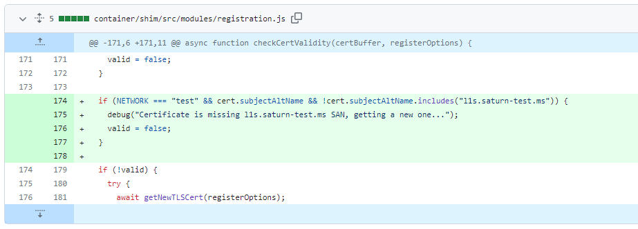
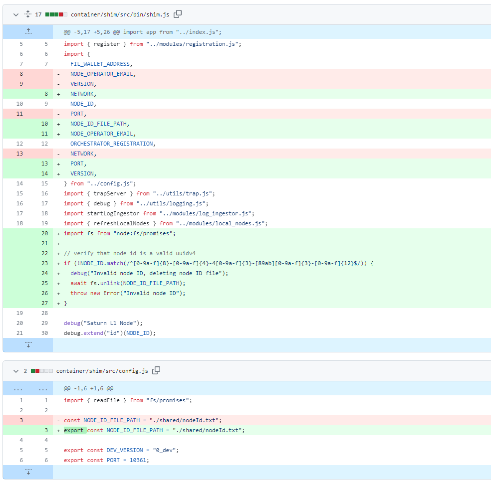
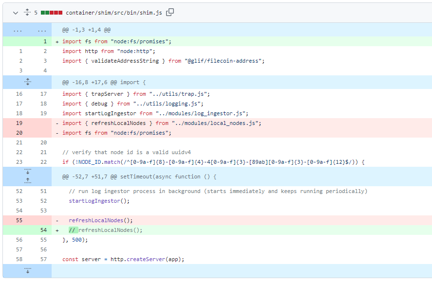
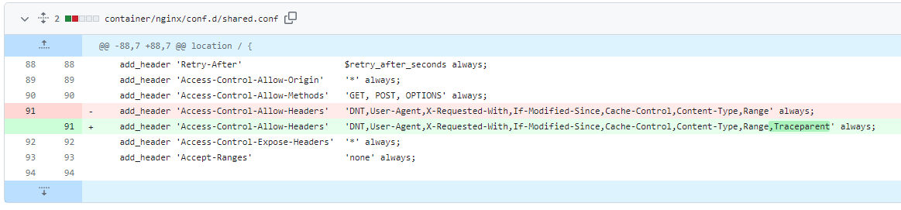
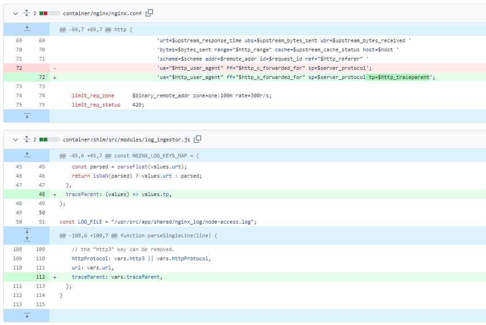
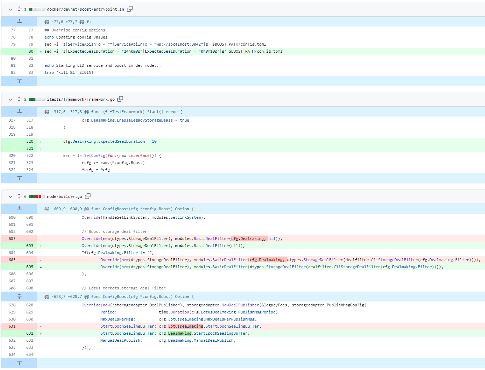
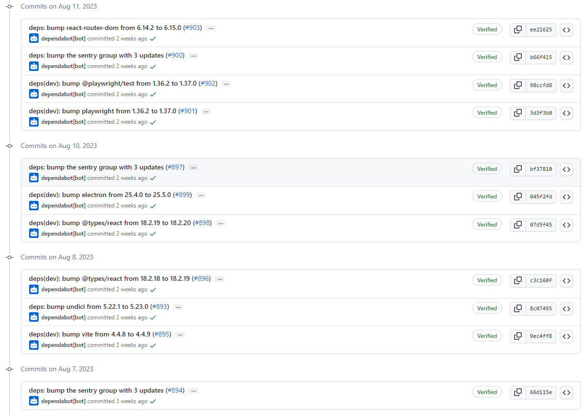
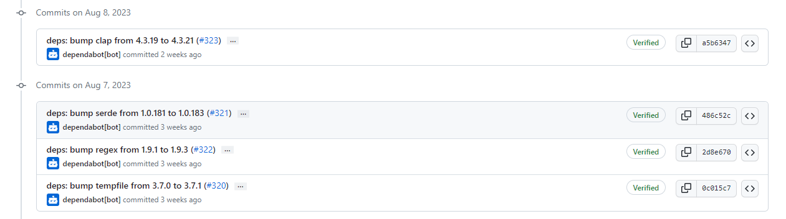
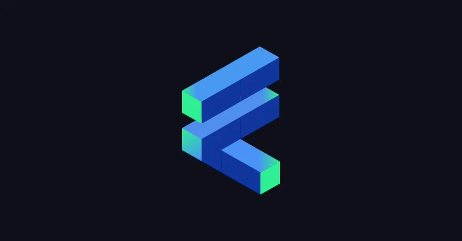
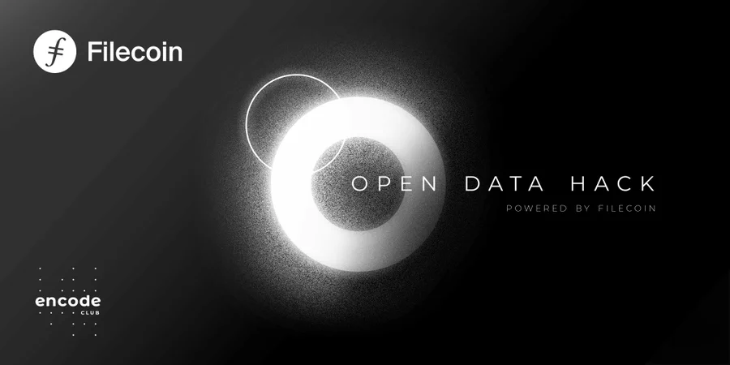

# 2023-8-13检索星球周报

## 🚀项目进展

### 1️⃣saturn

1.若`NETWORK === 'test'`，则迁移至测试网络

2.增加效验 node id 是否有效

3.禁用 /local/nodes orch 请求

4.在 `Access-Control-Allow-Headers` 中添加 `Traceparent`

5.nginx 中添加 `traceParent`

6.修改变量名，traceParent => traceparent

7.增加 `traceparent` 到 `lassie` 日志中

###  2️⃣boost工具

1.fix: 更新 deal 的过滤器，使用 `ExpectedSealDuration` 和 `MaxDealStartDelay`

+ 更新 `deal` 的过滤器
+ 修复 `itests`
+ 调整 `devnet` 的值
+ 更新 `docker/devnet/boost/entrypoint.sh`

2.migrate-lid：修复返回错误信息的问题

###  3️⃣storetheindex

1.更新 `dev` 环境下的 `telemetry` 数据

### 4️⃣Station

##### desktop

1.更新部分项目的依赖

##### zinnia

1.更新部分项目的依赖

##  📢一周资讯

1.**Why FVM?**

1. 无限可能：DataDAOs、永久存储、金融。
2. 去中心化计算和第 2 层网络。
3. 信誉系统和内容交付。
4. 加入支持性社区。
5. 在 Filecoin 主网上发布应用程序！

2.**Open Data Hack**

从 8 月 30 日起，与 Filecoin 和 Encode Club 一起探索开放数据黑客（Open Data Hack）！ 提高技能，塑造 web3，赢取价值 3 万美元的奖池。

[Read more](https://twitter.com/encodeclub/status/1688944069710376960)

3.**Filecoin News 71**

1. DSA 将去中心化存储成本降低 40%
2. FVM 创世加速器由@LongHashX & @protocollabs提供
3. 基金公益黑客马拉松@FundingCommons
4. FIL Vegas，10月 3-5日

[Read more](https://filecoin.io/blog/posts/filecoin-news-71/)

4.**Filecoin Infra Roundtable**

[audio](https://twitter.com/i/spaces/1eaKbrgAekZKX?s=20)

5.**FILDevSummit23**

Filecoin 社区非常高兴地举办 FILDevSummit23 - 开发人员和社区成员在这里塑造 Filecoin 的协议、工具和网络。加入我们在新加坡（9 月 12 日至 14 日）和冰岛（9 月 25 日至 27 日）的活动。

[Read more](https://fildev.io/)

6.**Step into the Filecoin Ecosystem**

[Read more](https://youtu.be/26ZdMAo23mM)
