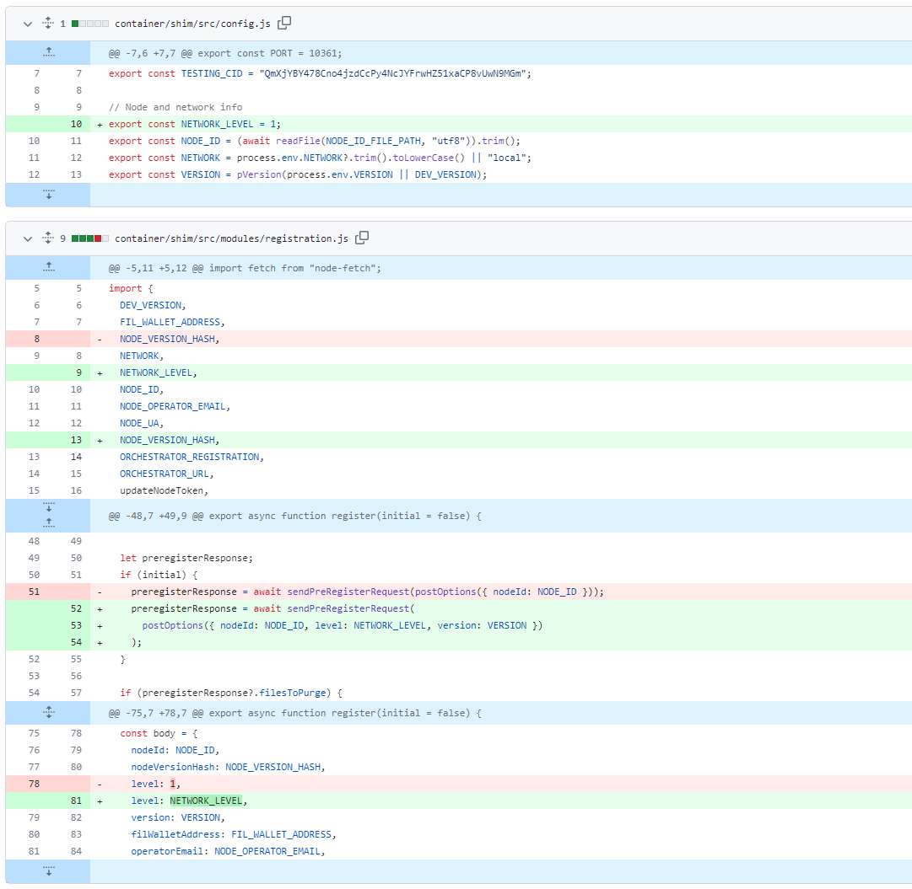
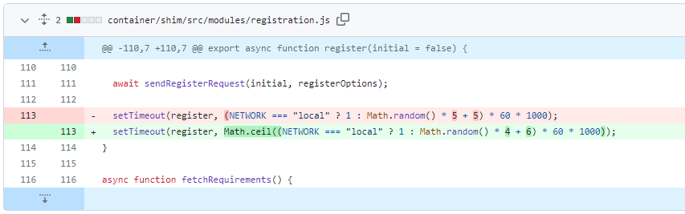
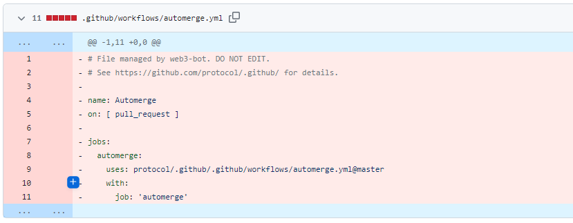
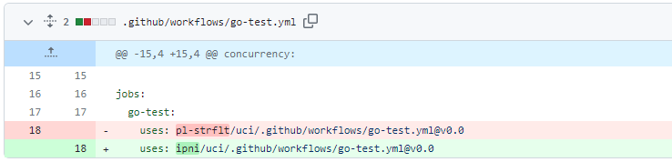

# 2023-8-20检索星球周报

## 🚀项目进展

### 1️⃣saturn

1.feat: 在预注册时添加 nginx 缓存清除器

+ 修改在连接失败时连接失效的问题
+ 更新部分依赖

2.fix: 检测预注册时的回复

3.docs: 修改文档中的节点更新时间，8 => 4

4.fix(pre-register): 发送预注册的字段

5.升级 `Lassie` 至 v0.15.0

6.chore: 清除更新部分的 `protobuf`

7.chore(registration): 注册间隔的毫秒时间

8.chore: 升级 `protobuf` 至 24.0

###  2️⃣boost工具

1.feat: 添加 docker 以容器化独立的 boost-client

+ chore: 清理主网 docker 构建
+ 更新 docker/boost-client/Dockerfile.source

2.`migrate-lid` 的超时

###  3️⃣storetheindex

1.chore: 删除部分模板

2.chore: 添加或强制更新 `.github/workflows/go-check.yml`

3.chore: 添加或强制更新 `.github/workflows/go-test.yml`

4.chore: 添加或强制更新 `.github/workflows/releaser.yml`

5.chore: 添加或强制更新 `.github/workflows/release-check.yml`

6.chore: 添加或强制更新 `.github/workflows/tagpush.yml`

7.chore: 更新 `.github/workflows/go-test.yml`

8.从 ipni/uci/copy-templates 合并请求 [#2220](https://github.com/ipni/storetheindex/pull/2220)

9.更新为不带选择器的 go-libp2p

10.更新 `telemetry`

11.可配置的最大异步和同步并发量

### 4️⃣Station

##### desktop

1.更新部分项目依赖

##  📢一周资讯

### 1.Filecoin & IPFS Ecosystem Roundup

1. 八月份 Filecoin & IPFS 生态系统综述已上线！[Read more](https://youtu.be/lpQWwF4dd2o)

2. Filecoin、IPFS 和 Web3 的现状

   1. FIL-Paris - http://fil-paris.io
   2. 检索市场工作组 - http://retrieval.market
   3. 数据计算工作组 - http://cod.cloud
   4. IPC WG - http://fil.space
   5. Messari 第二季度报告：http://messari.io/report/state-of-filecoin-q2-2023

3. 本月最佳战绩

   1. @Filet_finance超过 85 万 Fil 存款！
   2. 150 天的 FVM https://twitter.com/Filecoin/status/1672007789533618177...
   3. HASS - 高可用性扇区存储处于测试阶段 FileDrive1https://youtube.com/watch?v=lpQWwF4dd2o&t=581s
   4.  密封服务器成本最多可降低 90% https://twitter.com/Filecoin/status/1674818033771069440...
   5. @HashKingGlobal
   6. 近 100 万 FIL 入金！
   7. http://Spheron.Network - FVM 链启动 https://spheron.network https://youtube.com/watch?v=lpQWwF4dd2o&t=581s

4. 本月最佳应用程序Iroh

   现在就为全世界提供高效的 IPFS。Iroh 让 IPFS 超越理论，为开发人员提供高效的基础架构，可将数据分发扩展到超过 1000 万台设备。https://iroh.computer

5. FILMVP

   1. @OpenGateNFT 用于启动 Filecoin DNS。
   2. @fvm_SPex 用于实现流动性和金融解决方案的交易、融资、竞价和互动。
   3. @CollectifDAO 为 Filecoin 带来资本高效存储和挖矿！

6. Events

   SBS-Earth Replay - [https://youtube.com/watch?v=1nuMk72bytg](https://t.co/2gE0s3dcZn)

7. 下一步是什么？

   敬请期待 9 月 7 日的下一期综述！如果您想分享胜利和更新信息，请发送电子邮件至 events@protocol.ai，在推特上使用 #FilecoinRoundup 标签，或填写以下表格	[link](https://airtable.com/shrcadO9WAnQ5nJvA)
