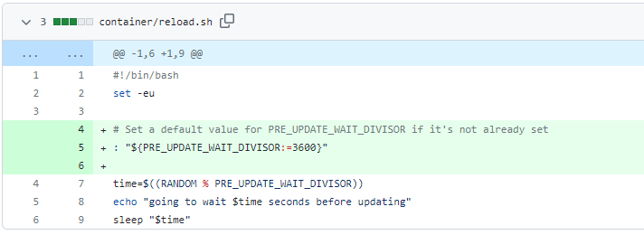
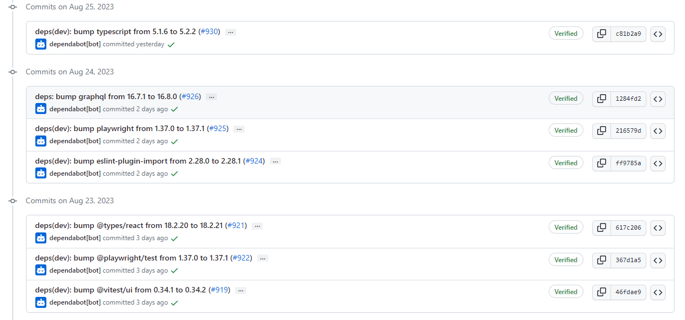
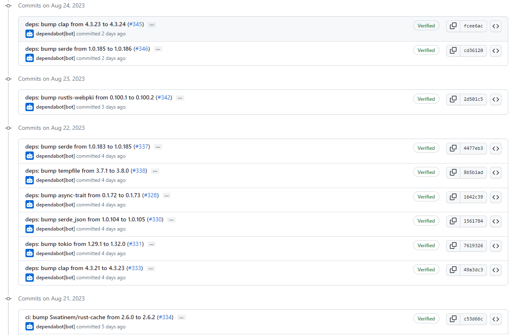

# 2023-8-27检索星球周报

## 🚀项目进展

### 1️⃣saturn

1.chore(protobuf)：更新 `protobuf` 版本 protoc-24.0 => protoc-24.1

2.chore(reload.sh)：添加默认的 `PRE_UPDATE_WAIT_DIVISOR` 在reload.sh文件中

3.升级 Lassie 至0.16.1

###  2️⃣boost工具

*None*

###  3️⃣storetheindex

1.ci: uci/copy-templates

+ chore: 将 `go.mod` 升级到 1.20 并且 `run go fix`
+ chore: 将 `go-libp2p` 和 `quic-go` 升级至最新版本

2.创建新的 dhstore 节点 `dhstore-ravi`

3.将 `inga-indexer` 改为使用 `dhstore-ravi`

4.部署新的 `ipnisycn` 索引器，以检查是否与现有 `providers` 合作

5.更新 dev 环境中的 `ipnisync sti` 镜像

### 4️⃣Station

##### desktop

1.更改 `deps(dev)`：`bump electron` 版本从 25.5.0 更新到 26.0.0

2.`desktop` 版本更新至 0.21.0

3.更新项目部分依赖

##### zinnia

1.ci: 使用Go version 1.20

2.更新部分项目依赖

##  📢一周资讯

1.**FTC Berlin**

9 月 8 日至 9 日，与我们一起在 Funding the Commons 参加 FTC Berlin，庆祝创造和创新的实践精神。参加由该领域主要参与者举办的研讨会和深入讲座。

[注册](https://lu.ma/descixfundingthecommons_berlin2023)

2.**FilecoinGreen**

[Read more](https://twitter.com/FilecoinTLDR/status/1694418996206985544)

3.**FILDevSummit23**

您将在 #FILDevSummit23 上看到什么？关于以下方面的重要对话   

+ 协议可扩展性
+ 网络改进
+ 数据导入工具
+ 即将进行的升级

新加坡（9 月 12-14 日）和冰岛（9 月 25-27 日）
[注册](https://fildev.io/?utm_campaign=FIL%20Dev%20Summit&utm_content=261588821&utm_medium=social&utm_source=twitter&hss_channel=tw-2653394250)

4.**LabWeek23**

LabWeek23即将在伊斯坦布尔举行 - 11 月 13-17 日，与 Devconnect 同时举行

与 1500 多名 PLN 建设者一起在以下领域进行创新：

+ 去中心化存储
+ 人工智能、Zk、CoD
+ 公共产品及更多

了解更多信息： http://23.labweek.io

5.**Filecoin news 72**

查看以下信息

+ 九月举行的 #FILDevSummit23 峰会
+ 最新的 Filecoin & IPFS生态系统综述
+ 最新发布的 Lotus Slasher 和 Lotus Disputer 服务
+ 即将举行的全球 FIL 活动

[Read more](https://filecoin.io/blog/posts/filecoin-news-72/)
