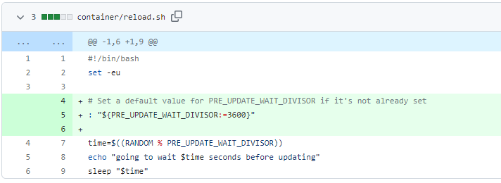
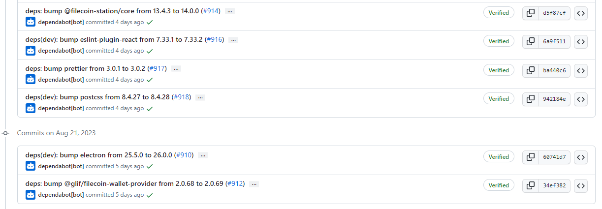
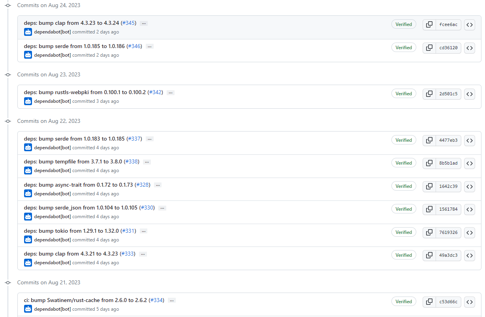

# 2023-8-27检索星çƒå‘¨æŠ¥

## 🚀项目进展

### 1ï¸âƒ£saturn

1.chore(protobuf)：更新 `protobuf` 版本 protoc-24.0 => protoc-24.1

2.chore(reload.sh)：添加默认的 `PRE_UPDATE_WAIT_DIVISOR` 在reload.sh文件中

3.å‡çº§ Lassie 至0.16.1

###  2ï¸âƒ£boost工具

*None*

###  3ï¸âƒ£storetheindex

1.ci: uci/copy-templates

+ chore: å°† `go.mod` å‡çº§åˆ° 1.20 并且 `run go fix`
+ chore: å°† `go-libp2p` å’Œ `quic-go` å‡çº§è‡³æœ€æ–°ç‰ˆæœ¬

2.创建新的 dhstore 节点 `dhstore-ravi`

3.将 `inga-indexer` 改为使用 `dhstore-ravi`

4.部署新的 `ipnisycn` 索引器，以检查是å¦ä¸ç°æœ‰ `providers` åˆä½œ

5.æ›´æ–° dev ç¯å¢ƒä¸­çš„ `ipnisync sti` é•œåƒ

### 4ï¸âƒ£Station

##### desktop

1.更改 `deps(dev)`：`bump electron` ç‰ˆæœ¬ä» 25.5.0 更新到 26.0.0

2.`desktop` 版本更新至 0.21.0

3.更新项目部分ä¾èµ–

##### zinnia

1.ci: 使用Go version 1.20

2.更新部分项目ä¾èµ–

##  📢一周资讯

