# 2023-8-6检索星球周报

## 🚀项目进展

### 1️⃣saturn

1.更新L1-node的项目依赖

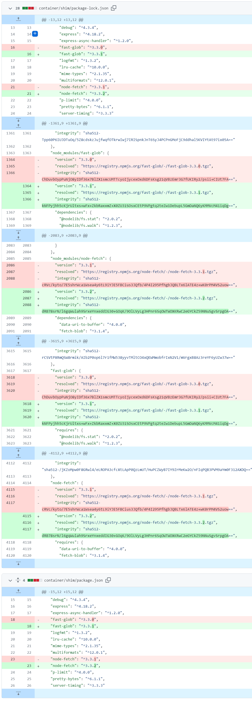

2.简化 NJS 变量、order 导入

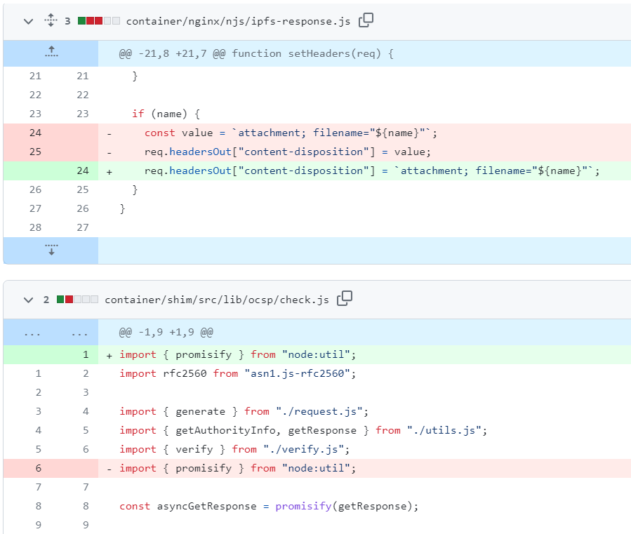

###  2️⃣boost工具

1.fix: 启动时禁用索引提供程序

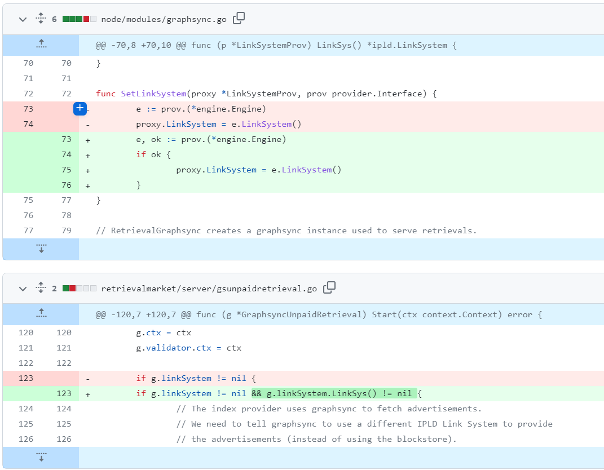

2.创建 `CONTRIBUTING.md` 更新 `README.md`

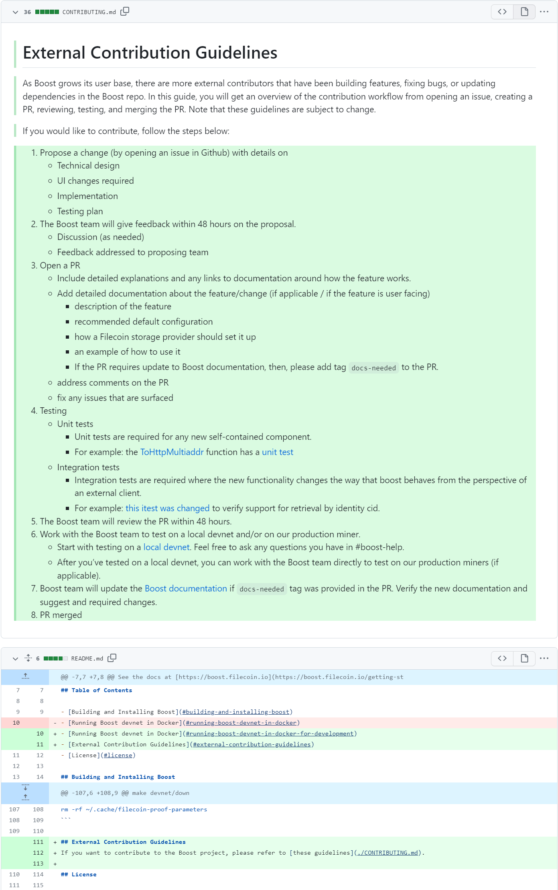

###  3️⃣storetheindex

1.具有更多内存和更新超时的 Telemetry 功能

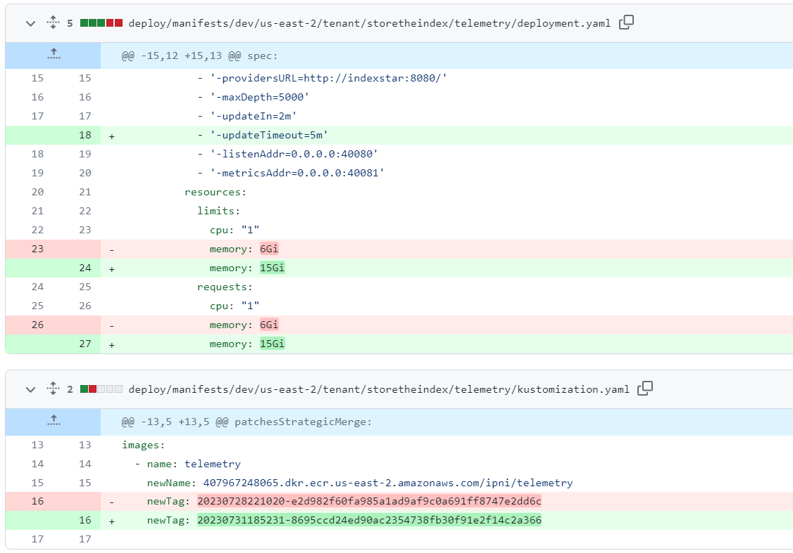

2.更新telemetry的内存泄露问题

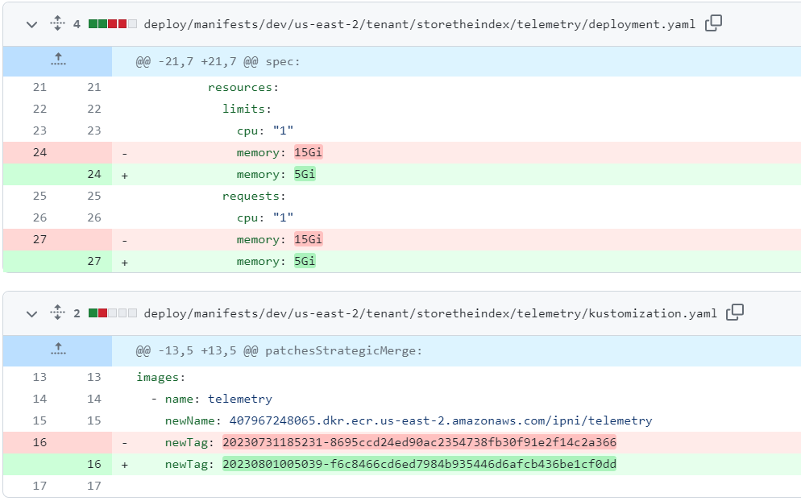

3.将 telemetry 服务部署到 prod 环境中，更新镜像

4.从 5G 到 15G 为 telemetry 分配更多内存

5.indexer 不需要持久化引导 peers

6.将最新版本部署到开发环境

+ 更新`dev`环境中的 storetheindex
+ 使用相同的镜像

7.修复内存泄露

8.允许分配器（assigner）以零索引器启动

9.修复因未分配引导配置函数而导致的恐慌

+ 原因：[ipfs/kubo#10030](https://github.com/ipfs/kubo/issues/10030)

10.使用空索引器 (indexer) 池部署新的分配器 (assigner)

11.修复 telemetry 中的错误 count

12.利用FLux CD重新生成 github的tokens

13.更新go-libpni至最新版本

+ 更新包括修复 graphsync deadlock死锁问题
+ 测试关闭 libp2p hosts问题

14.部署最新的 telemetry 来修复 graphsync 问题

15.从 infra 中移除 alumni 用户

16.部署最新的 `dev` 环境

+ 更新 `storetheindex` 到 `dev` 环境中去

17.更新版本至 v0.7.7

18.部署到最新的 `prod` 环境中

19.删除 announcements 中和 ads 中未指定的地址

20.更新`storetheindex` 到 `dev` 环境中去

21.使用最新的provider版本 更新 Terraform 锁文件

22.切换 dhstore 后端以调查降级的 ingest

23.将 indexers 的终止时间缩短到3min

24.删除 K8S 工作组中多余的 tains

25.更新 go-libp2p 至 v0.29.1

26.回滚 “切换 dhstore 后端以调查降级的 ingest”

27.更新版本至v0.7.8

28.更新 `storetheindex` 到 `prod` 环境中

29.更新 `storetheindex` 到 `dev` 环境中

### 4️⃣Station

##### desktop

1.更新版本至 v0.20.6

2.ci: 添加自动批准 vitejs/plugin-react 插件的更新

3.更新依赖项目的版本

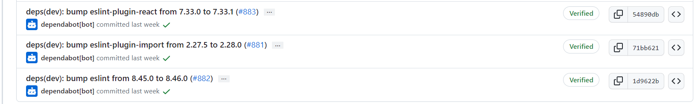

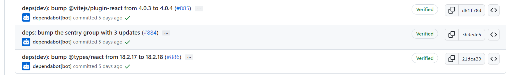

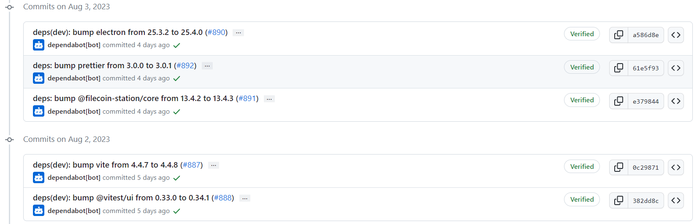

##### zinnia

1.ci: 修改 `actionsx/prettier`

+ 修改 [actionsx/prettier](https://github.com/actionsx/prettier) 从 e90ec5455552f0f640781bdd5f5d2415acb52f1a 到 3d9f7c3fa44c9cb819e68292a328d7f4384be206

2.chore: 配置Dependabot, 对 Denon 进行分组

3.更新依赖项目的版本

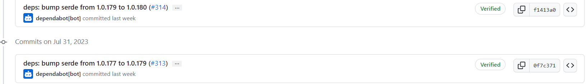

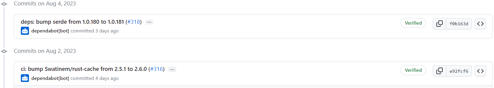

##  📢一周资讯

### 1.Filecoin SPs

呼吁所有 Filecoin SP, 查看这篇关于 CC 扇区指南和建模的深度文章。获得优化存储性能和利用最新升级的宝贵见解。[Read more](https://filecoin.io/blog/posts/cc-sector-upgrade-guidelines-and-modeling/)

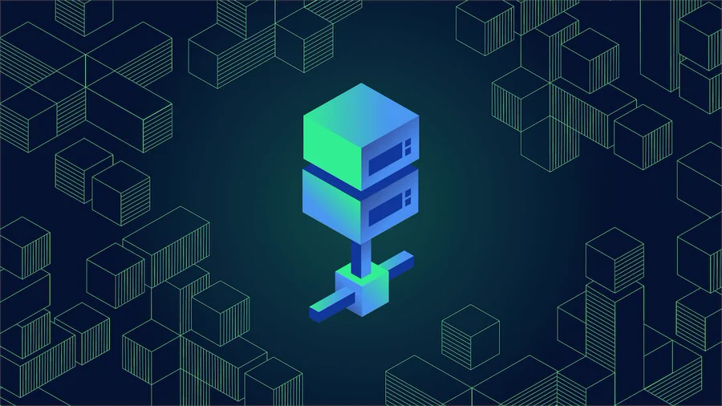

### 2.Open Data Hack(开放数据黑客)

1.介绍由 Filecoin 生态系统和 @encodeclub 发起的为期 3 周的在线黑客马拉松活动 Open Data Hack。从 8 月 30 日开始，您将有机会探索新的 Filecoin 用例，打造开放数据经济。

2.立即申请，您将获得机会：

+ 3万美元奖金（还在不断增加中）
+ 1:1 导师指导
+ 工作场所等（及更多）

3.敬请期待有关开放数据黑客的更多精彩更新，请访问@encodeclub。我们期待共同开发鼓舞人心的新用例，打造开放数据经济！

### 3.Boost your Filecoin storage game

提升您的 Filecoin 存储游戏！  学习监控 booster-http 检索，实现无缝客户端体验。查看我们关于 HTTP 服务和使用 nginx 进行 booster-http 保护的博客。[Read more](https://filecoin.io/blog/posts/monitoring-booster-http-retrievals/)

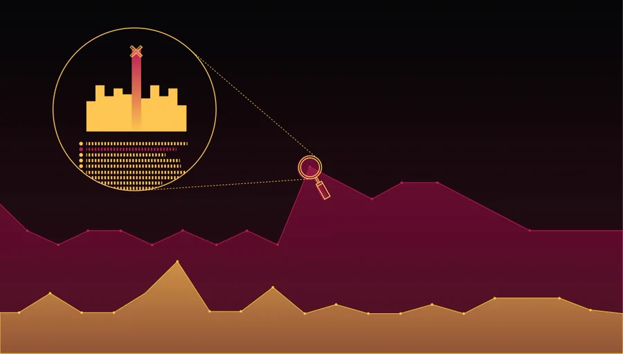

### 4.SBSEarth

The future is green.

这就是为什么我们要通过 #SBSEarth 将 web3 和可持续发展对话推向全球。

这是在 web3 和生物圈交汇处举办的一次完全虚拟的活动，由@FilecoinGreen.

8月16日 [Join the conversion](https://sbs.tech/?utm_content=257971564&utm_medium=social&utm_source=twitter&hss_channel=tw-2653394250) 

### 5.FVM Genesis Accelerator

介绍 Filecoin Virtual Machine (#FVM) Genesis Accelerator，这是 Web3 + AI 合作的开创性项目，由LongHashX，protocollabs，和Filecoin 社区共通合作。

[Read more](https://twitter.com/LongHashX/status/1687101022630707201)

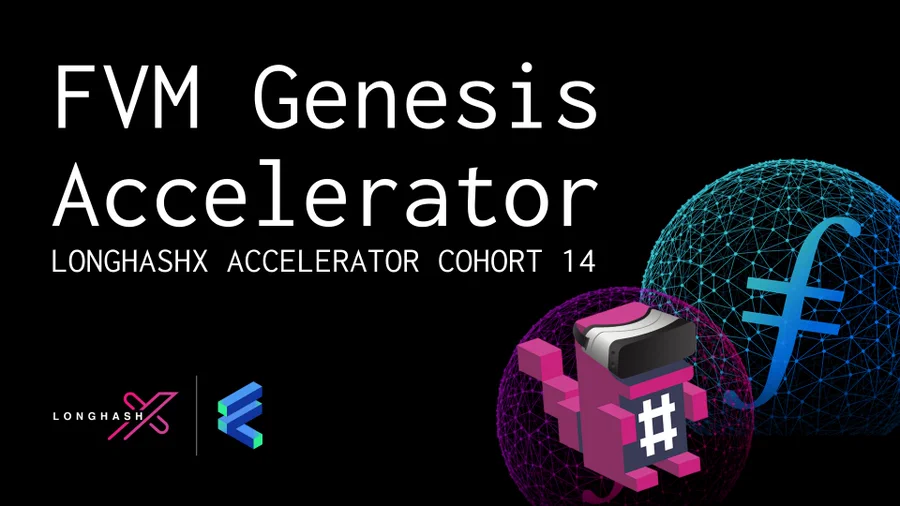
