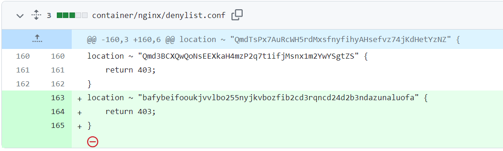
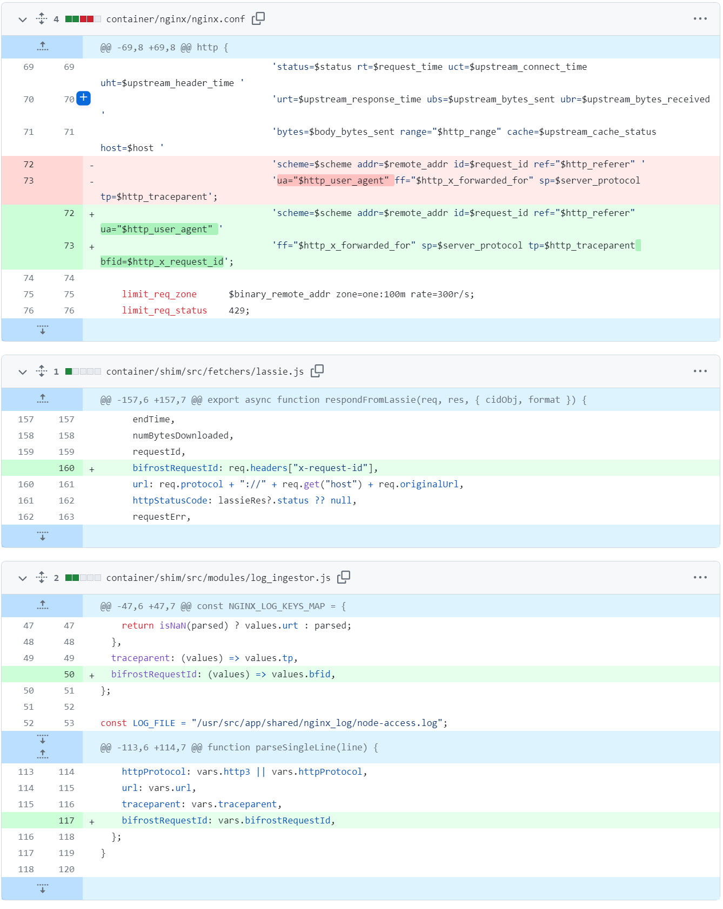
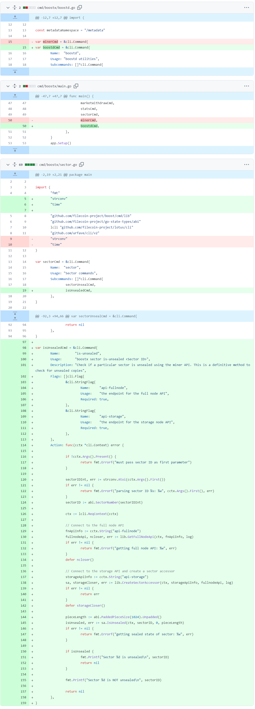
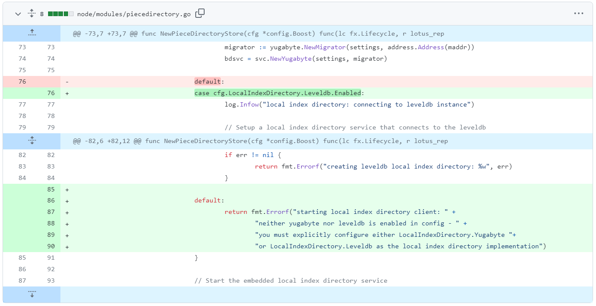
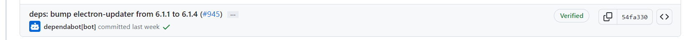
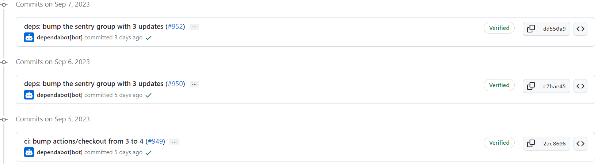
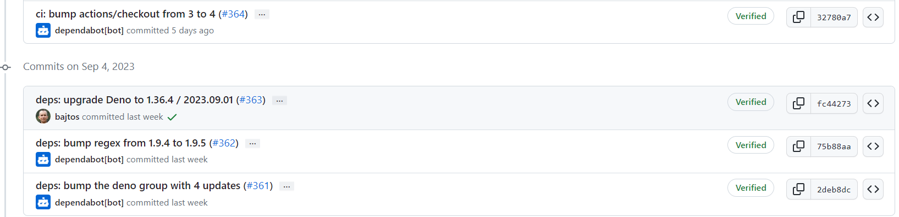
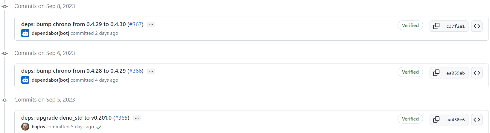
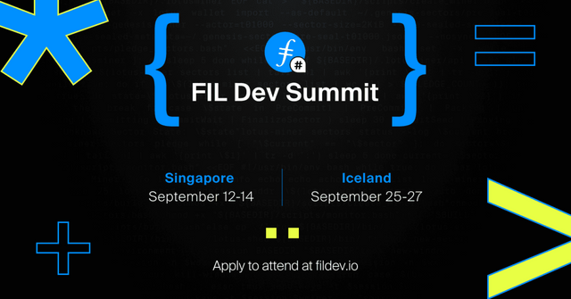

# 2023-9-10检索星球周报

## 🚀项目进展

### 1️⃣saturn

1. docs: 修正错别字
   + README.md: varariable => variable, an => a
   + faq.md: escenarios =>  scenarios, recommended => recommend, ~~to~~
2. chore: 将 lassie 升级至 v0.17.0，支持 entity-bytes
3. refactor: 'entity-bytes' => "entity-bytes"
4. chore: 禁止CID

5. 向 log-ingestor 报告 x-request-id

###  2️⃣boost工具

1. feat: 为 boostx 添加 InUnsealed 工具

2. fix: 禁用 flay TestConcurrentTransfers
3. fix: 禁用 leveldb 作为 LID 的默认设置
4. fix: 修复 docsgen 和 itests
5. fix: 修复 itest
6. update: 更新 node/modules/piecedirectory.go

###  3️⃣storetheindex

1. 更新为具有 libp2phttp 功能的 ipnisync
1. 默认情况下不适用可重试的HTTP客户端
1. 针对所有类型的提供程序运行 e2e 测试：libp2phttp, plain http, dtsync
1. 在测试中使用 ipnisync publisher
1. 更新 docs
1. 更新项目依赖
1. 更新 README，并移除规范版本中的 docs
1. 更新 Dockerfile 中的 go 版本（golang:1.21）
1. Metrics: 追踪每个 provider 的 ingestion
1. 将最新版本部署到 dev 开发环境中
1. 将可还原的 HTTP 客户端数设置为 0
1. 部署最新的 telemetry

### 4️⃣Station

##### desktop

1. 更新 desktop 的版本至 0.22.0
1. 更新项目部分依赖

##### zinnia

1. ci: 升级 action/checkout 从 3 到 4
2. 更新部分项目依赖

##  📢一周资讯

### 1.FILDevSummit23

新加坡 FILDevSummit23 大会的演讲者阵容包括：

1. 在[#FILDevSummit23](https://twitter.com/hashtag/FILDevSummit23?src=hashtag_click)进入 FVM 应用程序和工具阶段的是[@nanditmehra](https://twitter.com/nanditmehra) ，创始人[@LighthouseWeb3](https://twitter.com/LighthouseWeb3) \- 在[@IPFS](https://twitter.com/IPFS) 、Filecoin 和以太坊上提供永久文件存储。了解 Lighthouse 如何通过支持可编程存储和 PoDSI 的 SDK 使 FVM 构建变得简单。
2. 不要错过[@Glifio](https://twitter.com/glifio)创始人，[@j_schwartzz](https://twitter.com/j_schwartzz)谈论存储提供商如何通过基于市场的利率“保持盈利”。了解如何得出基于市场的利率并了解 GLIF 如何在其 DeFi 协议中使用它们。在[#FILDevSummit23](https://twitter.com/hashtag/FILDevSummit23?src=hashtag_click) SP 工具轨道中。
3. 想了解如何通过拉格朗日计算释放 Filecoin 网络的潜力吗？不要错过[#FILDevSummit23](https://twitter.com/hashtag/FILDevSummit23?src=hashtag_click)客户数据入职培训期间[@0xfilswan](https://twitter.com/0xfilswan) [@0xcharlescao](https://twitter.com/0xcharlescao) 。他将介绍他们如何彻底改变 AIGC 和 LLM 领域。
4. 在 Web3 的去中心化世界中，社区起着至关重要的作用。聆听[@ChainSafeth](https://twitter.com/ChainSafeth)的 Aidan Hyman 讲述社区拥有的协议所扮演的角色以及未来预期的变化。发生在[#FILDevSummit23](https://twitter.com/hashtag/FILDevSummit23?src=hashtag_click)协议开发 + 演进轨道中。

