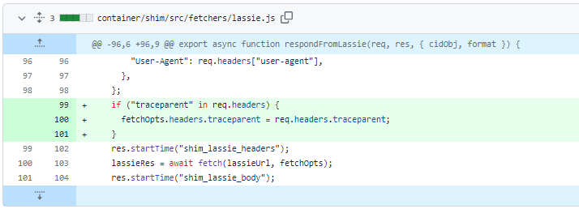
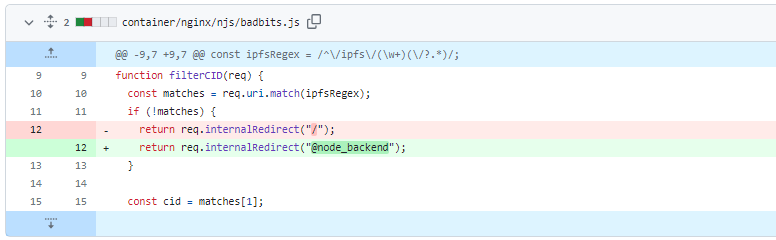
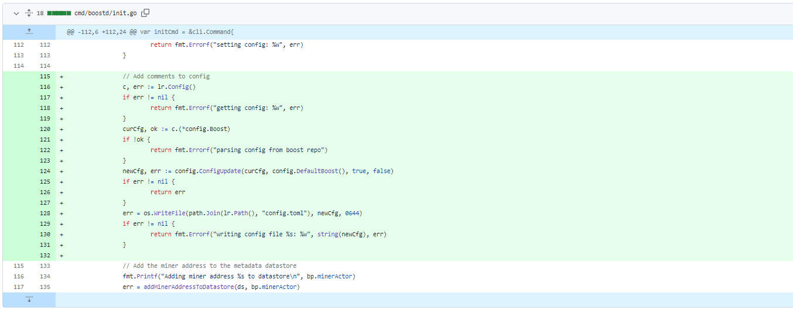
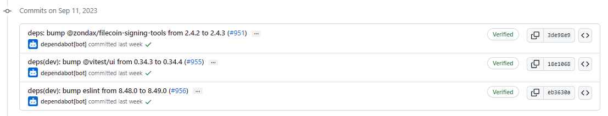
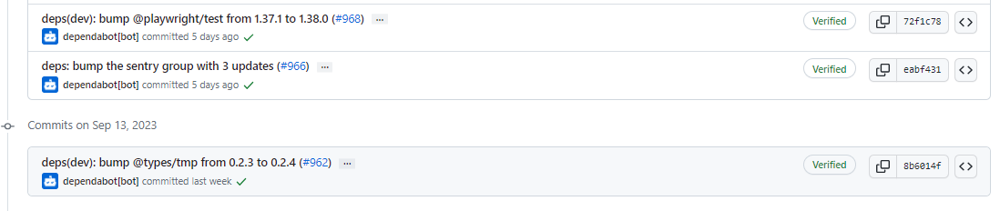
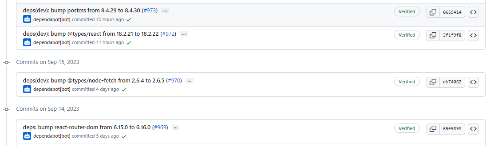
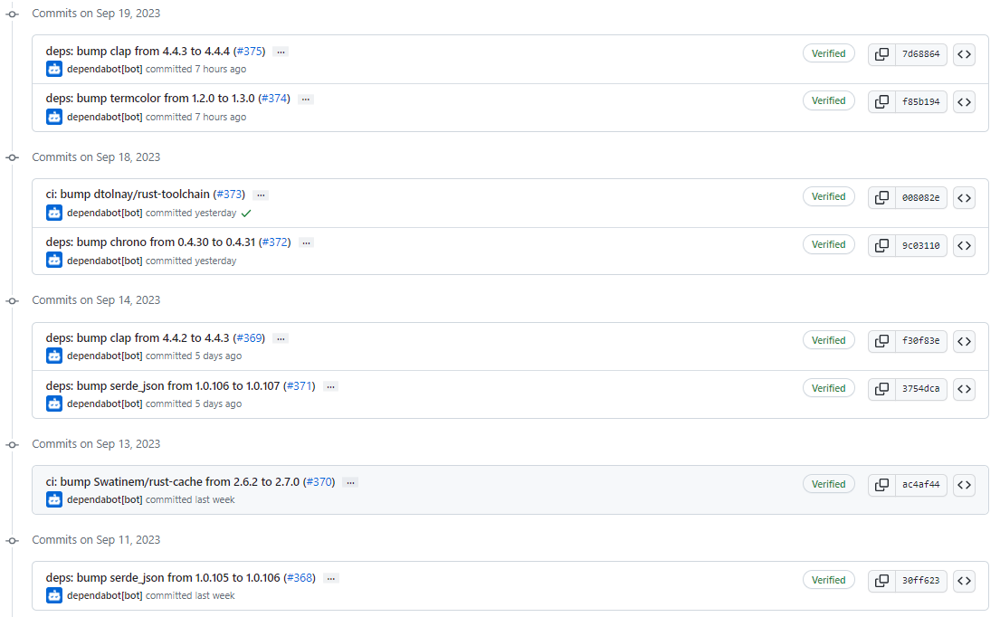

# 2023-9-17检索星球周报

## 🚀项目进展

### 1️⃣saturn

1. docs: saturn(与 lassie) 缓存缺失问题由 [IPFS network] 和 Filecoin [Storage Providers] 提供服务，不再是由 [IPFS Gateway]。
1. 在 dockerfile 中添加 otel 头文件

3. 当 set 时，将 traceparent 转发给 lassie

4. fix(badbits): 将 返回的 410 替换成 403
5. fix(badbits): 改变内置的 internal 重定向

6. 合并分支 "main" 到 feat/docker-env-telemetry
7. 添加 otel 头文件到新合并的 dockerfile 文件中

###  2️⃣boost工具

1. 在 init.go 文件中添加注释配置

2. fix: 为 migrate-lid 添加 parallel flag 并改进日志记录
3. fix: 修复丢失的 boostrap-icons, 1.10.5 => 1.11.0

###  3️⃣storetheindex

1. 将 go-car 从 v2.12.0 升级到 v2.13.1
2. 部署最新的 dhstore 和 indexstar
3. 使用 mutex 替换 register goroutine 和 channel
   + 这将简化注册表代码并提高其效率
4. feat: 公开暴露 e2e TestIndexerRunner
5. 部署新的 indexer 和 telemetry
6. 部署带有 total distance 的指标的 最新 telemetry
7. 从新的 telemetry 中获取 ingestion 和 rate metrics
8. 使用最新的 go-libipni，v0.5.0 => v0.5.1
9. 将最新的 storetheindex/storetheindex 部署到 dev 环境中去
10. 更新 storetheindex 版本，v0.7.8 => v.0.8.0
11. 更新 storetheindex 到生产环境中去
12. 在生产环境中向 inga 部署最新的索引器
13. 部署最新的 telemetry 服务到生产环境中

### 4️⃣Station

##### desktop

1. ci: 使用 WIN_* 开头的前缀，替换 ci.yml 中的 CSC 前缀的配置文件
1. deps: 移除 undici，使用 Node.js/Electron 提供的内置 `fetch` 实现
1. deps: 升级filecoin-station/core 至 14.2.0
1. 更新 filecoin-station/desktop 至 0.23.0
1. 部分依赖项目的更新

##### zinnia

1. 部分依赖项目的更新

##  📢一周资讯

### 1.Fil Dev Day 1

新加坡 FILDevSummit23

以下是今天的主题概览。

+ 最新升级和协议演变
+ 客户数据接入策略
+ 核心开发人员创新

### 2.Fil Dev Day 2

FILDevSummit23 新加坡站第二天的活动

+ 与 alex North 一起跨地域扩展 Filecoin
+ 与 Steven004_Li 讨论 Venus 的设计、架构和开发
+ web3mine 密封即服务

完整日程： https://filec.org/3sT2wiU

### 3.Fil Dev Day 3

以下是 FILDevSummit23 第二天的日程安排

+ 协议升级与演进
+ 促进 SP 业务成功
+ 使用 IPC 扩展 Filecoin

会议于美国东部时间上午 9 点开始。查看完整日程
https://filec.org/3r8yQ0B

### 2.Fil Dev Summit Iceland

地址：冰岛

时间：9月25日-9月27日

申请：[Apply to attend](https://fildev.io/?utm_content=264089682&utm_medium=social&utm_source=twitter&hss_channel=tw-2653394250#iceland)

