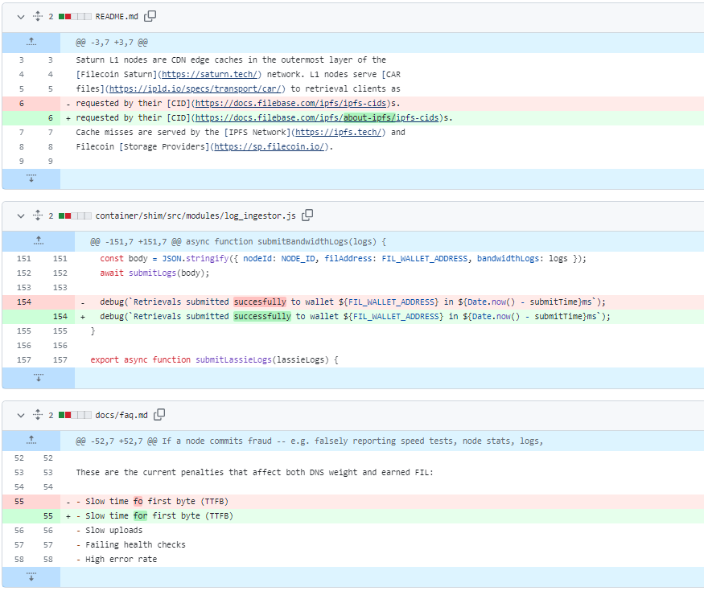
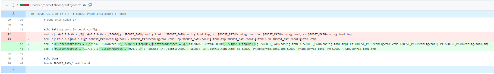
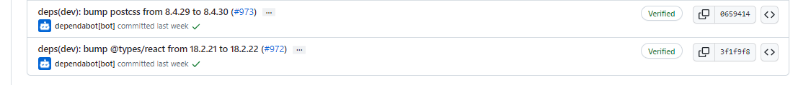
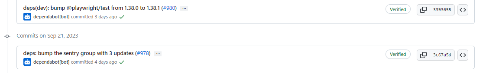
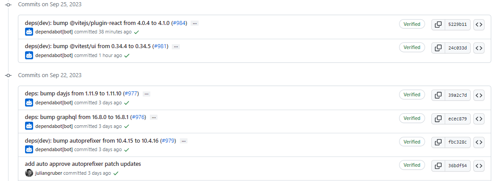
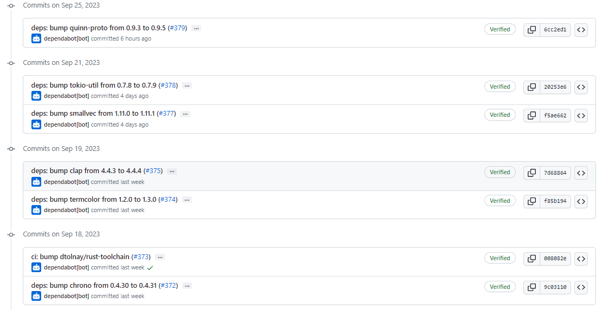

# 2023-9-24检索星球周报

## 🚀项目进展

### 1️⃣saturn

1. Fix: correction on js and md files and update URL

###  2️⃣boost工具

1. chore: 添加 identity CID 存储 and 检索测试；升级 GS
1. feat: 升级 docker devnet 构建
1. 更新 makefile, 移除 lotus 容器的构建
1. 进行多平台构建
1. 修复 lotus image 的名称
1. 更新 readme 文件
1. pull boost images
1. 明确 build_boost
1. 修复 devnet 的 config.toml

###  3️⃣storetheindex

1. 添加 piece reader close()
1. fix entrypoint

### 4️⃣Station

##### desktop

1. deps: 升级 filecoin-station/core 到 14.2.0
   + https://github.com/filecoin-station/core/releases/tag/v14.2.0
1. 升级 filecoin-station 到 0.23.0
1. 添加 dependable-auto-approve-patch graphql，dayjs, autoprefixer 补丁
1. 部分依赖项目的更新

##### zinnia

1. 部分依赖项目的更新

##  📢一周资讯

### 1.FILDevSummit Iceland

FILDevSummit 距离冰岛还有不到一周的时间，一起成为Filecoin协议的构建者、开发者和社区成员。

时间：9月25日至27日

地点：冰岛

[注册地址](https://fildev.io/?utm_campaign=FIL%20Dev%20Summit&utm_content=264764279&utm_medium=social&utm_source=twitter&hss_channel=tw-2653394250#iceland)

