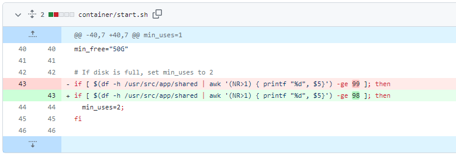
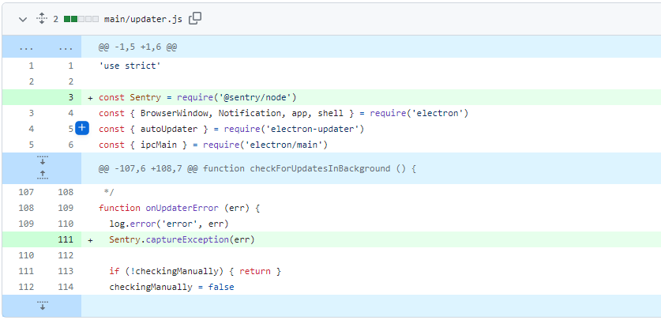
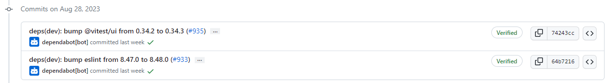
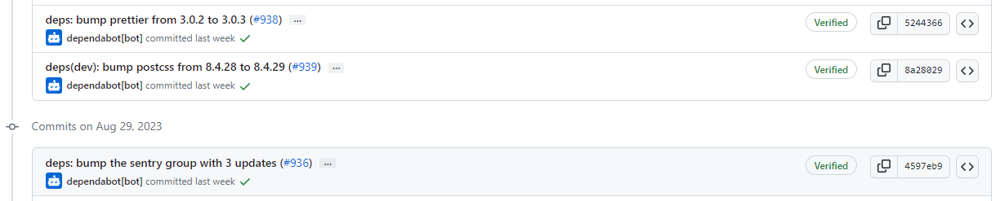
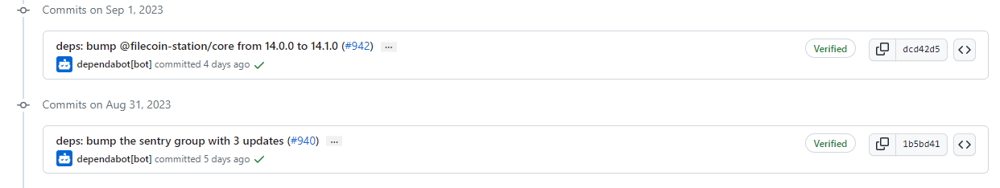
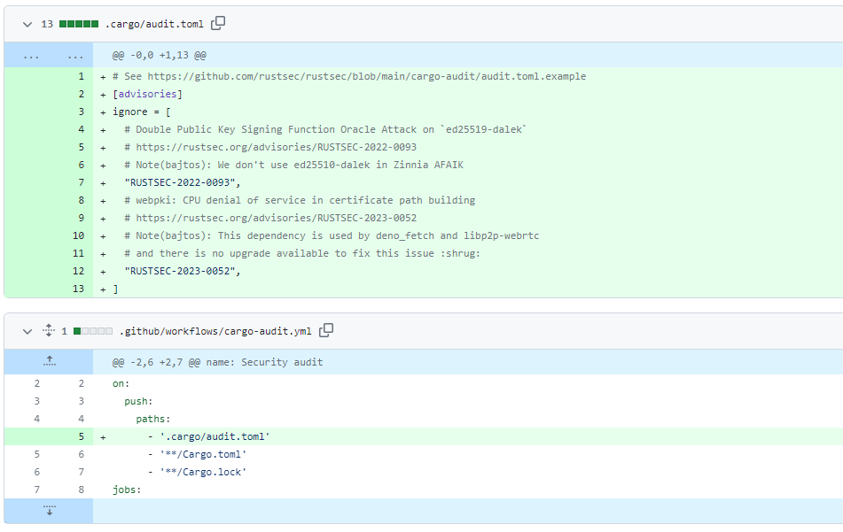
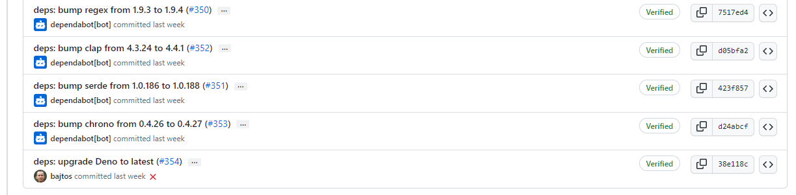
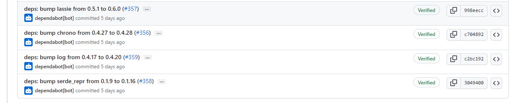
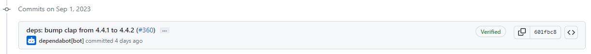
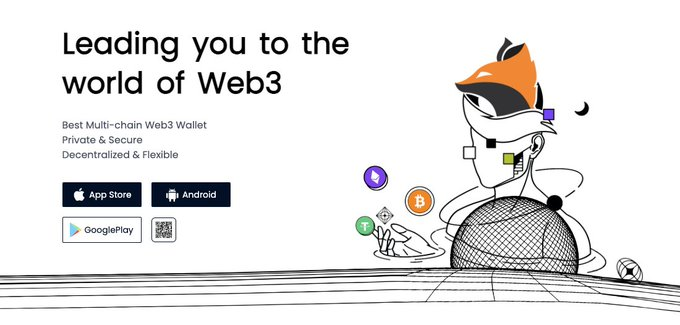

# 2023-9-3检索星球周报

## 🚀项目进展

### 1️⃣saturn

1. chore: 将 lassie 升级到 v0.17.0, 并支持 'entity-bytes' 类型
   + Ref: https://github.com/filecoin-project/lassie/releases/tag/v0.17.0
2. chore(start.sh): 将 min_uses=2 的阈值从99降低至98

3. docs: 修复 README.md 文件中的错别字
4. refactor: 修改 'entity-bytes' => "entity-bytes"

###  2️⃣boost工具

1. chore: 将 boost-graphsync 升级到 v0.13.7，并添加 selector 进行检索测试

2. feat: 在单一 LID 支持的基础上增加多名矿工

   + feat: 检索多名矿工提供的数据
   + 添加 booster-http 进行多名矿工检索的测试
   + feat: 添加booster-http multi-miner 的检索测试
   + refactor: 将 api 版本检查移动至 自己内部的函数中
   + test: 添加 booster-bitswap multi-miner 的测试
   + wip: multi-miner / 单一 LID - piece doctor
   + refactor: 将 yugabyte 迁移至单独的类中
   + fix: 添加 miner address 至 yugabyte/leveldb 的继承中
   + refactor: 将矿工无法交易的日志更新为 warning
   + refactor: 将 migration 分为两部分进行迁移
   + feat: 如果 PieceTracker 表中没有数据，则在前一种跳过地址的设置
   + fix: 将 PieceTracker 和 PieceFlagged 进行拆分，再进行迁移
   + fix: 修改 yugabyte 迁移命令名称
   + feat: 增加 在 boost UI 页面顶部添加矿工地址
   + 更新 react / src / MinerAddress.js

3. refactor: 在 GraphsyncStorageAPIInfo 中将 StorageAccessAPIInfo 配置移至 DealMaking

   + feat: 在检索列表页面上显示检索矿工列表
   + fix: 修复检索矿工地址解析器
   + fix: 针对 LID UI 的 mmlid 修复
   + fix: 针对 multi-miner accessor (而非仅针对本地矿机) 查找 unseal status
   + feat: 如果仍然在进行 initial scan 则在 piece doctor 页面提示 warning 信息
   + update: 更新 extern/boostd-data/yugabyte/piecedoctor.go

4. feat: 改变 postgres 的 timezone types 来包含 timezone

   + feat: 在二进制版本中显示网络的名称
   + fix: 修复 boostd-data maddr, 巩固项目的构建
   + 添加 CQL 移植程序
   + refactor: 重构迁移程序
   + update: 修改迁移查询
   + 从迁移查询中删除 idx
   + 移除 CQL 迁移工具
   + 撤销 go mod 更改，修复主网构建
   + 撤销对 yugabyte 的更改
   + 删除多余的行
   + feat: Cassandra 迁移
   +  refactor: dbname => appliedMigration
   + fix: yugabyte lid 测试
   + feat: 添加 postgres 迁移
   + refactor: 简化 Cassandra 迁移
   + fix: 删除 PieceTracker 表中的重复行
   + fix: 修复测试

5. chore: 发布版本 v2.1.0-rc1

6. fix(docker): 没有内联的 sed，让 sed 命令输出单独的文件，然后复制过来：https://forums.docker.com/t/sed-couldnt-open-temporary-file-xyz-permission-denied-when-using-virtiofs/125473/5

7. 通过 CI 构建和发布 boost devnet 容器

   在每个 PR 上构建 boost 容器，以确保所有用于devnet 构建。在非 PR 事件中，将容器发布到 ghcr.io。

   这将大大减少与 devnet 交互时的等待时间交互时的等待时间，因为用户不再需要从头开始构建所有相关映像。CI 设置为使用 GitHub行动缓存层，这将进一步加快每次提交的构建速度。

   构建的容器将有一个标签前缀，对应于的目标名称。这包括

   * `boost-dev`
   * `booster-http-dev`
   * `booster-bitswap-dev`
   * `lotus-dev`
   * `lotus-miner-dev`.

8.  允许容器构建 job 推送映像

   + 修正权限，允许 github 操作将图片推送至 ghrc.io。

   + 修复所有标记方式的标记前缀，以包含中间图像名称。

9. 在 GitHub 行动 CI 缓存中设置范围，以保留多个构建层，否则，在多阶段构建中只会保留最后的构建层。

###  3️⃣storetheindex

1. 将 metrics 更新到 dev 环境中
2. 更新为具有 libp2phttp  功能的 ipnisync
3. 默认情况下不适用可重用的 HTTP 客户端
4. 针对所有类型的提供程序运行 e2e 测试：libp2phttp, plain http, dtsync
5. 在测试中使用 ipnisync publisher
6. 更新 docs
7. 更新至依赖库
8. 更新 README 并 移除规范版本中的文档
9. 更新 Dockerfile 中的 go 版本
10. 更新 dev 环境中的 storetheindex/storetheindex
11. 不要使用可还原的 HTTP 客户端
12. 部署最新的 telemetry

### 4️⃣Station

##### desktop

1. feat: 向哨兵报告自动更新程序错误

2. feat: 更新时自动重启
   + 当 Station 在托盘中运行，并检测到新版本时，会立即触发 "restart to install"。
   + 目标是加快 Station Desktop 新版本的采用速度。
3. 部分依赖项目的更新

##### zinnia

1. chore: 修复 cargo-audit
   + chore: 忽略不适用的安全建议
   + CI: 运行安全升级以审核配置的更改

2. chore: 将 zinnia 版本更新至 0.14.0
3. 部分依赖项目的更新

##  📢一周资讯

### 1.FILDevSummit23

您在为 Filecoin 核心协议做贡献吗？

不要错过 #FILDevSummit23--今年九月将在两个国家举行。

期待有关网络发展的技术深挖、研讨会和专家讲座。

新加坡和爱尔兰

[申请参加](https://t.co/gCHgCIM8m7)

### 2.KoreaBlockchainWeek

作为 #KoreaBlockchainWeek 的一部分，将在 Filecoin 基金会的慷慨支持下举办 FIL 首尔交流活动。

2023 年 9 月 6-7 日

韩国首尔

[立即注册](https://fil-seoul.com)

### 3.FoxWallet

FoxWallet 已集成 Filecoin，实现了通向 Filecoin 宇宙和 FVM 的无信任网关。无缝访问 Filecoin 及其由 DeFi、DEX、存储解决方案和强大的数据工具组成的生态系统。

+ FoxWallet 允许您访问尖端的 DeFi 和 DEX 工具，这些工具可利用 FVM 的强大功能实现下一级交易和借贷 dApps。
+ Storage Sector，Filecoin 革命的心脏。FoxWallet 可确保您轻松访问和管理存储交易。
+ 使用 FoxWallet 的数据工具了解最新信息。实时了解 Filecoin 网络 - 区块高度、矿工表现等。
+ 下载 FoxWallet 探索这些功能和更多 https://foxwallet.com/download

### 4.FILVegas

加入我们的 FILVegas 2023 - 今年北美第一个大型 Filecoin 社区活动！

探索人工智能和去中心化存储，实现无与伦比的弹性和可扩展性。让我们共同塑造未来！

 [https://fil-vegas.io](https://t.co/3c5P0RAemB)

