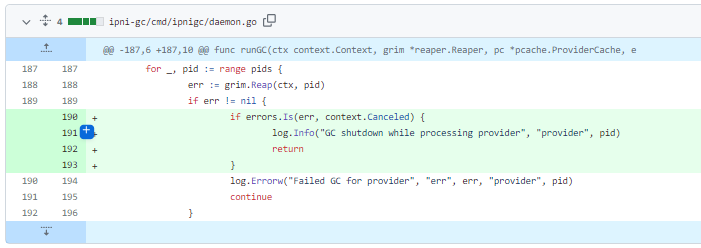
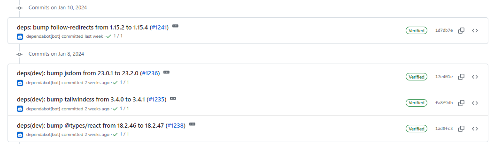
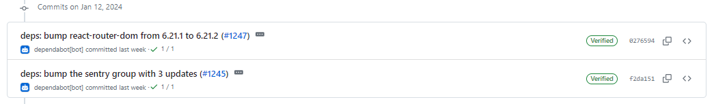
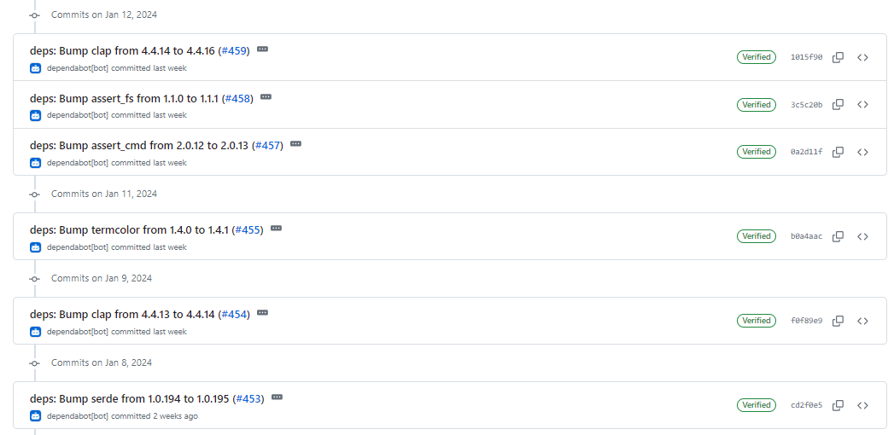

# 2024-1-14检索星球周报

## 🚀项目进展

### 1️⃣saturn

**L1-node**

1. 

###  2️⃣boost工具

1. feat: 添加 ad 删除命令
2. fix: 用户界面处理错误信息
3. 提升 cbor-gen 实用程序
   + go mod tidy
   + cbor-gen 自动生成 types
4. 所有请求处理程序的安全处理程序
5. fix: 处理 podsi 索引中的panic

###  3️⃣storetheindex

1. 更新 core
   + 更新 boxo
   + 增加 GC 的默认 dhstore 批量大小
2. 更新版本至 v0.8.15
3. 升级到最新的 multiaddr 依赖项
4. 更新版本至 v0.8.16
5. 将 dhstore v0.1.14 部署到 prod
6. 更新 libipni 并使用 dagsync 常规块钩子
7. 更新版本至 v0.8.17
8. 将最新版本部署到开发环境
9. 将开发分配器更新为最新映像
10. 将最新版本部署到 prod 环境
11. 守护进程关闭时立即退出

### 4️⃣Station

**desktop**

1. 更新合约地址
1. 更新版本至 1.2.4
1. 更新项目部门依赖

**Zinnia**

1. 部分项目依赖的更新

##  📢一周资讯

1. ### Filecoin Saturn

Filecoin Saturn 是一个先进的 Web3 CDN，正在推出针对网站的私人测试版！如果您的网站从 IPFS 和 Filecoin 加载内容，请使用 FilecoinSaturn 的快如闪电的全球去中心化网络来提升其性能。

加入测试网：https://tally.so/r/mRo7xp

