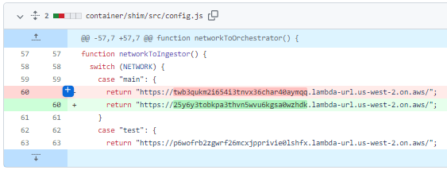
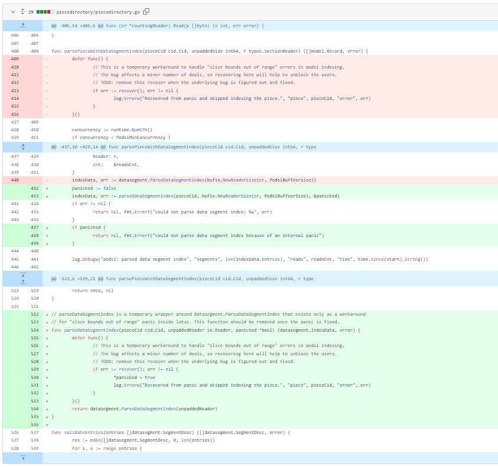
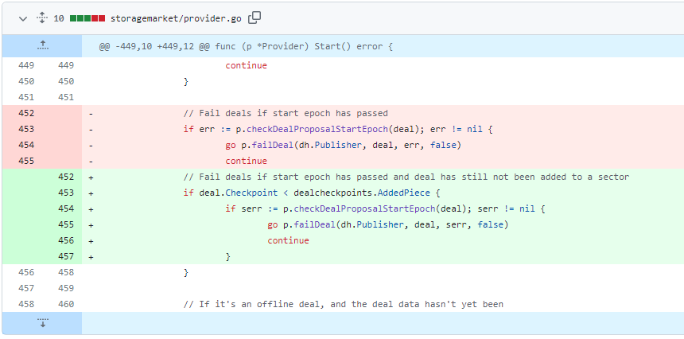
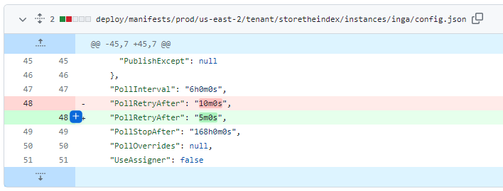
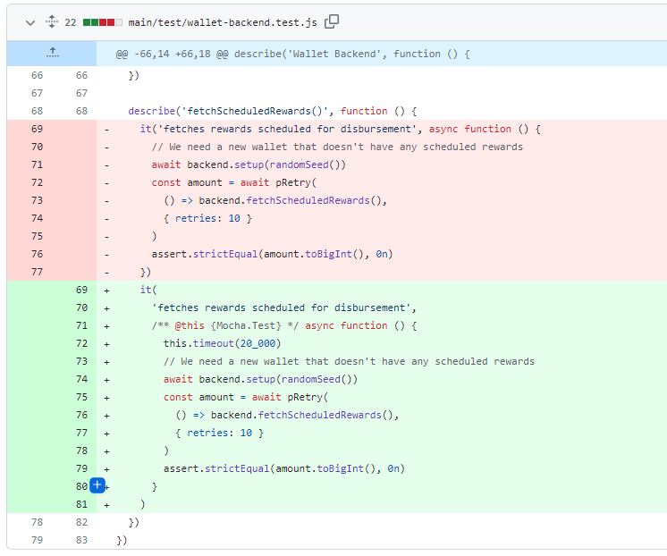
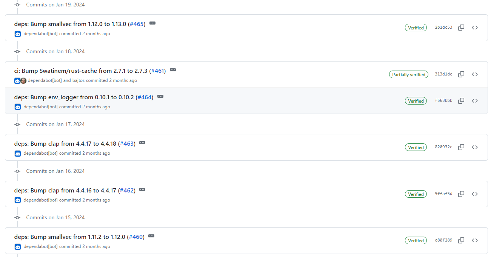
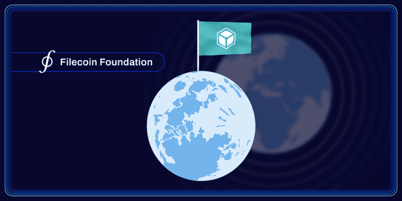
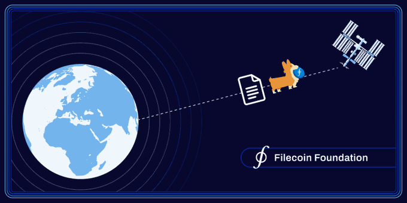
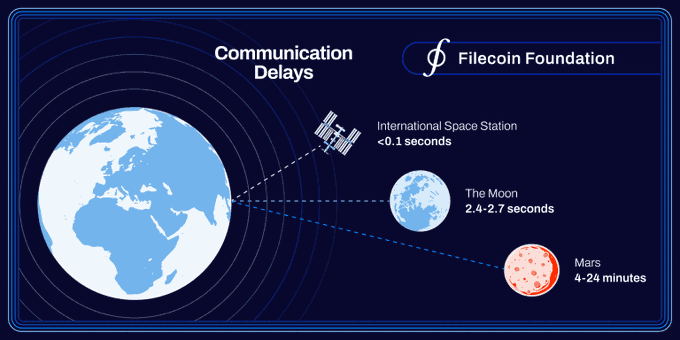
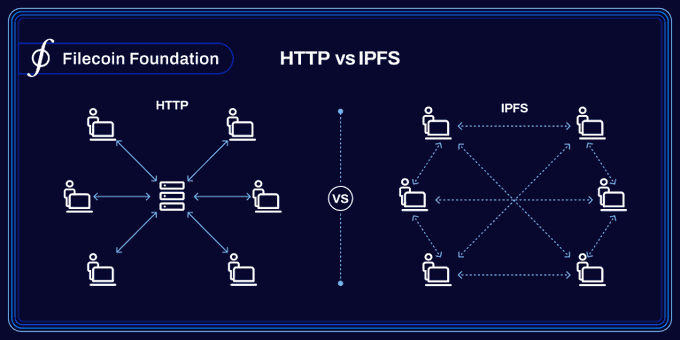

# 2024-1-21检索星球周报

## 🚀项目进展

### 1️⃣saturn

**L1-node**

1. 更新日志接收器 URL

2. 同时运行两个平台，更新行动版本（修改workflows）
3. 更新 lassie v0.21.0
4. 升级到 Node 20 和 npm 部署
   + 升级节点
   + 升级部署

###  2️⃣boost工具

1. fix: 如果 podsi 失败，则回退到常规索引

2. 发布版本 v2.1.2
3. fix: 不要让已通过 AP() 但未编入索引的交易失败

###  3️⃣storetheindex

1. 部署最新的 telemetry 服务
2. 将最新的 indexstar 部署到开发阶段和生产阶段
3. 出现同步错误的轮询提供帮助
   + 由于各种错误（如网络超时、速率限制等），许多提供商无法完成广告处理。在短时间后重试时，通常可以继续处理。但是，如果没有宣布新的广告，在轮询时间结束之前，提供程序不会被重试。这种变化会将上一次同步过程中出现错误的提供程序纳入要轮询的提供程序集中。
4. 将最新版本部署到开发环境
5. 更新版本至 v0.8.18
6. 缩短轮询间隔时间至10m。修复测试
7. 在 prod 环境中更新 storetheindex/storetheindex 至 0.8.18
8. 增加投票频率

### 4️⃣Station

**desktop**

1. 修复 fetchScheduledRewards() 测试超时问题

2. 部分依赖项目的更新

**Zinnia**

1. 部分依赖项目的更新

##  📢一周资讯

1. **FIL to the moon**

   1 月 16 日， [FilFoundation](https://twitter.com/FilFoundation)宣布成功使用星际文件系统 (IPFS) 将文件从地球发送到外太空并返回-- Filecoin 网络建立在 IPFS 之上，IPFS 是一种去中心化的点对点文件共享 HTTP 协议的替代方案。 除了效率之外，IPFS 还允许数据可验证，这在验证卫星图像的真实性时非常有用。 此外，在太空中存储文件具有挑战性，因为辐射等因素可能会损坏数据。为了维护有效文件，需要存储大量副本的去中心化协议。 阅读更多内容[Cointelegraph](https://twitter.com/Cointelegraph)

   

2. **First-of-its-kind mission deploying IPFS in space**

   + Filecoin 基金会完成了首次在太空部署[@IPFS](https://twitter.com/IPFS)的任务 – 使用 IPFS 成功将文件从地球发送到轨道并再次返回；

   + [IPFS](https://twitter.com/IPFS)演示任务使用[LMSpace](https://twitter.com/LMSpace)的软件进行，演示了 IPFS 等去中心化技术如何能够实现更好的太空长距离通信，[Link](https://fil.org/blog/filecoin-foundation-successfully-deploys-interplanetary-file-system-ipfs-in-space/)；

     

   + [@FilFoundation](https://twitter.com/FilFoundation)和[@LMSpace](https://twitter.com/LMSpace)最初于 2022 年 5 月在达沃斯宣布合作将 IPFS 推向太空;

   + 2023 年 1 月，[FilFoundation](https://twitter.com/FilFoundation)和[LMSpace](https://twitter.com/LMSpace)公布了[IPFS](https://twitter.com/IPFS)任务的详细信息，[link](https://youtu.be/2svEGRuOwyU)

   + 作为演示任务的一部， [@IPFS](https://twitter.com/IPFS)白皮书和 Biscuit“FileCorgi”图像通过[@LMSpace](https://twitter.com/LMSpace)的 SmartSat软件平台从地球传输到轨道卫星并返回，[link](https://www.lockheedmartin.com/en-us/news/features/2024/smartsat-equipped-satellite-uploads-new-mission-on-orbit.html)；

     

   + “今天的集中式互联网模式在太空中不起作用。每次点击时，都必须从中央服务器检索该数据；如果您在月球上，从地球检索内容时将会出现多秒的延迟”- [MartaBelcher](https://twitter.com/MartaBelcher) ，总统[FilFoundation](https://twitter.com/FilFoundation) 。

     

   + 使用[IPFS](https://twitter.com/IPFS) ，数据不需要每次都从地球来回传输。相反，IPFS 从最近的位置检索内容，而不是特定位置的特定服务器检索内容。

     

   + 该任务展示了使用[IPFS](https://twitter.com/IPFS)进行太空通信和网络的几个关键优势。

     + 更快的通信；
     + 数据验证；
     + 数据弹性；

     详细了解[ Filecoin 基金会](https://fil.org/blog/filecoin-foundation-successfully-deploys-interplanetary-file-system-ipfs-in-space/) 将去中心化技术带入太空的工作。
