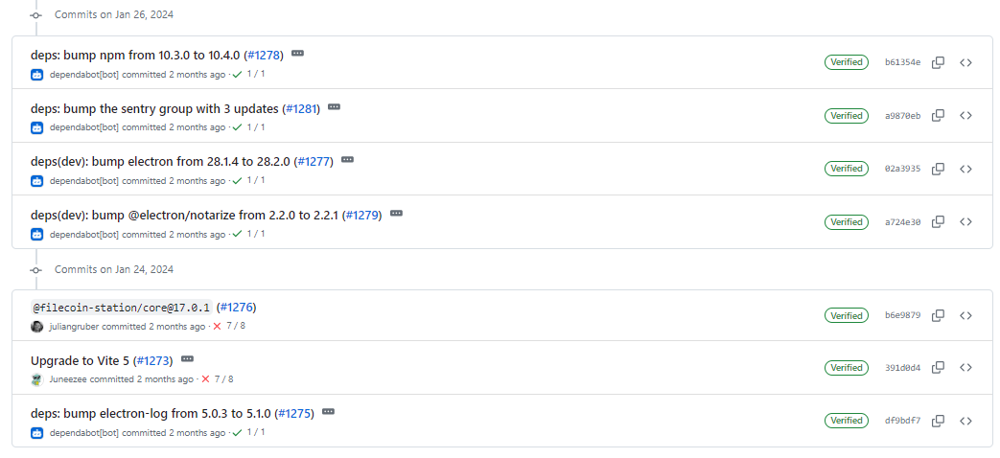

# 2024-1-28检索星球周报

## 🚀项目进展

### 1️⃣saturn

**L1-node**

1. 同时串行运行两个平台

2. 将 nodejs 版本更新为当前版本(0.8.2)和 NJS 版本(21)

###  2️⃣boost工具

1. fix: 移除即时索引，修复测试

2. fix: 解析 PODSI 交易段时意外出现 EOF
3. fix: 修复 黑桃交易的 POSDI 索引错误修复
   + 重构 io.seek

###  3️⃣storetheindex

1. 删除未使用的metric，修复日志信息

### 4️⃣Station

**desktop**

1. 更新 Vite 5 至 5.0.12
1. 更新 filecoin-station/core 至 17.0.1
1. 部分依赖项目的更新

**Zinnia**

1. fix: 删除已启动事件中的stop，update daemon/main.rs

2.部分依赖项目的更新

##  📢一周资讯

1. **Swan Chain Saturn Testnet is LIVE!**
   + Swan 将 Filecoin ZK-SNARKs 集成到安全的 UBI 机制中。
   + 在整个过程中，Swan 通过 IPFS 依赖 Filecoin 存储。
   + Filecoin SP 抓住机会贡献闲置资源，提高 Swan 的计算能力，从而获得额外收益！

​	[more](https://swanchain.medium.com/swan-chain-saturn-testnet-official-announcement-4527b7a722e8)

2. **Empower transparency**

   MuckRock 是一个非营利性新闻网站，为人们提供保持政府透明度和问责制的工具。  与 Filecoin 网络和文件云, MuckRock 保存了超过 1000 万份经过验证的文件。

   [more]()

3. Destor

   数据为您最重要的工作提供动力--成本不应成为存储更多数据的障碍。DeStor 提供传统提供商无法比拟的可验证、有弹性、经济高效的云存储。[more](https://destor.com/)

   + 高度可扩展
   + 经济高效
   + 安全可靠

   

4. **AI & Ocean Protocol**

   站在人工智能的最前沿、Ocean Protocol 倡导积极变革。  Ocean Protocol为数据利益相关者赋权，使数据发布者、市场和应用程序能够安全地将其信息存储在具有弹性的 Filecoin 网络上。

   [more](https://oceanprotocol.com/)

   

5. Become an Orbit Ambassador

   对塑造区块链和 Web3 是否感到好奇？Filecoin 社区--这是为 .加入 #FilecoinOrbit 社区计划！参与研讨会、黑客马拉松和教育活动，覆盖 80 个国家的 26k+ 建设者。

   [成为 Orbit 大使](https://filecoin.notion.site/Filecoin-Orbit-Community-Program-3d8a03c8d5444d3491908249664e55e9)

