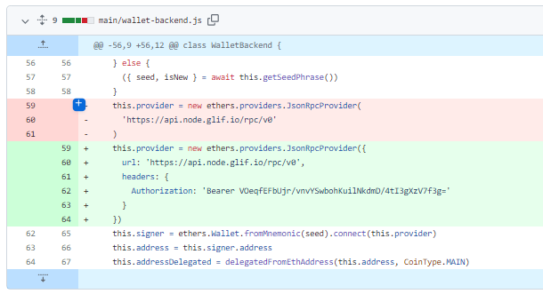
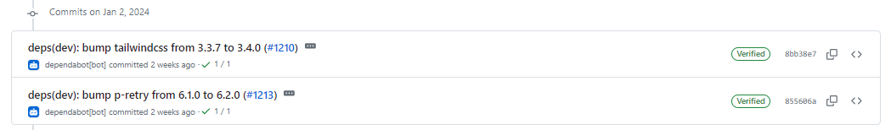
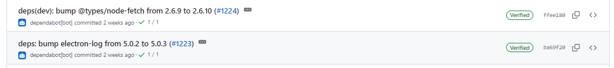
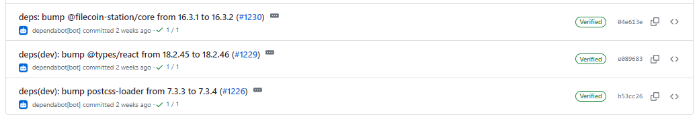
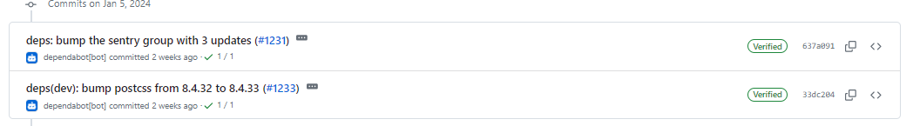
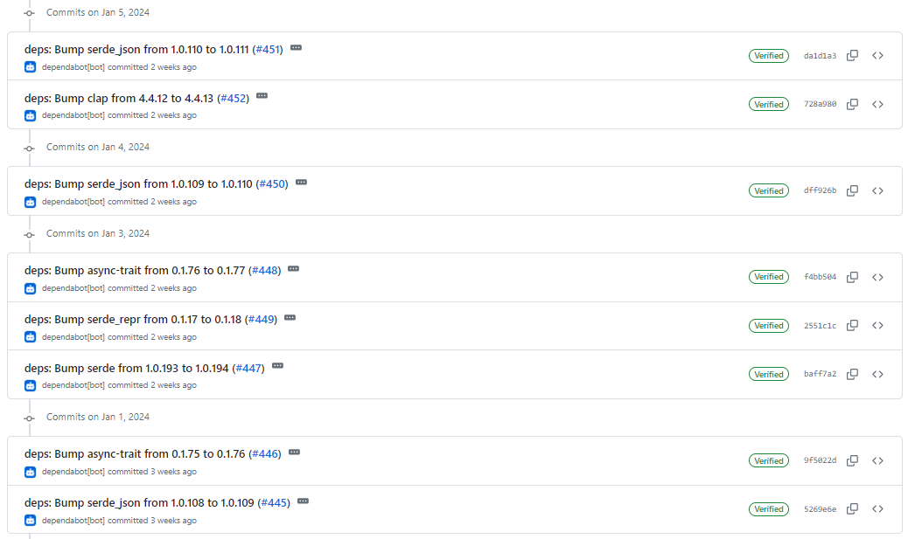
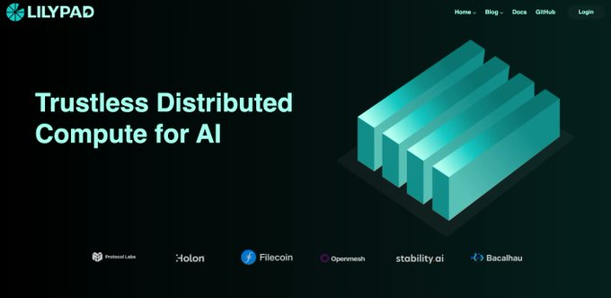

# 2024-1-7检索星球周报

## 🚀项目进展

###  1️⃣storetheindex

1. 将最新的 dhstore 与 v1.0.0 pebble 一起部署到开发环境中

### 2️⃣Station

**desktop**

1. filecoin-station/core@16.3.1 + telemetry 
1. 更新项目至 1.2.2
1. 为 glif 请求添加身份验证

4. 部分依赖项目的更新

**Zinnia**

1. 更新部分项目依赖

##  📢一周资讯

### 1.Lilypad

了解最新信息，请访问 [@Lilypad_Tech](https://twitter.com/Lilypad_Tech)!  参加有关去中心化人工智能应用程序创建的开发研讨会，在校准测试网上测试您的技能，通过 Lilypad 引人入胜的教程掌握技能，并探索全新的 https://lilypad.tech 网站！

https://blog.lilypadnetwork.org/lilypad-project-report-december-11

