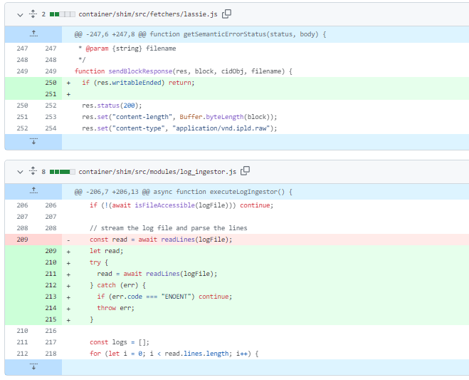
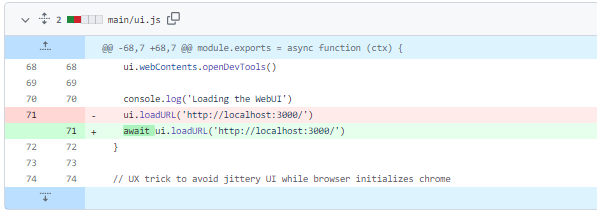
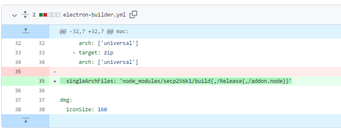
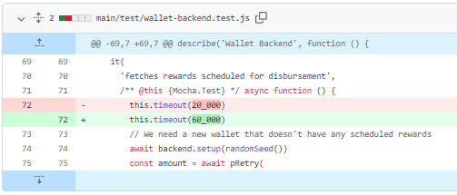
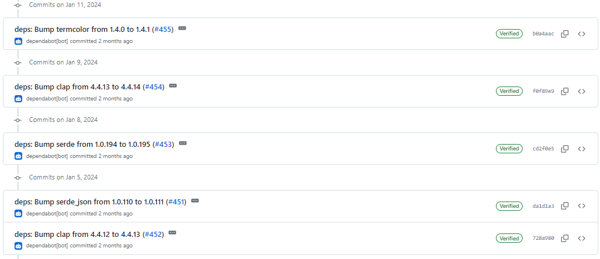
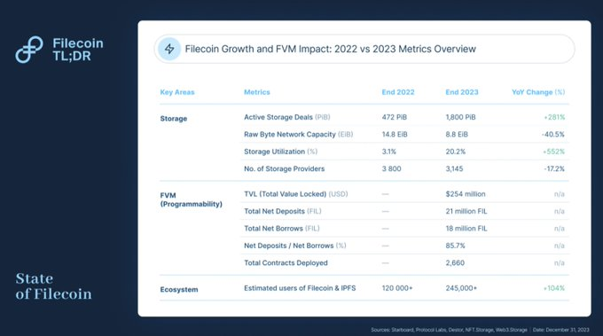
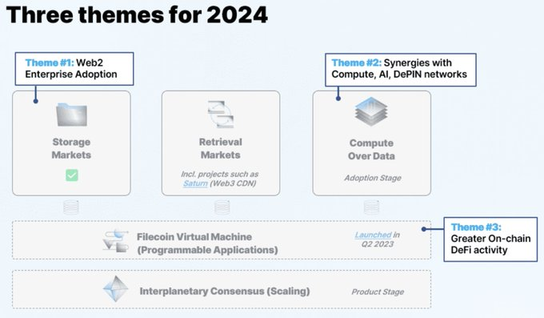
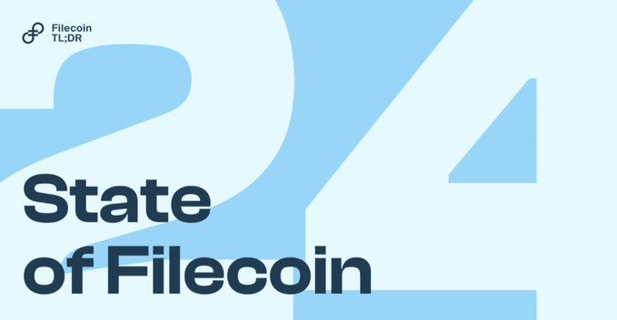

# 2024-2-11检索星球周报

## 🚀项目进展

### 1️⃣saturn

**L1-node**

1. fix: EPIPE and ENOENT errors

###  2️⃣storetheindex

1. 将最新的 dhstore 部署到开发环境

2. 将新的 dhstore 部署到 prod

3. 可配置的首次同步深度

4. 发布容器，以便在裸机实例上进行测试

5. 修复分配器启动和使用新图像部署的问题
   * 使用新镜像部署分配器

   更改分配器启动命令时需要同时使用新的容器映像。

   * 删除分支 ecr 构建

###  3️⃣Station

**desktop**

1. 修改 telemetry token
1. fix: await ui.loadURL()

3. electron-builder@24.9.1

4. 升级项目版本至 1.3.9

5. 从`core`读取计划奖励

   + 1134 重构
   * lint fix

   * 不更改钱包存储 API

   * 将钱包存储设置还原为原始设置

   * 仅使用钱包存储作为调度奖励的状态

   * 删除控制台日志

   * 更新核心版本并添加测试用例

   * 更新呈现器/src/utils/number-ops.ts

   * 确保数值不断更新

   * 更新 main/utils.js

6. 升级filecoin-station/core至19.0.2

7. 增加测试超时

8. core: 修复日志中的空行
9. ci: 添加自动批准 minor mocha 更新
10. try: 上移 "Open Station"
11. core: remove 不必要的闭合
12. ci: 禁用总是失败的 WINDOWS PR 编译

**Zinnia**

1. 部分依赖项目的更新

##  📢一周资讯

1. **FileMarket**

   FileMarket 允许您在 Filecoin 网络上安全地存储数字内容 - 您甚至可以通过公共店面将内容货币化。

   FileMarket 独特的加密文件令牌 (EFT) 协议解决了传统 NFT 中常见的 "右键点击并保存 "问题，加密令牌化文件存储在 Filecoin 的去中心化网络中。

   FileMarket_xyz 包括令牌化、安全存储、链上数据传输和平台活动奖励等功能。此外，您还可以在二级市场上获得内容版税。

   您的数字内容创作之旅将变得更轻松、更有价值。  快来 FileMarket 一试身手吧！

2. **axelarnetwork**

   刚刚推出！axelarnetwork推出了链间代币服务（ITS），以下是您需要了解的信息：

   什么是 ITS？

   + 实现在不同区块链网络之间快速创建或转换代币。
   + 促进 Axelar 支持的所有 EVM 链之间的 1:1 代币桥接。
   + 无需技术技能--无代码解决方案。
   + 利用 Axelar 安全的去中心化权益证明机制。
   + 代币可在 Squid 路由器上列入白名单，方便跨链交换。

   **Axelar 通过简化代币创建、鼓励更多参与、提高流动性和 Filecoin TVL 来支持 Filecoin 网络。**

   准备好探索 ITS了吗？快来体验吧
   门户网站: https://beta.interchain.axelar.dev
   文档: https://docs.axelar.dev/dev/send-tokens/interchain-tokens

   

   2024 年的主题：
   协同效应：期待 Filecoin 与计算、#AI 和 #DePIN 网络无缝整合，实现协同发展。
   Web2 企业数据存储：来自以下团队的产品将得到加强
   @BanyanComputer,@SealStorage和 Steeldome 等团队加强了产品，以满足企业客户的独特需求。
   崛起中的 DeFi：包括 DEXes、Oracles 和 CDP 在内的链上 DeFi 协议持续增长。

   

   展望 2024 年：

   + 协同效应层出不穷：Filecoin 的改进实现了与其他生态系统的无缝互动，有望带来许多用例。
   + Web2 企业解决方案：像@BanyanComputer,@SealStorage
     和 Steeldome 等团队满足企业需求，提供适应性和兼容性。
   + 链上 DeFi 激增：更多服务，包括@SushiSwap 和Uniswap 等更多服务，在链上提供多样化的 DeFi 服务，扩大了生态系统。

   2024 年，Filecoin 预计将得到广泛应用，尤其是在计算、人工智能和目标企业领域。链上服务收入和不断增长的 DeFi 活动将推动 Filecoin 进入下一个显著增长阶段。

   渴望了解更多详情？请阅读报告全文：https://filecointldr.io/article/state-of-filecoin-2024

   

3. **Happy Lunar New Year!** 

   
