# 2024-2-18检索星球周报

## 🚀项目进展

### 1️⃣boost工具

1. 手动停滞交易 IPNI announcement

###  2️⃣storetheindex

1. 为裸机镜像实例创建只读用户
2. 移除专用的 assigner dockerfile，改用根 dockerfile
3. 执行脚本，跨索引器交叉宣布提供商
4. 如果从写镜像读取了 CAR，则避免镜像头检查
5. 读写分离的镜像存储后台
6. 更新版本至 v0.8.20
7. 将最新版本部署到开发环境
8. 停止在开发索引器上使用镜像

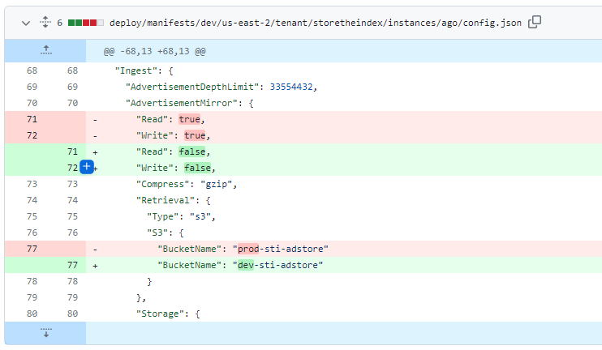

9. 将最新版本部署到 prod 环境
10. 在 Docker 镜像中构建不含 CGO 的 ipnigc
11. 配置评论

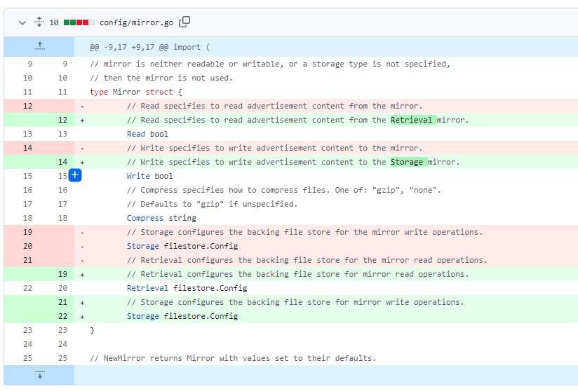

12. 更新开发环境中的 storetheindex/storetheindex
13. 将 ipni-gc 改为存储索引的 gc 子命令
14. 更新版本至 v0.8.21
15. 将最新版本部署到开发环境
16. 在 prod 环境中更新 storetheindex/storetheindex

###  3️⃣Station

**desktop**

1. refactor: 将 logs.push() 更名为 logs.pushLine()

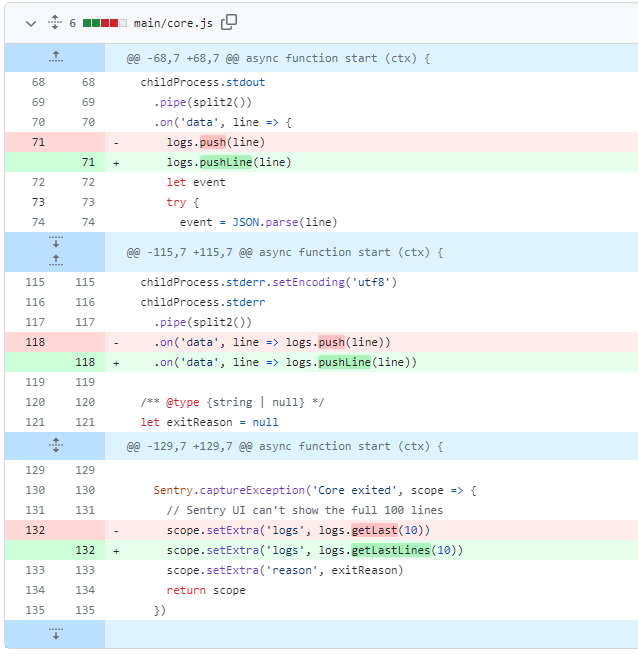

2. 部分依赖项目的更新

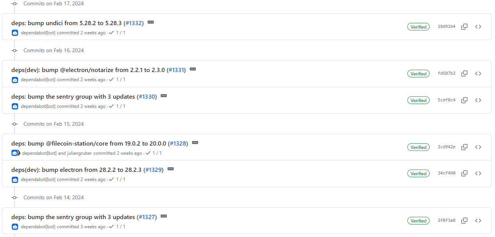

**Zinnia**

1. ci：使用 M1 macOS 运行程序

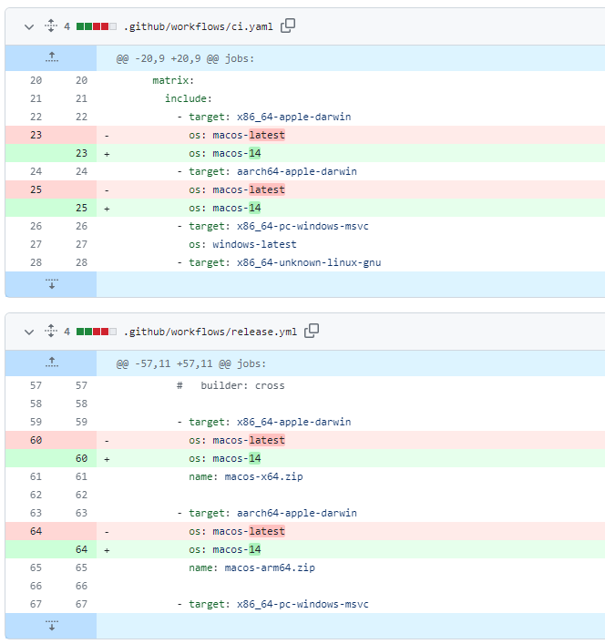

2. 部分依赖项目的更新

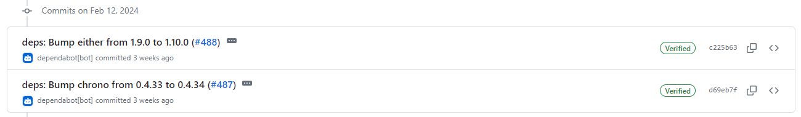

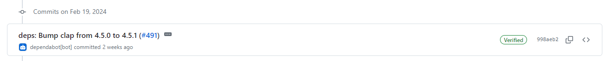

##  📢一周资讯

1. **Livepeer**

   传统的视频存储解决方案成本高昂。但使用 Livepeer，经济实惠的存储触手可及。

   Livepeer 是一个用于直播和点播流媒体的开放式视频基础设施网络。

   这一创新解决方案通过 Filecoin 虚拟机（#FVM）为开发人员提供了经济实惠的视频归档和存储解决方案，允许数百万直播流用户录制和存储他们的流媒体，每周的数据存储量达 TB。

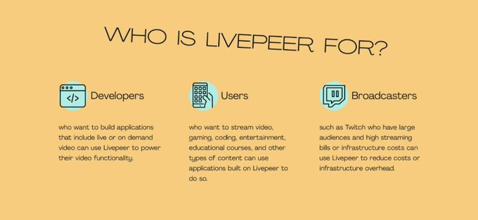

2. **Storage market**

   Filecoin 在去中心化存储市场上占据主导地位，其存储的数据占所有协议存储数据总量的 99%。

   到 2023 年底，#Filecoin 上存储的数据量激增了 3.8 倍，达到了 1,800 PiB 的巨量。

   来源：@FilecoinTLDR
   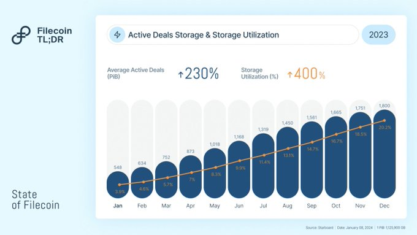

3. **FILDevSummit24**

   很高兴 #FILDevSummit24 将在@ethereumdenver?  加入我们吧，开发者、建设者和充满激情的社区成员将齐聚一堂，共同推动 Filecoin 的发展！

   http://2024.fildev.io
   **The Slate Denver**
   2 月 29 日

   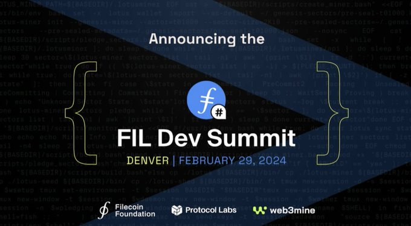

   FIL Dev 峰会不仅仅是一个聚会--它还是一个建立联系、激发创新和塑造 Filecoin 未来的动态聚会。深入到有影响力的对话中，探索新的可能性，将 Filecoin 推向新的高度！

   值得期待

   + 关于热门存储和聚合 L2 的引人入胜的讨论。
   + 关于 FIL+ 分配器工具和设计的实践研讨会。
   + 深入了解最先进的检索指标和激励机制。
   + 来自 web3 存储客户端和 onramps 的分析和最佳实践。

    立即注册： http://2024.fildev.io

4. **Solana & Filecoin**

   Solana 与 Filecoin 的整合是摒弃集中式存储解决方案的重大举措，也是提高 Solana 区块链可靠性和可扩展性的重要一步。

   solana 正在利用 Filecoin 使基础设施提供商、探索者、索引编制者和任何需要历史访问的人更容易访问和使用其区块历史。

   通过利用 Filecoin 的去中心化存储功能、solana 可以实现数据冗余、可扩展性和更高的安全性，同时忠实于其去中心化的精神。

   此次合作展示了区块链网络创建更强大、更有弹性的生态系统的能力，为用户和开发者带来了益处。

   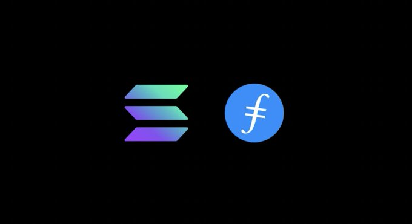
