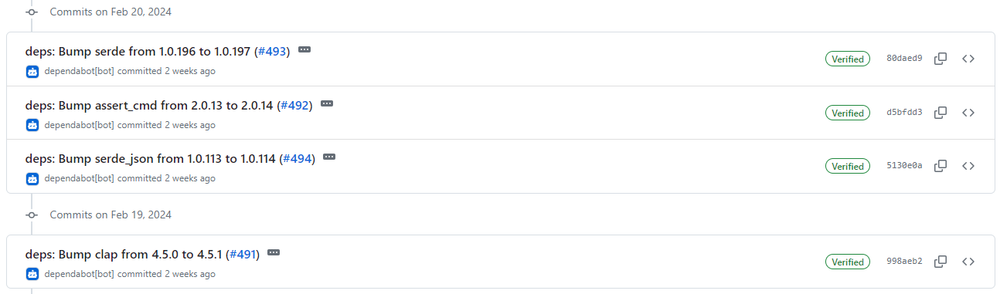
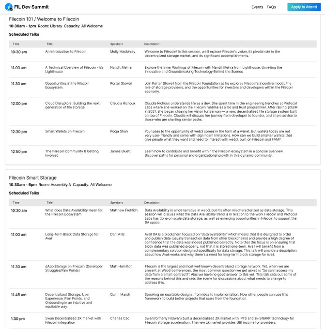

# 2024-2-25检索星球周报

## 🚀项目进展

### 1️⃣saturn

**L1-node**

1. chore(lassie): 移除事件记录器

###  2️⃣boost工具

1. fix: 移除 boost-gfm 和 go-data-transfer
2. 移除 gfm，删除数据传输
3. 制作 gen、docsgen
4. 修复循环依赖关系
5. go mod tidy
6. fix lint errors
7. 将 RetrievalAskGetter 转换为接口
8. 修复接口指针
9. 修复依赖注入，移动查询数据库
10. fix itests
11. clean up mocks
12. chore: 更多 DT 和 GS 调试 
13. 修正 lint 错误，添加回 ProviderDataTransfer
14. 重新生成 cbor
15. 清理数据传输
16. 修复图形同步检索
17. 使用新客户端进行 GS 测试
18. 修复选择器类型
19. 恢复选择器类型
20. fix: 清理并修复检索框架和测试 (#1848)
21. fix: 修复：清理并修复检索框架和测试
22. 使用新的 go-trustless-utils 基元和遍历工具
23. 简化框架#检索
24. fix: 创建客户端时等待数据传输完全启动
25. 修复提示错误
26. 修复 go mod
27. 清理 itest 固件，修复 gql
28. 整理go mod
29. 修复 directDealProv
30. 处理存储问题
31. 清理配置
32. 删除 graphsync 单元测试
33. 添加检索配置头
34. 更新检索配置
35. 修复存储询问数据库命令
36. 修复 BoostLegacyDealByProposalCid api
37. 使 cbor-gen
38. 修复缺失的 api 示例
39. 迁移配置，转储 dagstore 配置

###  3️⃣storetheindex

1. 部署最新的镜像

2. 允许配置每个提供商的发布商策略
   * 允许配置每个提供商的发布商策略。这允许每个提供商拥有自己的策略，允许哪些发布商代表该提供商发布广告。当没有为特定提供商配置任何策略时，以前的发布商策略将作为默认策略。

   * 默认情况下允许新提供商使用任何发布商

### 4️⃣Station

**desktop**

1. fix: 修复 loadURL 的 await 丢失问题

2. 升级版本至 1.3.13
3. 升级filecoin-station/core 至 20.1.0
4. logs: 将 保留行数增加至 1000 行
5. update：修复更新仅在下载后可用
6. 部分依赖项目的更新

**Zinnia**

1. 部分依赖项目的更新

##  📢一周资讯

1. **PYTH & Filecoin**

最近，Pyth Feeds 与 #Filecoin 的整合标志着区块链技术的重大进步，它提供了实时数据、透明度、效率、扩展的使用案例，并增加了对用户和开发者的吸引力。

PythNetwork 是最大的第一方金融甲骨文网络，为 50 多个区块链提供实时市场数据。

为什么这种整合很重要？让我们来分析一下：

+ 实时数据：Pyth Feeds 可提供最新的市场数据，让用户根据最新信息做出明智决策。

+ 增强透明度：通过整合 Pyth Feed，Filecoin 提高了其生态系统的透明度。用户可以访问准确可靠的市场数据，从而增强对平台的信任和信心。

+ 市场效率：有了唾手可得的实时数据，用户可以更高效地执行交易，减少延迟，改善 Filecoin 网络的整体市场运作。

+ 扩展使用案例：Pyth Feeds 的集成为开发人员在 Filecoin 平台上创建创新应用程序和服务提供了新的可能性。使用案例的扩展有助于生态系统的发展和多功能性。

+ 吸引用户和开发者：Pyth Feeds 的可用性使 Filecoin 对区块链社区内的用户和开发者更具吸引力--平台增强的功能和创新潜力吸引了更多参与者，推动了采用和增长。

  深入了解：https://pyth.network/blog/pyth-price-feeds-launch-on-filecoin-vm

2. **WeatherXM & IPFS**

   WeatherXM 是一个由社区驱动的气象网络，也是 Filecoin 生态系统中的一个重要项目，它奖励气象站所有者，并为个人、企业和研究机构提供准确的气象服务。

    全球有 4000 多个实时气象站。

   WeatherXM 气象站所有者利用 IPFS 收集实时数据，提供可访问的本地天气见解。准备好探索了吗？
   https://explorer.weatherxm.com/stats

3. **FIL Dev Summit**

   为 FIL Dev Summit #3 兴奋不已！

   我们将就以下方面展开热烈讨论

   + 入门开发人员、FVM Builder 或 SP
   + File coin 热/智能存储系统
   + Filecoin Retrievals & Allocators
   + Filecoin Retro PGF
   + 去中心化计算与存储

   议程 https://fildev.io/FDS-3/list

