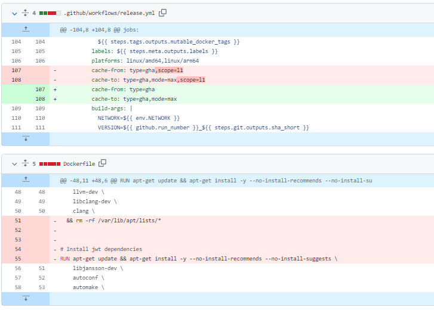
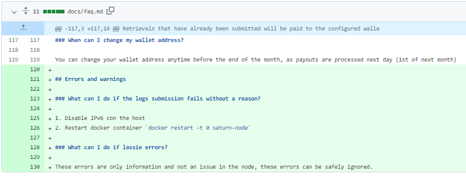
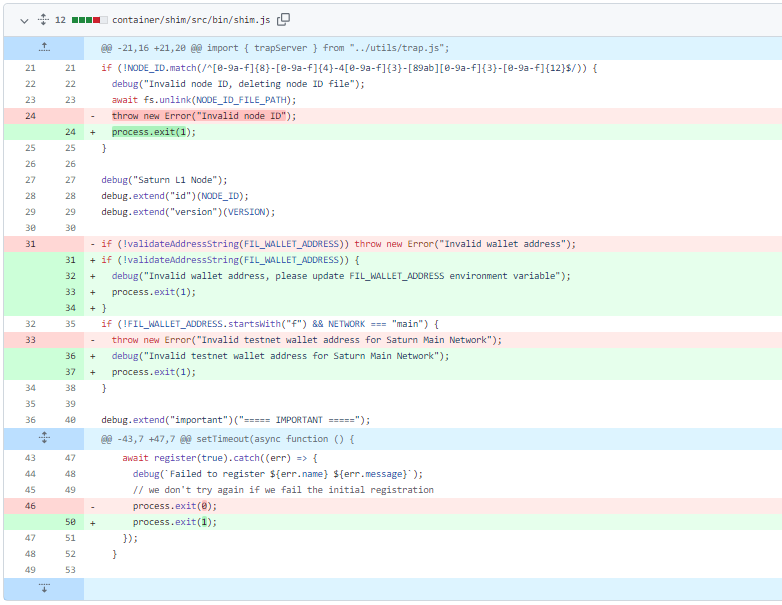
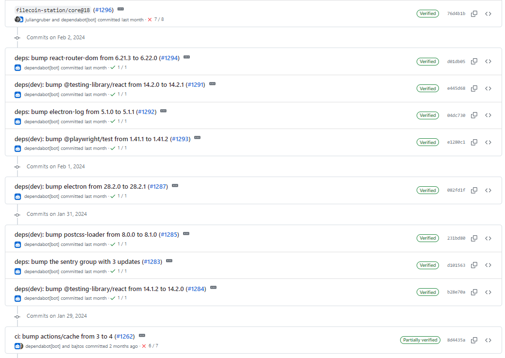
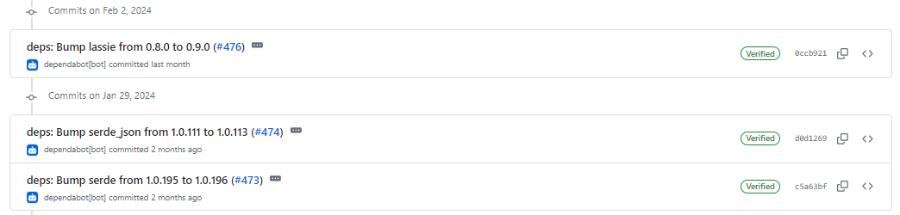
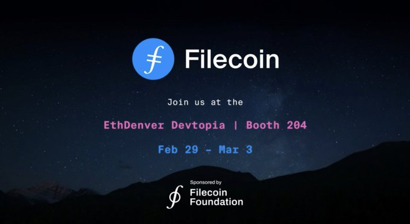

# 2024-2-4检索星球周报

## 🚀项目进展

### 1️⃣saturn

**L1-node**

1. 恢复到 LTS 节点的版本到20
1. feat: 添加 Sentry 集成
1. 强制新增缓存空间

4. docs: 更新日志提交问题

5. fix: 改进在 shim 上的错误处理

###  2️⃣boost工具

1. feat: 添加 deal IPNI 公告命令，修复移除ad命令

###  3️⃣storetheindex

1. update: 更新 CD pipeline 访问令牌
2. 配置选项以跳过第一个条目块上出现 500 错误的ads
3. 更新版本至 v0.8.19
4. 在 prod 环境中更新 storetheindex/storetheindex 至 v0.8.19

### 4️⃣Station

**desktop**

1. 部分依赖项目的更新

2. 更新项目版本至 v1.3.0

**Zinnia**

1. 部分依赖项目的更新

##  📢一周资讯

1. **Filecoin 2024**

   这将是一个激动人心的 2024 年。

   + 在 Filecoin 上使用 #IPC 子网的新应用程序和计算 L2s
   + Filecoin 作为 #web3 的基础存储层 - 从 DePIN 网络到所有链态！
   + Filecoin 用于热数据，通过许多付费的 onramps 快速检索
   + 更多的 DeFi 应用程序（利用更快的桥接和新的 DEX!）

   [more](https://filecoin.io/blog/posts/2023-expanding-from-a-storage-network-to-enabling-open-services-for-data-part-ii/)

2. EthDenver

   2 月 29 日至 3 月 3 日[@EthereumDenver](https://twitter.com/EthereumDenver) [@FilFoundation](https://twitter.com/FilFoundation)展位探索 @FilFoundation 展位的魔力探索 [Filecoin](https://twitter.com/hashtag/Filecoin?src=hashtag_click)生态系统，参与演示，并参加富有洞察力的演讲。

   想要展示您的项目？现在就申请：https://bit.ly/47P8e3Q

3. BanyanComputer

   [BanyanComputer](https://twitter.com/BanyanComputer)的 MVP 是第一个基于[Filecoin](https://twitter.com/hashtag/Filecoin?src=hashtag_click)网络构建的企业级文件存储解决方案，现已进入公开测试版。 

   享受加密、私密、去中心化的文件存储以及无缝的用户体验。免费试用并分享您的反馈： [https://beta.data.banyan.computer/login](https://t.co/EsjlkHSaXv)

   

4. **Project Saturn**

   土星项目旨在彻底改变内容检索，提供快速、低成本的交付服务。每月约有 30,000 个 FIL 池，节点运营商有动力满足检索请求，确保无缝访问数据。

   FilecoinSaturn的目标是什么？为 Web2 和 Web3 应用程序提供可靠的内容检索，提高速度和性能。大部分数据镜像自IPFS的镜像，从而提高跨平台的可访问性。

   根据 MessariCrypto，土星在全球拥有 1800 多个节点：

    欧洲：766 个节点（42）
    北美：531 个节点（29）
    亚洲：409 个节点（22）
    世界其他地区：120 个节点（7%），遍布南美、非洲和大洋洲。

   通过土星仪表板查看土星节点性能： https://dashboard.saturn.tech/stats

