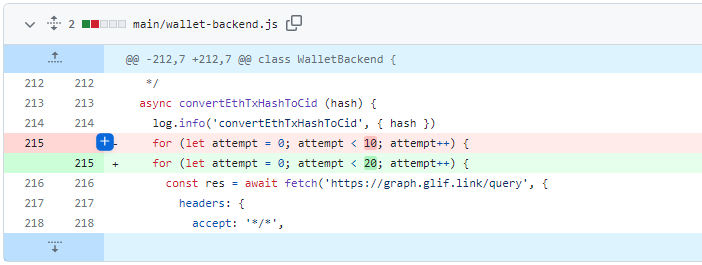
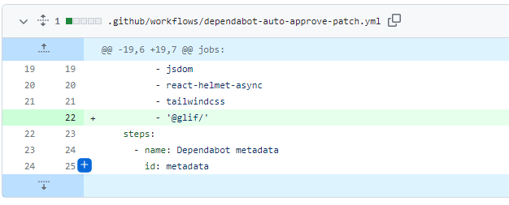
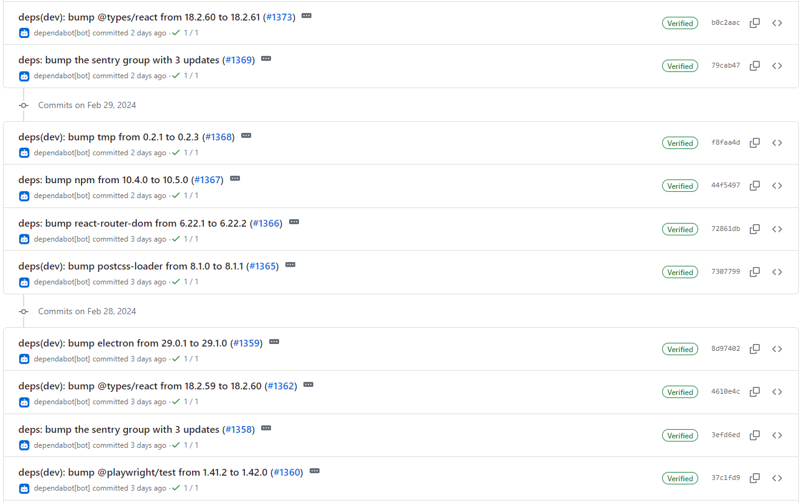
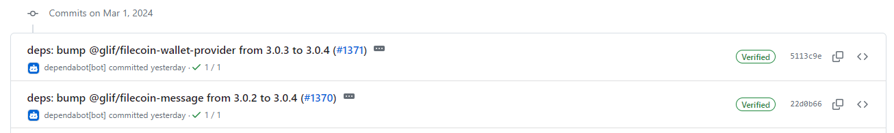
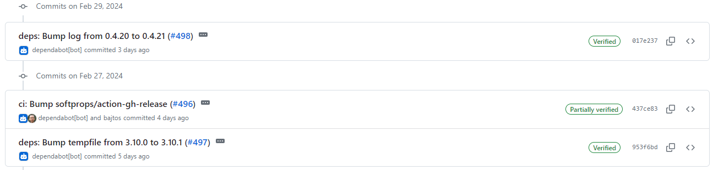
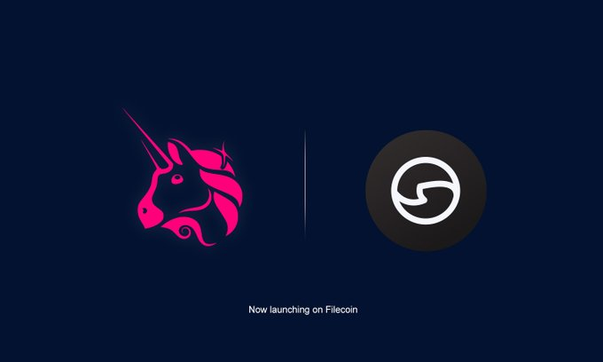

# 2024-3-3检索星球周报

## 🚀项目进展

### 1️⃣saturn

**L1-node**

无更新

###  2️⃣boost工具

无更新

###  3️⃣storetheindex

1. 移除 tornado 命名空间
2. 删除与tornado 团队/项目相关的基础设施：
   - RDS 数据库
   - KMS 关键
   - 角色绑定和策略
3. 删除多余的资源访问权限并清理权限。为逐步淘汰 AWS 环境做准备。
4. 从开发中解除部署 K6 控制器和基础 DB CRD。
5. 从 K8S 开发集群中移除索引提供者租户。
6. 从 K8S 群集中取消部署 grafana dashboard。将未使用的 grafana dashboard replcia 数量降至零。
7. 减少群集控制器副本。
8. 调整 dev 上 dhstore 的大小。
9. 允许 dev 上的 dhstore 使用任何可用节点。
10. 删除 dev 中 dhstore 的显式节点类型选择器。
11. 清理开发中利用率低的工人小组。移除和重新安排container，提高开发部基础设施的利用率。
12. 更新依赖项
13. 将最新版本部署到开发环境
14. 删除dead的引导节点
15. 更新版本至 v0.8.22
16. 将最新版本部署到开发环境
17. 在 prod 环境中更新 storetheindex/storetheindex
18. 从分配器配置中删除 dead bootstrap peers

### 4️⃣Station

**desktop**

1. wallet-backend: 增加将 eht tx 哈希值转换为 cid 的尝试次数

2. 修改 station 名称 update-available 为 readyToUpdate
3. 从 glif graphql 和 filfox 迁移到 Beryx
4. 更新项目版本至 1.3.15
5. 将钱包刷新超时时间延长至 60 秒（减少 api 负载）
6. CI：添加自动批准 @glif/* 补丁更新

7. 部分依赖项目的更新

**Zinnia**

1. 部分依赖项目的更新

##  📢一周资讯

1. **IPC**

   "IPC 的目标是为 web3 提供尽可能接近 k8s 的功能" - Evgeny Ponomarev (@eponomarev) 和 Juan Benet (@juanbenet) 在 #ETHDenver 的舞台上宣布了令人兴奋的项目即将推出主网。

   

2. **Uniswap & Filecoin**

   继 2023 年 10 月成功提出 Uniswap 治理提案之后、Uniswap v3 已在 FVM 上推出 - 可在 http://OKU.trade 上进行交易。

   与[AxelarNetwork](https://twitter.com/axelarnetwork)的桥接 USDC 和 ETH，开发者可以在 Filecoin 上使用这些桥接资产。

   
